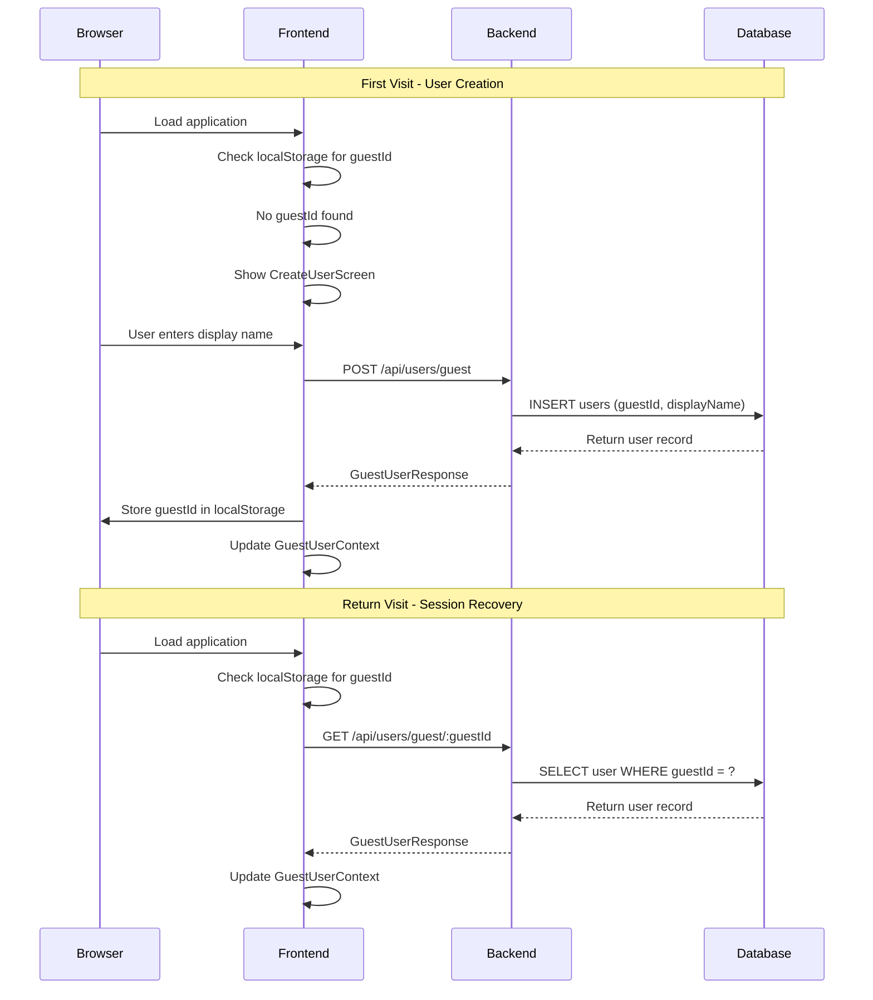

# User Authentication & Guest System

The retrospective application uses a passwordless guest user system where
identity is managed through server-generated opaque credentials stored in
the browser's localStorage.

## Architecture Overview



## Database Schema

### Users Table

```sql
CREATE TABLE users (
  id UUID PRIMARY KEY DEFAULT gen_random_uuid(),
  guest_id VARCHAR(100) NOT NULL UNIQUE,
  display_name VARCHAR(100) NOT NULL,
  created_at TIMESTAMP NOT NULL DEFAULT NOW()
);

CREATE INDEX users_guest_id_idx ON users(guest_id);
```

**Key Fields:**

- `id`: Internal UUID used for foreign key relationships
- `guest_id`: Public opaque string in format `guest-{timestamp}-{random}`
- `display_name`: User-chosen name displayed in the application
- `created_at`: Account creation timestamp

## Backend Implementation

### API Endpoints

#### Create Guest User

```http
POST /api/users/guest
Content-Type: application/json

{
  "displayName": "John Doe"
}
```

**Response (201):**

```json
{
  "success": true,
  "data": {
    "userId": "uuid-v4",
    "guestId": "guest-1704067200000-abc123",
    "displayName": "John Doe",
    "createdAt": "2024-01-01T00:00:00.000Z"
  }
}
```

**Errors:**

- `400`: Missing or invalid displayName
- `500`: Database error or guestId collision

#### Get Guest User

```http
GET /api/users/guest/:guestId
```

**Response (200):**

```json
{
  "success": true,
  "data": {
    "userId": "uuid-v4",
    "guestId": "guest-1704067200000-abc123",
    "displayName": "John Doe",
    "createdAt": "2024-01-01T00:00:00.000Z"
  }
}
```

**Errors:**

- `400`: Missing guestId parameter
- `404`: Guest user not found
- `500`: Database error

#### Update Guest User

```http
PUT /api/users/guest/:guestId
Content-Type: application/json

{
  "displayName": "Jane Smith"
}
```

**Response (200):**

```json
{
  "success": true,
  "data": {
    "userId": "uuid-v4",
    "guestId": "guest-1704067200000-abc123",
    "displayName": "Jane Smith",
    "createdAt": "2024-01-01T00:00:00.000Z"
  }
}
```

### Controller Implementation

Located in [`backend/src/controllers/userController.ts`](../backend/src/controllers/userController.ts):

```typescript
export const createGuestUser = asyncHandler(async (req: Request, res: CustomResponse<GuestUserResponse>) => {
  const { displayName }: CreateGuestUserRequest = req.body

  if (!displayName?.trim()) {
    res.status(400).json({
      success: false,
      error: 'Validation Error',
      message: 'Display name is required'
    })
    return
  }

  const guestId = generateGuestId()
  
  const newUser = await db.insert(users)
    .values({
      guestId,
      displayName: displayName.trim()
    })
    .returning()

  res.status(201).json({
    success: true,
    data: {
      userId: newUser[0].id,
      guestId: newUser[0].guestId,
      displayName: newUser[0].displayName,
      createdAt: newUser[0].createdAt.toISOString()
    }
  })
})
```

### Guest ID Generation

```typescript
function generateGuestId(): string {
  const timestamp = Date.now()
  const random = Math.random().toString(36).substring(2, 8)
  return `guest-${timestamp}-${random}`
}
```

**Format:** `guest-{timestamp}-{6-char-random}`

- Timestamp ensures uniqueness across time
- Random suffix handles concurrent requests
- Prefix makes the purpose clear in logs/debugging

### Authentication Middleware

Located in [`backend/src/middleware/auth.ts`](../backend/src/middleware/auth.ts):

```typescript
export const resolveGuestUser = async (guestId: string): Promise<string> => {
  if (!guestId) {
    throw new Error('Guest ID is required')
  }

  const user = await db.query.users.findFirst({
    where: eq(users.guestId, guestId)
  })

  if (!user) {
    throw new Error('Invalid guest ID')
  }

  return user.id // Returns internal userId
}

export const requireGuestUser = async (
  req: Request,
  res: CustomResponse,
  next: NextFunction
) => {
  try {
    const { guestId } = req.body

    if (!guestId) {
      res.status(400).json({
        success: false,
        error: 'Validation Error',
        message: 'Guest ID is required'
      })
      return
    }

    const userId = await resolveGuestUser(guestId)
    req.userId = userId
    req.guestId = guestId
    next()
  } catch (error) {
    res.status(401).json({
      success: false,
      error: 'Authorization Error',
      message: 'Invalid user credentials'
    })
  }
}
```

**Note:** `requireGuestUser` middleware is defined but not currently used on
routes. Controllers call `resolveGuestUser` directly and handle errors as 500s
rather than 401s.

## Frontend Implementation

### Context Provider

The [`GuestUserContext`](../frontend/src/contexts/GuestUserContext.tsx) manages user state across the application:

```typescript
interface GuestUserContextType {
  guestUser: {
    userId: string | null
    guestId: string | null
    displayName: string | null
  }
  isLoading: boolean
  error: string | null
  createGuestUser: (displayName: string) => Promise<void>
  updateDisplayName: (displayName: string) => Promise<void>
  refreshGuestUser: () => void
}
```

### Initialization Flow

```typescript
const initializeGuestUser = useCallback(async () => {
  setIsLoading(true)
  setError(null)

  try {
    const storedGuestId = getStoredGuestId()
    
    if (storedGuestId) {
      // Attempt to hydrate user profile
      const userData = await guestUserApi.getGuestUser(storedGuestId)
      setGuestUser({
        userId: userData.userId,
        guestId: userData.guestId,
        displayName: userData.displayName
      })
    } else {
      // No stored ID, user needs to create account
      setGuestUser({ userId: null, guestId: null, displayName: null })
    }
  } catch (error) {
    const errorStatus = (error as any)?.status
    
    if (errorStatus === 404) {
      // Stored guestId is stale, clear it
      clearStoredGuestId()
      setGuestUser({ userId: null, guestId: null, displayName: null })
    } else {
      // Server/network error, preserve guestId for retry
      setError(error instanceof Error ? error.message : 'Failed to load user')
    }
  } finally {
    setIsLoading(false)
  }
}, [])
```

### localStorage Management

Located in [`frontend/src/utils/guestUser.ts`](../frontend/src/utils/guestUser.ts):

```typescript
const GUEST_ID_KEY = 'retro-guest-id'

export const getStoredGuestId = (): string | null => {
  return localStorage.getItem(GUEST_ID_KEY)
}

export const storeGuestId = (guestId: string): void => {
  localStorage.setItem(GUEST_ID_KEY, guestId)
}

export const clearStoredGuestId = (): void => {
  localStorage.removeItem(GUEST_ID_KEY)
}
```

### Authentication Guard

The [`AuthGuard`](../frontend/src/components/AuthGuard.tsx) component ensures
users have valid credentials before accessing the application:

```typescript
export function AuthGuard({ children }: AuthGuardProps) {
  const { guestUser, isLoading, error } = useGuestUser()

  // Show loading screen during initialization
  if (isLoading) {
    return <LoadingScreen />
  }

  // Show retry screen for server/network errors
  if (guestUser.guestId && !guestUser.userId && error) {
    return <RetryScreen />
  }

  // Show create user screen if no credentials exist
  if (!guestUser.guestId || !guestUser.userId || !guestUser.displayName) {
    return <CreateUserScreen />
  }

  // User is authenticated, render main application
  return <>{children}</>
}
```

### Onboarding Screens

#### LoadingScreen

Displays a spinner while initializing user state from localStorage and API.

#### CreateUserScreen

Shows the guest user modal in a blocking overlay when no credentials exist:

```typescript
export function CreateUserScreen() {
  const { openModal } = useModal()

  useEffect(() => {
    openModal('create')
  }, [openModal])

  return (
    <div className="min-h-screen bg-gray-50 flex items-center justify-center">
      <div className="text-center">
        <Typography variant="heading-lg">Welcome to Retro Tool</Typography>
        <Typography variant="body-md" color="neutral-600">
          Please create your profile to get started
        </Typography>
      </div>
    </div>
  )
}
```

#### RetryScreen

Shown when the stored guestId exists but profile hydration fails with non-404 errors:

```typescript
export function RetryScreen() {
  const { refreshGuestUser } = useGuestUser()

  return (
    <div className="min-h-screen bg-gray-50 flex items-center justify-center">
      <div className="text-center space-y-4">
        <Typography variant="heading-md">Connection Error</Typography>
        <Typography variant="body-md" color="neutral-600">
          Unable to load your profile. Please check your connection and try again.
        </Typography>
        <Button onClick={refreshGuestUser}>
          Retry
        </Button>
      </div>
    </div>
  )
}
```

### Guest User Modal

The [`GuestUserModal`](../frontend/src/components/GuestUserModal.tsx) handles both user creation and profile updates:

```typescript
export function GuestUserModal() {
  const { guestUser, createGuestUser, updateDisplayName } = useGuestUser()
  const { modalState, closeModal } = useModal()
  
  const mode = modalState.type // 'create' or 'edit'
  const isCreate = mode === 'create'

  const handleSubmit = async (e: React.FormEvent) => {
    e.preventDefault()
    
    try {
      if (isCreate) {
        await createGuestUser(displayName)
      } else {
        await updateDisplayName(displayName)
      }
      closeModal()
    } catch (error) {
      setError(error instanceof Error ? error.message : 'Operation failed')
    }
  }

  return (
    <Modal isOpen={modalState.isOpen} onClose={isCreate ? undefined : closeModal}>
      <form onSubmit={handleSubmit}>
        <Typography variant="heading-md">
          {isCreate ? 'Create Your Profile' : 'Update Display Name'}
        </Typography>
        
        <TextField
          label="Display Name"
          value={displayName}
          onChange={setDisplayName}
          required
          maxLength={100}
        />
        
        <Button type="submit" disabled={!displayName.trim()}>
          {isCreate ? 'Create Profile' : 'Update Name'}
        </Button>
      </form>
    </Modal>
  )
}
```

## Error Handling

### Backend Error Scenarios

| Scenario | HTTP Status | Response | Frontend Behavior |
|----------|-------------|----------|-------------------|
| Missing displayName | 400 | Validation error | Show field error |
| Guest user not found | 404 | Not found | Clear localStorage |
| Database error | 500 | Server error | Show retry screen |
| Duplicate guestId (rare) | 500 | Server error | Show retry screen |

### Frontend Error Handling

```typescript
// API client attaches status codes to errors
const request = async (url: string, options: RequestInit) => {
  const response = await fetch(url, options)
  
  if (!response.ok) {
    const errorData: ApiError = await response.json()
    const error = new Error(errorData.message)
    ;(error as any).status = response.status
    throw error
  }
  
  return response.json()
}

// Context handles different error types
catch (error) {
  const errorStatus = (error as any)?.status
  
  if (errorStatus === 404) {
    // Stale guestId, clear and restart
    clearStoredGuestId()
    setGuestUser({ userId: null, guestId: null, displayName: null })
  } else {
    // Preserve session, show retry UI
    setError(error instanceof Error ? error.message : 'Failed to load user')
  }
}
```

## Security Considerations

### No Traditional Authentication

- No passwords, JWTs, or server-side sessions
- Guest IDs are opaque and unguessable
- Client-side storage in localStorage (not httpOnly cookies)

### Threat Model

- **Acceptable**: Users can impersonate each other if they share guestIds
- **Mitigated**: Guest IDs are hard to guess (timestamp + random)
- **By Design**: No sensitive data stored, retrospectives are collaborative

### Authorization Pattern

Other API endpoints use the guestId to resolve the internal userId:

```typescript
// In room/card controllers
const userId = await resolveGuestUser(guestId)
const isParticipant = await validateRoomParticipant(userId, roomId)
const isFacilitator = await validateFacilitatorRole(userId, roomId)
```

## Integration with Other Features

### Room Operations

- Room creation requires valid guestId in request body
- Room joining uses guestId to create participant records
- Room access validation checks participant membership

### Card Operations  

- Card CRUD operations require guestId for ownership validation
- Card ownership determined by matching authorId to resolved userId
- Real-time updates include isOwner flags based on current user

### Facilitator Privileges

- Facilitator role stored in room_participants table
- Phase transitions restricted to facilitators
- Card grouping operations require facilitator role

## Troubleshooting

### Common Issues

**Guest ID Lost After Browser Restart**

- Check if localStorage is being cleared by browser settings
- Verify localStorage key is 'retro-guest-id'
- Check for incognito/private browsing mode

**Stuck on Loading Screen**

- Check network connectivity to backend
- Verify backend is running and accessible
- Check browser console for JavaScript errors

**"Invalid user credentials" Errors**

- Stored guestId may be stale (database reset)
- Clear localStorage manually: `localStorage.removeItem('retro-guest-id')`
- Refresh page to trigger new user creation flow

**Profile Updates Not Persisting**

- Check for 404 responses (stale guestId)
- Verify display name meets validation requirements
- Check for network errors during update request

### Debug Commands

```javascript
// Check stored guest ID
localStorage.getItem('retro-guest-id')

// Clear stored guest ID
localStorage.removeItem('retro-guest-id')

// Check current user context (in React DevTools)
// Look for GuestUserContext values
```
