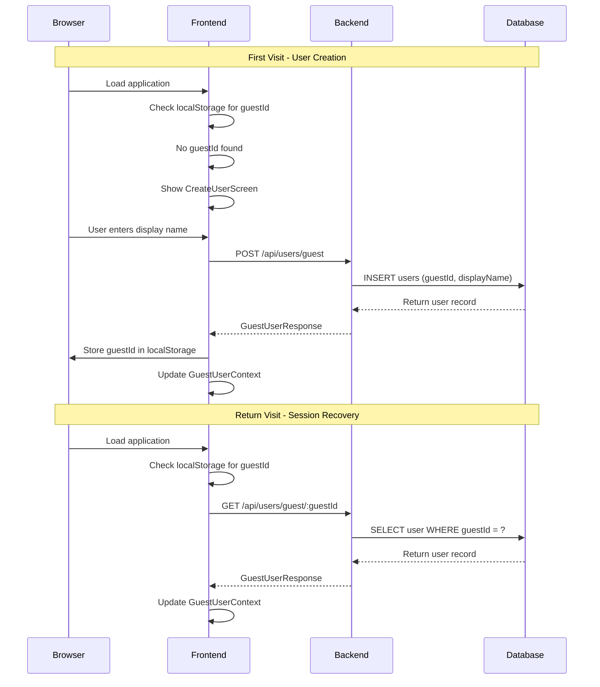

# User Authentication & Guest System

The retrospective application uses a passwordless guest user system where
identity is managed through server-generated opaque credentials stored in
the browser's localStorage.

## Architecture Overview



## Database Schema

### Users Table

```sql
CREATE TABLE users (
  id UUID PRIMARY KEY DEFAULT gen_random_uuid(),
  guest_id VARCHAR(100) NOT NULL UNIQUE,
  display_name VARCHAR(100) NOT NULL,
  created_at TIMESTAMP NOT NULL DEFAULT NOW()
);

CREATE INDEX users_guest_id_idx ON users(guest_id);
```

**Key Fields:**

- `id`: Internal UUID used for foreign key relationships
- `guest_id`: Public opaque string in format `guest-{timestamp}-{random}`
- `display_name`: User-chosen name displayed in the application
- `created_at`: Account creation timestamp

## Backend Implementation

### API Endpoints

#### Create Guest User

```http
POST /api/users/guest
Content-Type: application/json

{
  "displayName": "John Doe"
}
```

**Response (201):**

```json
{
  "success": true,
  "data": {
    "userId": "uuid-v4",
    "guestId": "guest-1704067200000-abc123",
    "displayName": "John Doe",
    "createdAt": "2024-01-01T00:00:00.000Z"
  }
}
```

**Errors:**

- `400`: Missing or invalid displayName
- `500`: Database error or guestId collision

#### Get Guest User

```http
GET /api/users/guest/:guestId
```

**Response (200):**

```json
{
  "success": true,
  "data": {
    "userId": "uuid-v4",
    "guestId": "guest-1704067200000-abc123",
    "displayName": "John Doe",
    "createdAt": "2024-01-01T00:00:00.000Z"
  }
}
```

**Errors:**

- `400`: Missing guestId parameter
- `404`: Guest user not found
- `500`: Database error

#### Update Guest User

```http
PUT /api/users/guest/:guestId
Content-Type: application/json

{
  "displayName": "Jane Smith"
}
```

**Response (200):**

```json
{
  "success": true,
  "data": {
    "userId": "uuid-v4",
    "guestId": "guest-1704067200000-abc123",
    "displayName": "Jane Smith",
    "createdAt": "2024-01-01T00:00:00.000Z"
  }
}
```

### Business Logic

**Guest User Creation:**

- Validates display name is provided and non-empty
- Generates unique opaque guest ID using timestamp + random suffix
- Stores user record in database with generated credentials
- Returns guest credentials for frontend storage

**Guest ID Format:** `guest-{timestamp}-{6-char-random}`

- Timestamp ensures uniqueness across time
- Random suffix handles concurrent requests  
- Prefix makes the purpose clear in logs/debugging

**User Retrieval:**

- Looks up user by guest ID from database
- Returns current profile information
- Handles missing users with appropriate 404 responses

**Profile Updates:**

- Validates new display name
- Updates user record maintaining same guest ID
- Preserves user session continuity

### Backend Implementation Files

- **Controller Logic:** [`backend/src/controllers/userController.ts`](../backend/src/controllers/userController.ts)
- **Guest ID Generation:** [`backend/src/utils/guestId.ts`](../backend/src/utils/guestId.ts)

### Authentication Middleware

**Header-Based Authentication:**

- Guest ID provided in `Authorization: Guest <guestId>` header format
- Validates and resolves guest ID to internal user ID
- Attaches resolved user information to request context (`req.userId`, `req.guestId`)
- Handles invalid credentials with appropriate 401 error responses

**Role-Based Authorization:**

- `requireGuestUser`: Validates authentication for all protected endpoints
- `requireRoomParticipant`: Ensures user is a participant in the specified room
- `requireFacilitator`: Ensures user has facilitator role in the specified room
- Room ID resolution supports multiple sources: URL params, request body, or middleware-resolved

**Response Filtering:**

- Sensitive data filtered based on user role and access level
- Facilitator codes only returned to facilitators
- Author IDs and vote user IDs removed for anonymity
- Participant IDs preserved for ordering and functionality

**Implementation:** [`backend/src/middleware/auth.ts`](../backend/src/middleware/auth.ts)

## Frontend Implementation

### Context Provider

**User State Management:**

- Maintains current user credentials and profile information
- Provides loading and error states for UI feedback
- Exposes functions for creating users and updating profiles
- Handles session persistence and recovery

**Initialization Logic:**

- Checks localStorage for existing guest ID on app startup
- Attempts to hydrate user profile from server if ID exists
- Handles stale credentials by clearing localStorage on 404 errors
- Preserves session data on temporary server/network errors
- Provides retry mechanism for failed initialization

**Session Persistence:**

- Stores guest ID in localStorage with key `retro-guest-id`
- Automatically clears invalid sessions (404 responses)
- Preserves sessions through browser restarts and tab changes

### Frontend Implementation Files

- **Context Provider:** [`frontend/src/contexts/GuestUserContext.tsx`](../frontend/src/contexts/GuestUserContext.tsx)
- **Storage Utilities:** [`frontend/src/utils/guestUser.ts`](../frontend/src/utils/guestUser.ts)
- **API Client:** [`frontend/src/utils/api.ts`](../frontend/src/utils/api.ts)

### Authentication Guard

**Access Control Logic:**

- Blocks application access until user has valid credentials
- Shows appropriate loading, error, or onboarding screens
- Ensures consistent authentication state across all routes
- Handles different authentication states with dedicated UI

**Authentication States:**

1. **Loading**: Initializing user state from storage and API
2. **Error with Session**: Server/network error but guest ID exists (show retry)
3. **No Credentials**: No guest ID or incomplete profile (show onboarding)
4. **Authenticated**: Valid credentials exist (allow app access)

### Onboarding Screens

**LoadingScreen:** Displays spinner during user state initialization

**CreateUserScreen:** Shows guest user modal when no credentials exist, blocking app access until profile is created

**RetryScreen:** Provides retry functionality when server errors occur but session data exists

### Guest User Modal

**Dual-Purpose Interface:**

- Handles both initial user creation and profile updates
- Switches behavior based on modal context (create vs edit mode)
- Blocks dismissal during user creation to ensure complete onboarding
- Allows cancellation during profile updates

**User Experience:**

- Simple form with display name field and validation
- Real-time validation with submit button state
- Error handling with inline feedback
- Automatic modal closure on successful operations

**Implementation:** [`frontend/src/components/GuestUserModal.tsx`](../frontend/src/components/GuestUserModal.tsx)

## Error Handling

### Backend Error Scenarios

| Scenario | HTTP Status | Response | Frontend Behavior |
|----------|-------------|----------|-------------------|
| Missing displayName | 400 | Validation error | Show field error |
| Guest user not found | 404 | Not found | Clear localStorage |
| Database error | 500 | Server error | Show retry screen |
| Duplicate guestId (rare) | 500 | Server error | Show retry screen |

### Frontend Error Handling

**Error Classification:**

- **404 Errors**: Stale guest ID, clear localStorage and restart onboarding
- **400 Errors**: Validation issues, show field-level error messages  
- **500 Errors**: Server/network issues, preserve session and show retry UI

**Error Recovery:**

- Attach HTTP status codes to error objects for proper handling
- Differentiate between authentication failures and temporary issues
- Maintain user session continuity when possible

## Security Considerations

### No Traditional Authentication

- No passwords, JWTs, or server-side sessions
- Guest IDs are opaque and unguessable
- Client-side storage in localStorage (not httpOnly cookies)

### Threat Model

- **Acceptable**: Users can impersonate each other if they share guestIds
- **Mitigated**: Guest IDs are hard to guess (timestamp + random)
- **By Design**: No sensitive data stored, retrospectives are collaborative

### Authorization Pattern

**Header-Based Authentication:**

- All protected API endpoints require `Authorization: Guest <guestId>` header
- Middleware automatically resolves guest ID to internal user ID
- Role-based middleware validates room participation and facilitator access
- Authorization failures return appropriate HTTP status codes (401/403)

**Security Enhancements:**

- Facilitator room codes only exposed to facilitators
- Card author IDs removed from responses for anonymity
- Vote user IDs filtered out to maintain voting privacy
- Participant IDs preserved for UI ordering and functionality

## Integration with Other Features

### Room Operations

- Room creation requires valid guestId in request body
- Room joining uses guestId to create participant records
- Room access validation checks participant membership

### Card Operations  

- Card CRUD operations require guestId for ownership validation
- Card ownership determined by matching authorId to resolved userId
- Real-time updates include isOwner flags based on current user

### Facilitator Privileges

- Facilitator role stored in room_participants table
- Phase transitions restricted to facilitators
- Card grouping operations require facilitator role

## Troubleshooting

### Common Issues

**Guest ID Lost After Browser Restart**

- Check if localStorage is being cleared by browser settings
- Verify localStorage key is 'retro-guest-id'
- Check for incognito/private browsing mode

**Stuck on Loading Screen**

- Check network connectivity to backend
- Verify backend is running and accessible
- Check browser console for JavaScript errors

**"Invalid user credentials" Errors**

- Stored guestId may be stale (database reset)
- Clear localStorage manually: `localStorage.removeItem('retro-guest-id')`
- Refresh page to trigger new user creation flow

**Profile Updates Not Persisting**

- Check for 404 responses (stale guestId)
- Verify display name meets validation requirements
- Check for network errors during update request

### Debug Commands

```javascript
// Check stored guest ID
localStorage.getItem('retro-guest-id')

// Clear stored guest ID
localStorage.removeItem('retro-guest-id')

// Check current user context (in React DevTools)
// Look for GuestUserContext values
```
