# Room Management

The room management system handles the complete lifecycle of retrospective
sessions, from creation and joining to access control and phase transitions.

## Architecture Overview

```mermaid
flowchart TB
    subgraph Creation [Room Creation Flow]
        C1[User clicks 'Create Retro']
        C2[Select template & enter details]
        C3[POST /api/rooms with guestId]
        C4[Generate facilitator/participant codes]
        C5[Create room & add user as facilitator]
        C6[Navigate to /retro/:roomId]
    end
    
    subgraph Joining [Room Joining Flow]
        J1[User enters join code]
        J2[POST /api/rooms/join]
        J3[Find room by code]
        J4[Determine role from code type]
        J5[Upsert room_participants]
        J6[Navigate to /retro/:roomId]
    end
    
    subgraph Access [Room Access Control]
        A1[GET /api/rooms/:id?guestId=...]
        A2[Validate user is participant]
        A3[Return full room data]
        A4[403 if not participant]
        A5[Redirect to home with error]
    end
    
    C1 --> C2 --> C3 --> C4 --> C5 --> C6
    J1 --> J2 --> J3 --> J4 --> J5 --> J6
    A1 --> A2 --> A3
    A2 --> A4 --> A5
```



## Database Schema

### Rooms Table

```sql
CREATE TABLE rooms (
  id UUID PRIMARY KEY DEFAULT gen_random_uuid(),
  name VARCHAR(255) NOT NULL,
  description TEXT,
  facilitator_code VARCHAR(50) NOT NULL UNIQUE,
  participant_code VARCHAR(50) NOT NULL UNIQUE,
  current_phase retroPhaseEnum NOT NULL DEFAULT 'setup',
  max_votes_per_user INTEGER NOT NULL DEFAULT 3,
  is_active BOOLEAN NOT NULL DEFAULT true,
  created_at TIMESTAMP NOT NULL DEFAULT NOW(),
  updated_at TIMESTAMP NOT NULL DEFAULT NOW()
);

CREATE INDEX rooms_facilitator_code_idx ON rooms(facilitator_code);
CREATE INDEX rooms_participant_code_idx ON rooms(participant_code);
CREATE INDEX rooms_active_idx ON rooms(is_active);
```

### Room Participants Table

```sql
CREATE TABLE room_participants (
  room_id UUID NOT NULL REFERENCES rooms(id) ON DELETE CASCADE,
  user_id UUID NOT NULL REFERENCES users(id) ON DELETE CASCADE,
  role participantRoleEnum NOT NULL DEFAULT 'participant',
  joined_at TIMESTAMP NOT NULL DEFAULT NOW(),
  PRIMARY KEY (room_id, user_id)
);
```

### Enums

```sql
CREATE TYPE retroPhaseEnum AS ENUM ('setup', 'writing', 'grouping', 'voting', 'discussing');
CREATE TYPE participantRoleEnum AS ENUM ('facilitator', 'participant');
```

**Key Relationships:**

- Each room has unique facilitator and participant codes
- Users can participate in multiple rooms with different roles
- Cascade deletes ensure data consistency when rooms are deleted

## Backend Implementation

### API Endpoints

#### Create Room

```http
POST /api/rooms
Content-Type: application/json
Authorization: Guest guest-1704067200000-abc123

{
  "name": "Sprint 23 Retrospective",
  "description": "Q4 sprint retrospective",
  "template": "startStopContinue"
}
```

**Response (201):**

```json
{
  "success": true,
  "data": {
    "id": "room-uuid",
    "name": "Sprint 23 Retrospective",
    "description": "Q4 sprint retrospective",
    "facilitatorCode": "ABC12345",
    "participantCode": "XYZ789",
    "currentPhase": "setup",
    "maxVotesPerUser": 3,
    "columns": [
      {
        "id": "column-uuid",
        "title": "Start Doing",
        "description": "What should we start doing?",
        "color": "#10B981"
      }
    ]
  }
}
```

#### Join Room

```http
POST /api/rooms/join
Content-Type: application/json
Authorization: Guest guest-1704067200000-abc123

{
  "code": "ABC12345"
}
```

**Response (200):**

```json
{
  "success": true,
  "data": {
    "roomId": "room-uuid",
    "role": "facilitator",
    "participantId": "user-uuid"
  }
}
```

#### Get Room Details

```http
GET /api/rooms/:id?guestId=guest-1704067200000-abc123
```

**Response (200):**

```json
{
  "success": true,
  "data": {
    "id": "room-uuid",
    "name": "Sprint 23 Retrospective",
    "description": "Q4 sprint retrospective",
    "facilitatorCode": "ABC12345",
    "participantCode": "XYZ789",
    "currentPhase": "discussing",
    "maxVotesPerUser": 3,
    "isActive": true,
    "columns": [
      {
        "id": "column-uuid",
        "title": "Start Doing",
        "description": "What should we start doing?",
        "color": "#10B981",
        "cards": [
          {
            "id": "card-uuid",
            "content": "Implement automated testing",
            "isAnonymous": true,
            "authorName": null,
            "sortOrder": 0,
            "createdAt": "2024-01-01T00:00:00.000Z",
            "voteCount": 5
          }
        ],
        "cardGroups": [
          {
            "id": "group-uuid",
            "title": "Process Improvements",
            "description": null,
            "sortOrder": 0,
            "createdAt": "2024-01-01T00:00:00.000Z",
            "voteCount": 8,
            "cards": [
              {
                "id": "grouped-card-uuid",
                "content": "Daily standup improvements",
                "isAnonymous": true,
                "authorName": null,
                "sortOrder": 0,
                "createdAt": "2024-01-01T00:00:00.000Z"
              }
            ]
          }
        ]
      }
    ],
    "participants": [
      {
        "id": "user-uuid",
        "displayName": "John Doe",
        "role": "facilitator",
        "joinedAt": "2024-01-01T00:00:00.000Z"
      }
    ],
    "createdAt": "2024-01-01T00:00:00.000Z"
  }
}
```

**Phase-Specific Fields:**

- **Voting Phase**: Cards and groups include `userVotes` (user's vote count on each item)
- **Discussion Phase**: Cards and groups include `voteCount` (total votes, anonymous)
- **Other Phases**: No vote-related fields included

#### Update Room Phase

```http
PATCH /api/rooms/:id/phase
Content-Type: application/json
Authorization: Guest guest-1704067200000-abc123

{
  "phase": "grouping"
}
```

**Response (200):**

```json
{
  "success": true,
  "data": {
    "id": "room-uuid",
    "name": "Sprint 23 Retrospective",
    "currentPhase": "grouping",
    "maxVotesPerUser": 3,
    "columns": []
  }
}
```

### Business Logic

**Room Creation:**

- Validates room name, template, and guest ID are provided
- Resolves guest ID to internal user ID for ownership
- Creates room record with generated facilitator and participant codes
- Initializes room with template-based column structure
- Adds creator as facilitator participant automatically

**Room Joining:**

- Validates join code format and guest ID
- Determines participant role based on code type (facilitator vs participant)
- Prevents duplicate participation by same user
- Creates participant record with appropriate role assignment

**Response Filtering:**

- **Facilitator Code**: Only included in responses for users with facilitator role
- **Participant Code**: Always included for room access
- **Participant IDs**: Preserved in responses for UI ordering and functionality
- **Card Author IDs**: Removed from card responses for anonymity
- **Vote User IDs**: Filtered out to maintain voting privacy

**Room Access:**

- Validates user is a participant before returning room data
- Includes ownership flags for cards based on requesting user
- Returns complete room structure with columns, cards, and groups
- Handles non-existent rooms and unauthorized access appropriately

**Phase Management:**

- Validates facilitator role before allowing phase transitions
- Updates room phase with validation of allowed transitions
- Maintains phase workflow: setup → writing → grouping → voting → discussing

### Backend Implementation Files

- **Controller Logic:** [`backend/src/controllers/roomController.ts`](../backend/src/controllers/roomController.ts)
- **Template System:** [`backend/src/constants/templates.ts`](../backend/src/constants/templates.ts)
- **Authorization Helpers:** [`backend/src/middleware/auth.ts`](../backend/src/middleware/auth.ts)

## Frontend Implementation

### Room Creation Flow

**User Experience:**

- Simple form with room name, optional description, and template selection
- Template selector shows available retrospective formats (Start/Stop/Continue, etc.)
- Real-time validation with submit button state management
- Automatic navigation to created room upon success

**Business Logic:**

- Validates user has valid guest credentials before creation
- Submits room data with selected template to backend API
- Handles creation errors with user-friendly messages
- Redirects to new room automatically after successful creation

### Room Joining Flow

**User Experience:**

- Clean interface with join code input field
- Supports both 6-character (participant) and 8-character (facilitator) codes
- Displays helpful error messages for invalid codes or access issues
- Handles URL parameter errors from room access redirects

**Business Logic:**

- Validates guest credentials before attempting join
- Normalizes join code format (uppercase) before submission
- Determines user role based on code type used
- Redirects to room upon successful join

### Room Access and Loading

**Access Control:**

- Validates user is room participant before displaying content
- Handles non-participant access by redirecting to home with error message
- Manages loading states during room data fetching
- Implements retry mechanism for temporary network issues

**Real-time Updates:**

- Polling mechanism to fetch updated room data every 5 seconds
- Smart merging to preserve user's active card edits during updates
- Pauses polling when browser tab is not visible for performance
- Handles network errors gracefully without disrupting user experience

### Frontend Implementation Files

- **Room Creation:** [`frontend/src/pages/CreateRetroPage.tsx`](../frontend/src/pages/CreateRetroPage.tsx)
- **Room Joining:** [`frontend/src/pages/HomePage.tsx`](../frontend/src/pages/HomePage.tsx)
- **Room Display:** [`frontend/src/pages/RetroPage.tsx`](../frontend/src/pages/RetroPage.tsx)
- **API Client:** [`frontend/src/utils/api.ts`](../frontend/src/utils/api.ts)
- **Polling Hook:** [`frontend/src/hooks/useRoomPolling.ts`](../frontend/src/hooks/useRoomPolling.ts)

## Template System

**Available Templates:**

- **Start/Stop/Continue**: What should we start doing, stop doing, and continue doing?
- **Mad/Sad/Glad**: What made us mad, sad, or glad this sprint?
- **Went Well/To Improve/Action Items**: Classic retrospective format
- **4Ls**: Liked, Learned, Lacked, Longed for

**Template Structure:**

- Each template defines column names, colors, and sort order
- Templates are stored as constants and referenced by key
- Room creation validates template selection against available options
- Columns are automatically created based on selected template

**Implementation:** [`backend/src/constants/templates.ts`](../backend/src/constants/templates.ts)

## Join Code System

**Code Generation:**

- **Facilitator codes**: 8 characters, alphanumeric, case-insensitive
- **Participant codes**: 6 characters, alphanumeric, case-insensitive  
- Codes are unique per room and generated during room creation
- No expiration or usage limits on codes

**Security Model:**

- Codes are the primary access control mechanism
- Facilitator codes grant admin privileges (phase transitions, card movement)
- Participant codes grant standard access (card creation, editing own cards)
- No additional authentication required beyond code possession

**Implementation:** [`backend/src/utils/codeGenerator.ts`](../backend/src/utils/codeGenerator.ts)

## Phase Management

**Phase Workflow:**

1. **Setup**: Initial room configuration, early card creation allowed
2. **Writing**: Primary card creation and editing phase
3. **Grouping**: Facilitator organizes cards into thematic groups
4. **Voting**: Participants vote on most important items
5. **Discussing**: Review results and create action items

**Phase Restrictions:**

- **Frontend enforced**: UI elements show/hide based on current phase
- **Backend validation**: Facilitator role required for phase transitions
- **Card operations**: Creation/editing restricted after writing phase
- **Movement operations**: Only available to facilitators during grouping phase

**Implementation:** [`frontend/src/components/PhaseControls.tsx`](../frontend/src/components/PhaseControls.tsx)

## Security Considerations

### Join Code Security

- **Facilitator codes**: 8 characters provide ~2.8 trillion combinations
- **Participant codes**: 6 characters provide ~56 billion combinations
- Codes are randomly generated with cryptographically secure methods
- No brute force protection needed due to combination space size

### Access Control

- **Room access**: Requires valid participation record in database
- **Full room data**: Returned only to verified participants
- **Card ownership**: Determined by author ID matching current user
- **Facilitator privileges**: Stored in participant role field

### Data Exposure

- **Full room data**: Returned to all participants (collaborative model)
- **Card ownership**: Visible to card authors only via `isOwner` flag
- **User information**: Display names visible to all room participants

## Integration with Other Features

### Authentication Requirements

- All room operations require valid guestId in request body
- Guest ID resolution happens in controllers before business logic
- Invalid credentials result in 500 errors (not 401s for simplicity)

### Card System Integration

- Rooms contain columns that hold individual cards and card groups
- Card ownership validation uses room participation records
- Real-time updates include card changes via polling mechanism

### Phase Workflow

1. **Setup**: Initial room configuration and early participation
2. **Writing**: Primary content creation phase with full card CRUD
3. **Grouping**: Facilitator-only card organization and movement
4. **Voting**: Participant voting on prioritized items (future feature)
5. **Discussing**: Review and action item creation (future feature)

## Troubleshooting

**Room creation fails**

- Check if guest ID is valid and user profile exists
- Verify template selection is valid option
- Ensure room name is provided and non-empty

**Cannot join room with valid code**

- Confirm guest user profile exists and is complete
- Check if code was entered correctly (case-insensitive)
- Verify room still exists and is active

**Room access denied**

- Ensure user previously joined room with valid code
- Check if room was deleted or marked inactive
- Verify guest ID hasn't changed or been cleared

**Phase transition not working**

- Confirm user has facilitator role in the room
- Check if current phase allows transition to target phase
- Verify network connectivity for API requests

**Real-time updates not working**

- Check if polling is enabled and browser tab is visible
- Verify network connectivity and API accessibility
- Look for JavaScript errors in browser console
- Confirm room ID is valid and user has access

## Performance Considerations

**Room Loading:**

- Room data includes full nested structure (columns, cards, groups, participants)
- Large rooms with many cards may have slower load times
- Consider pagination for rooms with 100+ cards (future enhancement)

**Real-time Updates:**

- Polling every 5 seconds provides near real-time experience
- Polling pauses when tab not visible to conserve resources
- Smart merging prevents overwriting user's active edits
- Network errors don't disrupt ongoing user interactions

**Code Generation:**

- Codes generated synchronously during room creation
- No collision detection needed due to large combination space
- Room creation is atomic transaction including code generation
