# Room Management

The room management system handles the complete lifecycle of retrospective
sessions, from creation and joining to access control and phase transitions.

## Architecture Overview

```mermaid
flowchart TB
    subgraph Creation [Room Creation Flow]
        C1[User clicks 'Create Retro']
        C2[Select template & enter details]
        C3[POST /api/rooms with guestId]
        C4[Generate facilitator/participant codes]
        C5[Create room & add user as facilitator]
        C6[Navigate to /retro/:roomId]
    end
    
    subgraph Joining [Room Joining Flow]
        J1[User enters join code]
        J2[POST /api/rooms/join]
        J3[Find room by code]
        J4[Determine role from code type]
        J5[Upsert room_participants]
        J6[Navigate to /retro/:roomId]
    end
    
    subgraph Access [Room Access Control]
        A1[GET /api/rooms/:id?guestId=...]
        A2[Validate user is participant]
        A3[Return full room data]
        A4[403 if not participant]
        A5[Redirect to home with error]
    end
    
    C1 --> C2 --> C3 --> C4 --> C5 --> C6
    J1 --> J2 --> J3 --> J4 --> J5 --> J6
    A1 --> A2 --> A3
    A2 --> A4 --> A5
```



## Database Schema

### Rooms Table

```sql
CREATE TABLE rooms (
  id UUID PRIMARY KEY DEFAULT gen_random_uuid(),
  name VARCHAR(255) NOT NULL,
  description TEXT,
  facilitator_code VARCHAR(50) NOT NULL UNIQUE,
  participant_code VARCHAR(50) NOT NULL UNIQUE,
  current_phase retroPhaseEnum NOT NULL DEFAULT 'setup',
  max_votes_per_user INTEGER NOT NULL DEFAULT 3,
  is_active BOOLEAN NOT NULL DEFAULT true,
  created_at TIMESTAMP NOT NULL DEFAULT NOW(),
  updated_at TIMESTAMP NOT NULL DEFAULT NOW()
);

CREATE INDEX rooms_facilitator_code_idx ON rooms(facilitator_code);
CREATE INDEX rooms_participant_code_idx ON rooms(participant_code);
CREATE INDEX rooms_active_idx ON rooms(is_active);
```

### Room Participants Table

```sql
CREATE TABLE room_participants (
  room_id UUID NOT NULL REFERENCES rooms(id) ON DELETE CASCADE,
  user_id UUID NOT NULL REFERENCES users(id) ON DELETE CASCADE,
  role participantRoleEnum NOT NULL DEFAULT 'participant',
  joined_at TIMESTAMP NOT NULL DEFAULT NOW(),
  PRIMARY KEY (room_id, user_id)
);
```

### Enums

```sql
CREATE TYPE retroPhaseEnum AS ENUM ('setup', 'writing', 'grouping', 'voting', 'discussing');
CREATE TYPE participantRoleEnum AS ENUM ('facilitator', 'participant');
```

**Key Relationships:**

- Each room has unique facilitator and participant codes
- Users can participate in multiple rooms with different roles
- Cascade deletes ensure data consistency when rooms are deleted

## Backend Implementation

### API Endpoints

#### Create Room

```http
POST /api/rooms
Content-Type: application/json

{
  "name": "Sprint 23 Retrospective",
  "description": "Q4 sprint retrospective",
  "template": "startStopContinue",
  "guestId": "guest-1704067200000-abc123"
}
```

**Response (201):**

```json
{
  "success": true,
  "data": {
    "id": "room-uuid",
    "name": "Sprint 23 Retrospective",
    "description": "Q4 sprint retrospective",
    "facilitatorCode": "ABC12345",
    "participantCode": "XYZ789",
    "currentPhase": "setup",
    "maxVotesPerUser": 3,
    "columns": [
      {
        "id": "column-uuid",
        "title": "Start Doing",
        "description": "What should we start doing?",
        "color": "#10B981"
      }
    ]
  }
}
```

#### Join Room

```http
POST /api/rooms/join
Content-Type: application/json

{
  "code": "ABC12345",
  "guestId": "guest-1704067200000-abc123"
}
```

**Response (200):**

```json
{
  "success": true,
  "data": {
    "roomId": "room-uuid",
    "role": "facilitator",
    "participantId": "user-uuid"
  }
}
```

#### Get Room Details

```http
GET /api/rooms/:id?guestId=guest-1704067200000-abc123
```

**Response (200):**

```json
{
  "success": true,
  "data": {
    "id": "room-uuid",
    "name": "Sprint 23 Retrospective",
    "description": "Q4 sprint retrospective",
    "facilitatorCode": "ABC12345",
    "participantCode": "XYZ789",
    "currentPhase": "writing",
    "maxVotesPerUser": 3,
    "isActive": true,
    "columns": [
      {
        "id": "column-uuid",
        "title": "Start Doing",
        "description": "What should we start doing?",
        "color": "#10B981",
        "cards": [],
        "cardGroups": []
      }
    ],
    "participants": [
      {
        "id": "user-uuid",
        "displayName": "John Doe",
        "role": "facilitator",
        "joinedAt": "2024-01-01T00:00:00.000Z"
      }
    ],
    "createdAt": "2024-01-01T00:00:00.000Z"
  }
}
```

#### Update Room Phase

```http
PATCH /api/rooms/:id/phase
Content-Type: application/json

{
  "phase": "grouping",
  "guestId": "guest-1704067200000-abc123"
}
```

**Response (200):**

```json
{
  "success": true,
  "data": {
    "id": "room-uuid",
    "name": "Sprint 23 Retrospective",
    "currentPhase": "grouping",
    "maxVotesPerUser": 3,
    "columns": []
  }
}
```

### Controller Implementation

Located in [`backend/src/controllers/roomController.ts`](../backend/src/controllers/roomController.ts):

#### Room Creation

```typescript
export const createRoom = asyncHandler(async (req: Request, res: CustomResponse<RoomResponse>) => {
  const { name, description, template, guestId }: CreateRoomRequest = req.body

  // Validation
  if (!name?.trim() || !template || !guestId) {
    res.status(400).json({
      success: false,
      error: 'Validation Error',
      message: 'Name, template, and guest ID are required'
    })
    return
  }

  if (!RETRO_TEMPLATES[template]) {
    res.status(400).json({
      success: false,
      error: 'Validation Error',
      message: 'Invalid template'
    })
    return
  }

  const facilitatorCode = generateCode(8)
  const participantCode = generateCode(6)

  try {
    const result = await db.transaction(async (tx) => {
      // Create room
      const roomResult = await tx
        .insert(rooms)
        .values({
          name: name.trim(),
          ...(description && { description: description.trim() }),
          facilitatorCode,
          participantCode,
        })
        .returning()

      const room = roomResult[0]

      // Find facilitator user
      const facilitator = await tx.query.users.findFirst({
        where: eq(users.guestId, guestId),
      })

      if (!facilitator) {
        throw new Error('Guest user not found. Please create guest user first.')
      }

      // Add facilitator to participants
      await tx.insert(roomParticipants).values({
        roomId: room.id,
        userId: facilitator.id,
        role: 'facilitator',
      })

      // Create columns from template
      const templateColumns = RETRO_TEMPLATES[template].columns
      const columnResults = await tx
        .insert(columns)
        .values(
          templateColumns.map((col, index) => ({
            roomId: room.id,
            title: col.title,
            description: col.description,
            color: col.color,
            sortOrder: index,
          }))
        )
        .returning()

      return { room, columns: columnResults }
    })

    res.status(201).json({
      success: true,
      data: {
        id: result.room.id,
        name: result.room.name,
        description: result.room.description,
        facilitatorCode: result.room.facilitatorCode,
        participantCode: result.room.participantCode,
        currentPhase: result.room.currentPhase,
        maxVotesPerUser: result.room.maxVotesPerUser,
        columns: result.columns.map(col => ({
          id: col.id,
          title: col.title,
          description: col.description,
          color: col.color
        }))
      }
    })
  } catch (error) {
    console.error('Failed to create room:', error)
    res.status(500).json({
      success: false,
      error: 'Internal Server Error',
      message: 'Failed to create room'
    })
  }
})
```

#### Join Code Generation

```typescript
function generateCode(length: number): string {
  const chars = 'ABCDEFGHIJKLMNOPQRSTUVWXYZ0123456789'
  let result = ''
  for (let i = 0; i < length; i++) {
    result += chars.charAt(Math.floor(Math.random() * chars.length))
  }
  return result
}
```

**Code Format:**

- **Facilitator codes**: 8 characters (e.g., `ABC12345`)
- **Participant codes**: 6 characters (e.g., `XYZ789`)
- **Character set**: A-Z and 0-9 (no ambiguous characters like O/0, I/1)

#### Room Joining

```typescript
export const joinRoom = asyncHandler(async (req: Request, res: CustomResponse<JoinRoomResponse>) => {
  const { code, guestId }: JoinRoomRequest = req.body

  // Find room by either code type
  const room = await db.query.rooms.findFirst({
    where: or(eq(rooms.facilitatorCode, code), eq(rooms.participantCode, code)),
  })

  if (!room || !room.isActive) {
    res.status(404).json({
      success: false,
      error: 'Not Found',
      message: 'Room not found or inactive',
    })
    return
  }

  // Determine role based on which code was used
  const role = room.facilitatorCode === code ? 'facilitator' : 'participant'

  try {
    const result = await db.transaction(async (tx) => {
      const user = await tx.query.users.findFirst({
        where: eq(users.guestId, guestId),
      })

      if (!user) {
        throw new Error('Guest user not found')
      }

      // Upsert participant (handles re-joining with different codes)
      await tx
        .insert(roomParticipants)
        .values({ roomId: room.id, userId: user.id, role })
        .onConflictDoUpdate({
          target: [roomParticipants.roomId, roomParticipants.userId],
          set: { role }, // Update role if rejoining with different code
        })

      return { userId: user.id }
    })

    res.status(200).json({
      success: true,
      data: {
        roomId: room.id,
        role,
        participantId: result.userId,
      },
    })
  } catch (error) {
    console.error('Failed to join room:', error)
    res.status(500).json({
      success: false,
      error: 'Internal Server Error',
      message: 'Failed to join room',
    })
  }
})
```

### Access Control Implementation

#### Room Access Validation

```typescript
export const getRoomById = asyncHandler(async (req: Request, res: CustomResponse<DetailedRoomResponse>) => {
  const roomId = req.params.id
  const guestId = req.query.guestId as string | undefined

  // Load room with full nested data
  const room = await db.query.rooms.findFirst({
    where: eq(rooms.id, roomId),
    with: {
      columns: {
        with: {
          cards: {
            with: { author: true },
            orderBy: asc(cards.sortOrder)
          },
          cardGroups: {
            with: {
              cards: {
                with: { author: true }
              }
            },
            orderBy: asc(cardGroups.sortOrder)
          }
        },
        orderBy: asc(columns.sortOrder)
      },
      participants: {
        with: { user: true },
        orderBy: asc(roomParticipants.joinedAt)
      }
    }
  })

  if (!room) {
    res.status(404).json({
      success: false,
      error: 'Not Found',
      message: 'Room not found'
    })
    return
  }

  // Resolve current user if guestId provided
  let currentUserId: string | undefined
  if (guestId) {
    try {
      currentUserId = await resolveGuestUser(guestId)
    } catch (error) {
      console.warn('Invalid guestId provided, continuing without user context:', error)
    }
  }

  // Validate participant access if user resolved
  if (guestId && currentUserId) {
    const isParticipant = await validateRoomParticipant(currentUserId, room.id)
    if (!isParticipant) {
      res.status(403).json({
        success: false,
        error: 'Authorization Error',
        message: 'You must be a room participant to access this room',
      })
      return
    }
  }

  // Transform and return room data
  res.status(200).json({
    success: true,
    data: transformRoomToDetailedResponse(room, currentUserId)
  })
})
```

### Authorization Helpers

Located in [`backend/src/middleware/auth.ts`](../backend/src/middleware/auth.ts):

```typescript
export const validateRoomParticipant = async (
  userId: string,
  roomId: string
): Promise<boolean> => {
  const participation = await db.query.roomParticipants.findFirst({
    where: and(
      eq(roomParticipants.userId, userId),
      eq(roomParticipants.roomId, roomId)
    )
  })

  return !!participation
}

export const validateFacilitatorRole = async (
  userId: string,
  roomId: string
): Promise<boolean> => {
  const participation = await db.query.roomParticipants.findFirst({
    where: and(
      eq(roomParticipants.userId, userId),
      eq(roomParticipants.roomId, roomId)
    )
  })

  return participation?.role === 'facilitator'
}
```

## Frontend Implementation

### Room Creation Flow

Located in [`frontend/src/pages/CreateRetroPage.tsx`](../frontend/src/pages/CreateRetroPage.tsx):

```typescript
export function CreateRetroPage() {
  const [formData, setFormData] = useState({
    name: '',
    description: '',
    template: 'startStopContinue' as keyof typeof RETRO_TEMPLATES
  })
  const [isLoading, setIsLoading] = useState(false)
  const [error, setError] = useState<string | null>(null)
  
  const { guestUser } = useGuestUser()
  const navigate = useNavigate()

  const handleSubmit = async (e: React.FormEvent) => {
    e.preventDefault()
    
    if (!guestUser.guestId) {
      setError('Please create your profile first')
      return
    }

    setIsLoading(true)
    setError(null)

    try {
      const room = await roomApi.createRoom({
        name: formData.name,
        description: formData.description || undefined,
        template: formData.template,
        guestId: guestUser.guestId
      })

      navigate(`/retro/${room.id}`)
    } catch (error) {
      setError(error instanceof Error ? error.message : 'Failed to create room')
    } finally {
      setIsLoading(false)
    }
  }

  return (
    <Container className="max-w-2xl mx-auto py-8">
      <form onSubmit={handleSubmit} className="space-y-6">
        <Typography variant="heading-lg">Create New Retrospective</Typography>
        
        {error && (
          <div className="p-4 bg-red-50 border border-red-200 rounded-md">
            <Typography variant="body-sm" color="error">{error}</Typography>
          </div>
        )}
        
        <TextField
          label="Retrospective Name"
          value={formData.name}
          onChange={(value) => setFormData(prev => ({ ...prev, name: value }))}
          required
          placeholder="Sprint 23 Retrospective"
        />
        
        <TextArea
          label="Description (Optional)"
          value={formData.description}
          onChange={(value) => setFormData(prev => ({ ...prev, description: value }))}
          placeholder="Brief description of this retrospective session"
          rows={3}
        />
        
        <TemplateSelector
          value={formData.template}
          onChange={(template) => setFormData(prev => ({ ...prev, template }))}
        />
        
        <Button
          type="submit"
          variant="primary"
          size="block"
          disabled={!formData.name.trim() || isLoading}
        >
          {isLoading ? 'Creating...' : 'Create Retrospective'}
        </Button>
      </form>
    </Container>
  )
}
```

### Room Joining Flow

Located in [`frontend/src/pages/HomePage.tsx`](../frontend/src/pages/HomePage.tsx):

```typescript
export function HomePage() {
  const [joinCode, setJoinCode] = useState('')
  const [isJoining, setIsJoining] = useState(false)
  const [error, setError] = useState<string | null>(null)
  
  const { guestUser } = useGuestUser()
  const navigate = useNavigate()
  const [searchParams] = useSearchParams()

  // Handle error messages from redirects
  useEffect(() => {
    const errorType = searchParams.get('error')
    if (errorType === 'not-participant') {
      setError('You are not a participant in that room. Please use a valid join code.')
    } else if (errorType === 'room-not-found') {
      setError('Room not found. Please check the code and try again.')
    }
  }, [searchParams])

  const handleJoinRoom = async (e: React.FormEvent) => {
    e.preventDefault()
    
    if (!guestUser.guestId) {
      setError('Please create your profile first')
      return
    }

    setIsJoining(true)
    setError(null)

    try {
      const result = await roomApi.joinRoom({
        code: joinCode.toUpperCase(),
        guestId: guestUser.guestId
      })

      navigate(`/retro/${result.roomId}`)
    } catch (error) {
      setError(error instanceof Error ? error.message : 'Failed to join room')
    } finally {
      setIsJoining(false)
    }
  }

  return (
    <Container className="max-w-md mx-auto py-12">
      <div className="text-center space-y-8">
        <Typography variant="heading-xl">Retro Tool</Typography>
        
        {error && (
          <div className="p-4 bg-amber-50 border border-amber-200 rounded-md">
            <Typography variant="body-sm" color="warning">{error}</Typography>
          </div>
        )}
        
        <form onSubmit={handleJoinRoom} className="space-y-4">
          <TextField
            label="Session Code"
            value={joinCode}
            onChange={setJoinCode}
            placeholder="Enter 6 or 8 character code"
            required
            maxLength={8}
          />
          
          <Button
            type="submit"
            variant="primary"
            size="block"
            disabled={!joinCode.trim() || isJoining}
          >
            {isJoining ? 'Joining...' : 'Join Session'}
          </Button>
        </form>
        
        <div className="text-center">
          <Typography variant="body-sm" color="neutral-600">
            Or
          </Typography>
          <Button
            variant="secondary"
            onClick={() => navigate('/create')}
            className="mt-2"
          >
            Create New Retrospective
          </Button>
        </div>
      </div>
    </Container>
  )
}
```

### Room Access and Loading

Located in [`frontend/src/pages/RetroPage.tsx`](../frontend/src/pages/RetroPage.tsx):

```typescript
export function RetroPage() {
  const { id } = useParams<{ id: string }>()
  const { guestUser } = useGuestUser()
  const navigate = useNavigate()
  
  const [room, setRoom] = useState<DetailedRoomResponse | null>(null)
  const [isLoading, setIsLoading] = useState(true)

  const loadRoom = useCallback(async () => {
    if (!id || !guestUser.guestId) return

    try {
      const roomData = await roomApi.getRoomById(id, guestUser.guestId)
      setRoom(roomData)
    } catch (error) {
      const errorStatus = (error as any)?.status
      
      if (errorStatus === 403) {
        // Not a participant
        navigate('/?error=not-participant', { replace: true })
      } else if (errorStatus === 404) {
        // Room not found
        navigate('/?error=room-not-found', { replace: true })
      } else {
        // Other errors - keep user on page but show error
        console.error('Failed to load room:', error)
      }
    } finally {
      setIsLoading(false)
    }
  }, [id, guestUser.guestId, navigate])

  useEffect(() => {
    loadRoom()
  }, [loadRoom])

  if (isLoading) {
    return <LoadingScreen />
  }

  if (!room) {
    return <div>Room not found</div>
  }

  return <RetroBoard room={room} onRoomUpdate={setRoom} />
}
```

### Phase Management

Phase transitions are restricted to facilitators:

```typescript
const handlePhaseChange = async (newPhase: RetroPhase) => {
  if (!isFacilitator || !guestUser.guestId) return

  setIsUpdatingPhase(true)
  
  try {
    await roomApi.updateRoomPhase(room.id, {
      phase: newPhase,
      guestId: guestUser.guestId
    })
    
    // Refresh room data
    await loadRoom()
  } catch (error) {
    console.error('Failed to update phase:', error)
  } finally {
    setIsUpdatingPhase(false)
  }
}

// Phase control UI (only shown to facilitators)
{isFacilitator && (
  <PhaseControls
    currentPhase={room.currentPhase}
    onPhaseChange={handlePhaseChange}
    disabled={isUpdatingPhase}
  />
)}
```

## Templates System

### Template Definition

Located in [`shared/src/constants/templates.ts`](../shared/src/constants/templates.ts):

```typescript
export const RETRO_TEMPLATES = {
  startStopContinue: {
    name: 'Start, Stop, Continue',
    description: 'Classic retrospective format',
    columns: [
      {
        title: 'Start Doing',
        description: 'What should we start doing?',
        color: '#10B981'
      },
      {
        title: 'Stop Doing', 
        description: 'What should we stop doing?',
        color: '#EF4444'
      },
      {
        title: 'Continue Doing',
        description: 'What should we continue doing?',
        color: '#3B82F6'
      }
    ]
  },
  wentWellCouldImprove: {
    name: 'Went Well, Could Improve',
    description: 'Simple two-column format',
    columns: [
      {
        title: 'Went Well',
        description: 'What went well this sprint?',
        color: '#10B981'
      },
      {
        title: 'Could Improve',
        description: 'What could we improve?',
        color: '#F59E0B'
      }
    ]
  }
} as const
```

### Template Selection UI

```typescript
interface TemplateSelectorProps {
  value: keyof typeof RETRO_TEMPLATES
  onChange: (template: keyof typeof RETRO_TEMPLATES) => void
}

export function TemplateSelector({ value, onChange }: TemplateSelectorProps) {
  return (
    <div className="space-y-3">
      <Typography variant="body-md-bold">Template</Typography>
      
      {Object.entries(RETRO_TEMPLATES).map(([key, template]) => (
        <div
          key={key}
          className={`p-4 border rounded-lg cursor-pointer transition-colors ${
            value === key ? 'border-blue-500 bg-blue-50' : 'border-gray-200 hover:border-gray-300'
          }`}
          onClick={() => onChange(key as keyof typeof RETRO_TEMPLATES)}
        >
          <Typography variant="body-md-bold">{template.name}</Typography>
          <Typography variant="body-sm" color="neutral-600">
            {template.description}
          </Typography>
          
          <div className="flex gap-2 mt-2">
            {template.columns.map((col, index) => (
              <div
                key={index}
                className="px-2 py-1 rounded text-xs text-white"
                style={{ backgroundColor: col.color }}
              >
                {col.title}
              </div>
            ))}
          </div>
        </div>
      ))}
    </div>
  )
}
```

## Real-time Updates

### Room Polling

The application uses polling rather than WebSockets for real-time updates:

```typescript
// useRoomPolling hook
export function useRoomPolling({
  roomId,
  guestId,
  enabled,
  onUpdate,
  onError
}: UseRoomPollingProps) {
  useEffect(() => {
    if (!enabled || !roomId || !guestId) return

    const poll = async () => {
      try {
        const roomData = await roomApi.getRoomById(roomId, guestId)
        onUpdate(roomData)
      } catch (error) {
        onError(error)
      }
    }

    // Poll every 5 seconds
    const interval = setInterval(poll, 5000)

    // Pause polling when tab is not visible
    const handleVisibilityChange = () => {
      if (document.hidden) {
        clearInterval(interval)
      } else {
        // Resume polling when tab becomes visible
        poll()
        setInterval(poll, 5000)
      }
    }

    document.addEventListener('visibilitychange', handleVisibilityChange)

    return () => {
      clearInterval(interval)
      document.removeEventListener('visibilitychange', handleVisibilityChange)
    }
  }, [roomId, guestId, enabled, onUpdate, onError])
}
```

## Error Scenarios

### Backend Error Handling

| Scenario | HTTP Status | Response | Frontend Action |
|----------|-------------|----------|-----------------|
| Missing required fields | 400 | Validation error | Show field errors |
| Invalid template | 400 | Validation error | Show template error |
| Guest user not found | 500 | Server error | Show generic error |
| Invalid join code | 404 | Room not found | Show "invalid code" message |
| Inactive room | 404 | Room not found | Show "room inactive" message |
| Not a participant | 403 | Authorization error | Redirect to home with error |
| Room not found | 404 | Not found | Redirect to home with error |
| Non-facilitator phase change | 403 | Authorization error | Show permission error |

### Frontend Error Handling

```typescript
// API error handling with status codes
try {
  const room = await roomApi.getRoomById(roomId, guestId)
  setRoom(room)
} catch (error) {
  const status = (error as any)?.status
  
  switch (status) {
    case 403:
      navigate('/?error=not-participant', { replace: true })
      break
    case 404:
      navigate('/?error=room-not-found', { replace: true })
      break
    default:
      setError('Failed to load room')
  }
}

// Error message display
const getErrorMessage = (errorType: string | null) => {
  switch (errorType) {
    case 'not-participant':
      return 'You are not a participant in that room. Please use a valid join code.'
    case 'room-not-found':
      return 'Room not found. Please check the code and try again.'
    default:
      return null
  }
}
```

## Security Considerations

### Join Code Security

- **Facilitator codes**: 8 characters, grant full room control
- **Participant codes**: 6 characters, grant read/write access to cards
- **No expiration**: Codes remain valid while room is active
- **No rate limiting**: Consider adding for production use

### Access Control

- **Room access**: Requires valid participation record
- **Phase changes**: Restricted to facilitators only
- **Card operations**: Require room participation (covered in card documentation)

### Data Exposure

- **Full room data**: Returned to all participants (including both codes)
- **Participant list**: Visible to all room members
- **No data filtering**: Consider role-based data filtering for sensitive information

## Integration Points

### Authentication Requirements

- All room operations require valid `guestId`
- Room creation adds user as facilitator automatically
- Room access validates participation status

### Card System Integration

- Rooms contain columns that hold cards
- Room participants can create/edit cards (phase-dependent)
- Room facilitators can move/group cards

### Phase Workflow

1. **Setup**: Initial room configuration
2. **Writing**: Participants add cards
3. **Grouping**: Facilitator organizes cards
4. **Voting**: Participants vote on items
5. **Discussing**: Review and action planning

## Troubleshooting

### Common Issues

**"Room not found" on valid code**

- Check if room is marked as inactive (`is_active = false`)
- Verify code was copied correctly (case-sensitive)
- Check if room was deleted from database

**Can't access room after joining**

- Ensure same `guestId` used for joining and accessing
- Check if user was actually added to `room_participants`
- Verify room ID in URL matches joined room

**Phase changes not working**

- Confirm user has facilitator role in `room_participants`
- Check if `guestId` resolves to correct user
- Verify API request includes required fields

**Codes not generating uniquely**

- Extremely rare with current implementation
- Would result in 500 error on room creation
- Consider adding retry logic for production

### Debug Queries

```sql
-- Check room and codes
SELECT id, name, facilitator_code, participant_code, is_active 
FROM rooms WHERE id = 'room-uuid';

-- Check participants
SELECT rp.role, u.display_name, u.guest_id
FROM room_participants rp
JOIN users u ON rp.user_id = u.id
WHERE rp.room_id = 'room-uuid';

-- Find room by code
SELECT * FROM rooms 
WHERE facilitator_code = 'ABC12345' OR participant_code = 'ABC12345';
```
