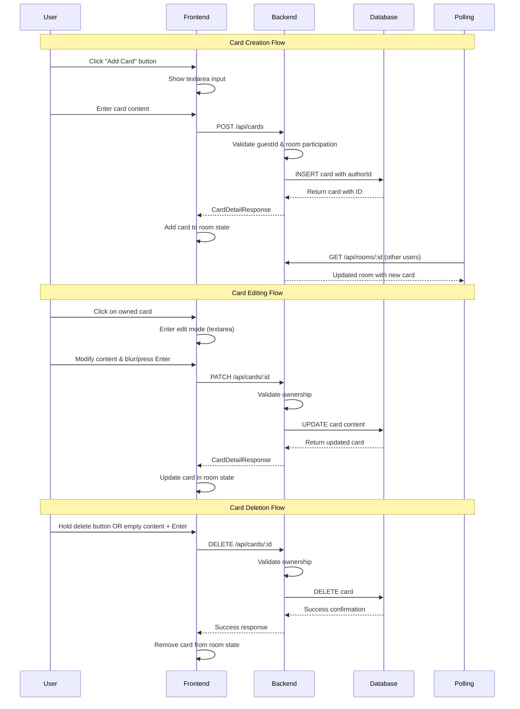

# Card CRUD Operations

The card CRUD system handles creating, reading, updating, and deleting
retrospective cards during the setup and writing phases. Cards are the
primary content units where participants capture their thoughts and feedback.

## Architecture Overview



## Database Schema

### Cards Table

```sql
CREATE TABLE cards (
  id UUID PRIMARY KEY DEFAULT gen_random_uuid(),
  column_id UUID NOT NULL REFERENCES columns(id) ON DELETE CASCADE,
  author_id UUID NOT NULL REFERENCES users(id) ON DELETE CASCADE,
  content TEXT NOT NULL,
  is_anonymous BOOLEAN NOT NULL DEFAULT true,
  sort_order INTEGER NOT NULL DEFAULT 0,
  created_at TIMESTAMP NOT NULL DEFAULT NOW(),
  updated_at TIMESTAMP NOT NULL DEFAULT NOW()
);

CREATE INDEX cards_column_id_idx ON cards(column_id);
CREATE INDEX cards_author_id_idx ON cards(author_id);
CREATE INDEX cards_sort_order_idx ON cards(column_id, sort_order);
```

**Key Fields:**

- `id`: Unique card identifier
- `column_id`: References the column this card belongs to
- `author_id`: References the user who created the card
- `content`: The card text content (required, non-empty)
- `is_anonymous`: Always `true` - cards appear anonymous to others
- `sort_order`: Position within the column (0-based)
- `created_at/updated_at`: Timestamps for audit trail

**Important Notes:**

- Cards are always anonymous (`is_anonymous: true`) but ownership is tracked for edit/delete permissions
- `sort_order` determines display order within columns
- Cascade deletes ensure cards are removed when columns or users are deleted

## Backend Implementation

### API Endpoints

#### Create Card

```http
POST /api/cards
Content-Type: application/json

{
  "columnId": "column-uuid",
  "content": "We should improve our testing process",
  "guestId": "guest-1704067200000-abc123"
}
```

**Response (201):**

```json
{
  "success": true,
  "data": {
    "id": "card-uuid",
    "content": "We should improve our testing process",
    "isAnonymous": true,
    "sortOrder": 3,
    "createdAt": "2024-01-01T00:00:00.000Z",
    "columnId": "column-uuid",
    "authorId": "user-uuid",
    "updatedAt": "2024-01-01T00:00:00.000Z",
    "isOwner": true
  }
}
```

#### Update Card

```http
PATCH /api/cards/:id
Content-Type: application/json

{
  "content": "We should significantly improve our testing process",
  "guestId": "guest-1704067200000-abc123"
}
```

**Response (200):**

```json
{
  "success": true,
  "data": {
    "id": "card-uuid",
    "content": "We should significantly improve our testing process",
    "isAnonymous": true,
    "sortOrder": 3,
    "createdAt": "2024-01-01T00:00:00.000Z",
    "columnId": "column-uuid",
    "authorId": "user-uuid",
    "updatedAt": "2024-01-01T00:05:00.000Z",
    "isOwner": true
  }
}
```

#### Delete Card

```http
DELETE /api/cards/:id
Content-Type: application/json

{
  "guestId": "guest-1704067200000-abc123"
}
```

**Response (200):**

```json
{
  "success": true,
  "message": "Card deleted successfully"
}
```

### Controller Implementation

Located in [`backend/src/controllers/cardController.ts`](../backend/src/controllers/cardController.ts):

#### Card Creation

```typescript
export const createCard = asyncHandler(async (req: Request, res: CustomResponse<CardDetailResponse>) => {
  const { columnId, content, guestId } = req.body as CreateCardRequest

  // Validation
  if (!columnId || !content?.trim() || !guestId) {
    res.status(400).json({
      success: false,
      error: 'Validation Error',
      message: 'Column ID, content, and guest ID are required'
    })
    return
  }

  try {
    // Resolve guest user
    const userId = await resolveGuestUser(guestId)

    // Verify column exists and get room info
    const column = await db.query.columns.findFirst({
      where: eq(columns.id, columnId),
      with: { room: true }
    })

    if (!column) {
      res.status(404).json({
        success: false,
        error: 'Not Found',
        message: 'Column not found'
      })
      return
    }

    // Validate user is a room participant
    const isParticipant = await validateRoomParticipant(userId, column.room.id)
    if (!isParticipant) {
      res.status(403).json({
        success: false,
        error: 'Authorization Error',
        message: 'You must be a room participant to create cards'
      })
      return
    }

    // Calculate next sort order
    const nextSortOrder = await calculateNextSortOrder(columnId)

    // Create card
    const newCard = await db
      .insert(cards)
      .values({
        columnId,
        authorId: userId,
        content: content.trim(),
        isAnonymous: true, // Always anonymous
        sortOrder: nextSortOrder
      })
      .returning()

    if (!newCard[0]) {
      throw new Error('Failed to create card')
    }

    res.status(201).json({
      success: true,
      data: {
        id: newCard[0].id,
        content: newCard[0].content,
        isAnonymous: newCard[0].isAnonymous,
        sortOrder: newCard[0].sortOrder,
        createdAt: newCard[0].createdAt.toISOString(),
        columnId: newCard[0].columnId,
        authorId: newCard[0].authorId,
        updatedAt: newCard[0].updatedAt.toISOString(),
        isOwner: true // Always true for creator
      }
    })
  } catch (error) {
    console.error('Failed to create card:', error)
    res.status(500).json({
      success: false,
      error: 'Internal Server Error',
      message: 'Failed to create card'
    })
  }
})
```

#### Card Update

```typescript
export const updateCard = asyncHandler(async (req: Request, res: CustomResponse<CardDetailResponse>) => {
  const cardId = req.params.id
  const { content, guestId } = req.body as UpdateCardRequest

  if (!cardId || !content?.trim() || !guestId) {
    res.status(400).json({
      success: false,
      error: 'Validation Error',
      message: 'Card ID, content, and guest ID are required'
    })
    return
  }

  try {
    const userId = await resolveGuestUser(guestId)

    // Validate card ownership
    const isOwner = await validateCardOwnership(cardId, userId)
    if (!isOwner) {
      res.status(403).json({
        success: false,
        error: 'Authorization Error',
        message: 'You can only edit your own cards'
      })
      return
    }

    // Update card
    const updatedCard = await db
      .update(cards)
      .set({
        content: content.trim(),
        updatedAt: new Date()
      })
      .where(eq(cards.id, cardId))
      .returning()

    if (!updatedCard[0]) {
      res.status(404).json({
        success: false,
        error: 'Not Found',
        message: 'Card not found'
      })
      return
    }

    res.status(200).json({
      success: true,
      data: {
        id: updatedCard[0].id,
        content: updatedCard[0].content,
        isAnonymous: updatedCard[0].isAnonymous,
        sortOrder: updatedCard[0].sortOrder,
        createdAt: updatedCard[0].createdAt.toISOString(),
        columnId: updatedCard[0].columnId,
        authorId: updatedCard[0].authorId,
        updatedAt: updatedCard[0].updatedAt.toISOString(),
        isOwner: true
      }
    })
  } catch (error) {
    console.error('Failed to update card:', error)
    res.status(500).json({
      success: false,
      error: 'Internal Server Error',
      message: 'Failed to update card'
    })
  }
})
```

#### Card Deletion

```typescript
export const deleteCard = asyncHandler(async (req: Request, res: CustomResponse) => {
  const cardId = req.params.id
  const { guestId } = req.body

  if (!cardId || !guestId) {
    res.status(400).json({
      success: false,
      error: 'Validation Error',
      message: 'Card ID and guest ID are required'
    })
    return
  }

  try {
    const userId = await resolveGuestUser(guestId)

    // Validate card ownership
    const isOwner = await validateCardOwnership(cardId, userId)
    if (!isOwner) {
      res.status(403).json({
        success: false,
        error: 'Authorization Error',
        message: 'You can only delete your own cards'
      })
      return
    }

    // Delete card
    const deletedCard = await db
      .delete(cards)
      .where(eq(cards.id, cardId))
      .returning()

    if (!deletedCard[0]) {
      res.status(404).json({
        success: false,
        error: 'Not Found',
        message: 'Card not found'
      })
      return
    }

    res.status(200).json({
      success: true,
      message: 'Card deleted successfully'
    })
  } catch (error) {
    console.error('Failed to delete card:', error)
    res.status(500).json({
      success: false,
      error: 'Internal Server Error',
      message: 'Failed to delete card'
    })
  }
})
```

### Ownership Validation

Located in [`backend/src/middleware/auth.ts`](../backend/src/middleware/auth.ts):

```typescript
export const validateCardOwnership = async (
  cardId: string,
  userId: string
): Promise<boolean> => {
  const card = await db.query.cards.findFirst({
    where: eq(cards.id, cardId)
  })

  return card?.authorId === userId
}
```

### Sort Order Management

Located in [`backend/src/utils/positionUtils.ts`](../backend/src/utils/positionUtils.ts):

```typescript
export const calculateNextSortOrder = async (columnId: string): Promise<number> => {
  const lastCard = await db.query.cards.findFirst({
    where: eq(cards.columnId, columnId),
    orderBy: desc(cards.sortOrder)
  })

  return lastCard ? lastCard.sortOrder + 1 : 0
}
```

**Important:** Phase restrictions are **not enforced server-side** for card CRUD operations. The API validates:

1. Valid `guestId` and room participation
2. Card ownership (for update/delete)
3. Non-empty content

Phase-based restrictions are implemented in the frontend UI only.

## Frontend Implementation

### Card Components

#### AddCardButton Component

Located in [`frontend/src/components/AddCardButton.tsx`](../frontend/src/components/AddCardButton.tsx):

```typescript
interface AddCardButtonProps {
  columnId: string
  columnColor: string
  onCreateCard: (columnId: string, content: string) => Promise<void>
  onCardCreated?: (card: CardDetailResponse) => void
  disabled?: boolean
}

export function AddCardButton({ 
  columnId, 
  columnColor, 
  onCreateCard, 
  disabled = false 
}: AddCardButtonProps) {
  const [isExpanded, setIsExpanded] = useState(false)
  const [content, setContent] = useState('')
  const [isLoading, setIsLoading] = useState(false)
  const textareaRef = useRef<HTMLTextAreaElement>(null)

  const handleSubmit = async () => {
    if (!content.trim() || isLoading) return

    setIsLoading(true)
    try {
      await onCreateCard(columnId, content.trim())
      setContent('')
      setIsExpanded(false)
    } catch (error) {
      console.error('Failed to create card:', error)
    } finally {
      setIsLoading(false)
    }
  }

  const handleKeyDown = (e: React.KeyboardEvent) => {
    if (e.key === 'Enter' && !e.shiftKey) {
      e.preventDefault()
      handleSubmit()
    } else if (e.key === 'Escape') {
      setContent('')
      setIsExpanded(false)
    }
  }

  if (!isExpanded) {
    return (
      <button
        onClick={() => setIsExpanded(true)}
        disabled={disabled}
        className="w-full p-3 border-2 border-dashed border-gray-300 rounded-lg text-gray-500 hover:border-gray-400 hover:text-gray-600 transition-colors disabled:opacity-50 disabled:cursor-not-allowed"
        style={{ borderColor: `${columnColor}40` }}
      >
        <PlusIcon className="w-4 h-4 mx-auto mb-1" />
        <Typography variant="body-sm">Add a card</Typography>
      </button>
    )
  }

  return (
    <div className="p-3 border-2 rounded-lg bg-white" style={{ borderColor: columnColor }}>
      <textarea
        ref={textareaRef}
        value={content}
        onChange={(e) => setContent(e.target.value)}
        onKeyDown={handleKeyDown}
        onBlur={handleSubmit}
        placeholder="What went well? What could be improved?"
        className="w-full resize-none border-none outline-none text-sm"
        rows={3}
        maxLength={500}
        autoFocus
      />
      
      <div className="flex justify-between items-center mt-2">
        <Typography variant="body-xs" color="neutral-500">
          {content.length}/500
        </Typography>
        
        <div className="flex gap-2">
          <Button
            variant="ghost"
            size="sm"
            onClick={() => {
              setContent('')
              setIsExpanded(false)
            }}
            disabled={isLoading}
          >
            Cancel
          </Button>
          <Button
            variant="primary"
            size="sm"
            onClick={handleSubmit}
            disabled={!content.trim() || isLoading}
          >
            {isLoading ? 'Adding...' : 'Add Card'}
          </Button>
        </div>
      </div>
    </div>
  )
}
```

#### RetroCard Component

Located in [`frontend/src/components/RetroCard.tsx`](../frontend/src/components/RetroCard.tsx):

```typescript
interface RetroCardProps {
  card: CardResponse & { isOwner?: boolean }
  columnColor: string
  onUpdate: (cardId: string, content: string) => Promise<void>
  onDelete: (cardId: string) => Promise<void>
  onEditStart?: (cardId: string) => void
  onEditEnd?: () => void
  disabled?: boolean
  showBlur?: boolean
  isDraggable?: boolean
}

export function RetroCard({
  card,
  columnColor,
  onUpdate,
  onDelete,
  onEditStart,
  onEditEnd,
  disabled = false,
  showBlur = true,
  isDraggable = false
}: RetroCardProps) {
  const [isEditing, setIsEditing] = useState(false)
  const [content, setContent] = useState(card.content)
  const [isLoading, setIsLoading] = useState(false)
  const textareaRef = useRef<HTMLTextAreaElement>(null)

  const handleCardClick = () => {
    if (!card.isOwner || disabled || isEditing) return
    
    setIsEditing(true)
    setContent(card.content)
    onEditStart?.(card.id)
    
    // Focus textarea after state update
    setTimeout(() => textareaRef.current?.focus(), 0)
  }

  const handleSave = async () => {
    if (isLoading) return

    const trimmedContent = content.trim()
    
    // Empty content triggers deletion
    if (!trimmedContent) {
      await handleDelete()
      return
    }

    // No changes, just exit edit mode
    if (trimmedContent === card.content) {
      setIsEditing(false)
      onEditEnd?.()
      return
    }

    setIsLoading(true)
    try {
      await onUpdate(card.id, trimmedContent)
      setIsEditing(false)
      onEditEnd?.()
    } catch (error) {
      console.error('Failed to update card:', error)
      // Reset content on error
      setContent(card.content)
    } finally {
      setIsLoading(false)
    }
  }

  const handleCancel = () => {
    setContent(card.content)
    setIsEditing(false)
    onEditEnd?.()
  }

  const handleKeyDown = (e: React.KeyboardEvent) => {
    if (e.key === 'Enter' && !e.shiftKey) {
      e.preventDefault()
      handleSave()
    } else if (e.key === 'Escape') {
      e.preventDefault()
      handleCancel()
    }
  }

  const handleDelete = async () => {
    if (isLoading) return

    setIsLoading(true)
    try {
      await onDelete(card.id)
    } catch (error) {
      console.error('Failed to delete card:', error)
    } finally {
      setIsLoading(false)
    }
  }

  return (
    <div
      className={`
        relative group bg-white rounded-lg border-2 shadow-sm transition-all duration-200
        ${isDraggable ? '' : (card.isOwner ? 'cursor-pointer hover:shadow-md' : 'cursor-default')}
        ${isEditing ? 'ring-2 ring-blue-500 shadow-md' : 'border-gray-200'}
      `}
      style={{
        borderLeftColor: columnColor,
        borderLeftWidth: '4px',
      }}
      onClick={card.isOwner ? handleCardClick : undefined}
    >
      {/* Delete button - only visible for owned cards */}
      {card.isOwner && !disabled && (
        <HoldToDeleteButton
          onDelete={handleDelete}
          disabled={isLoading}
          className="absolute top-2 right-2 opacity-0 group-hover:opacity-100 transition-opacity"
        />
      )}

      <div className="p-3">
        {isEditing ? (
          <div className="space-y-2">
            <textarea
              ref={textareaRef}
              value={content}
              onChange={(e) => setContent(e.target.value)}
              onKeyDown={handleKeyDown}
              onBlur={handleSave}
              className="w-full resize-none border-none outline-none text-sm"
              rows={Math.max(2, Math.ceil(content.length / 50))}
              maxLength={500}
              disabled={isLoading}
            />
            
            <div className="flex justify-between items-center">
              <Typography variant="body-xs" color="neutral-500">
                {content.length}/500
              </Typography>
              
              {isLoading && (
                <Typography variant="body-xs" color="neutral-500">
                  Saving...
                </Typography>
              )}
            </div>
          </div>
        ) : (
          <Typography 
            variant="body-sm" 
            className={`whitespace-pre-wrap ${
              showBlur && !card.isOwner ? 'blur-sm' : ''
            }`}
          >
            {card.content}
          </Typography>
        )}
      </div>
    </div>
  )
}
```

#### HoldToDeleteButton Component

Located in [`frontend/src/components/HoldToDeleteButton.tsx`](../frontend/src/components/HoldToDeleteButton.tsx):

```typescript
interface HoldToDeleteButtonProps {
  onDelete: () => void
  disabled?: boolean
  className?: string
}

export function HoldToDeleteButton({ 
  onDelete, 
  disabled = false, 
  className = '' 
}: HoldToDeleteButtonProps) {
  const [isHolding, setIsHolding] = useState(false)
  const [progress, setProgress] = useState(0)
  const timeoutRef = useRef<NodeJS.Timeout>()
  const intervalRef = useRef<NodeJS.Timeout>()

  const startHold = (e: React.MouseEvent) => {
    e.stopPropagation()
    e.preventDefault()
    
    if (disabled) return

    setIsHolding(true)
    setProgress(0)

    // Update progress every 50ms
    intervalRef.current = setInterval(() => {
      setProgress(prev => {
        const next = prev + (50 / 1000) // 1 second total
        return Math.min(next, 1)
      })
    }, 50)

    // Trigger delete after 1 second
    timeoutRef.current = setTimeout(() => {
      onDelete()
      cleanup()
    }, 1000)
  }

  const cleanup = () => {
    setIsHolding(false)
    setProgress(0)
    if (timeoutRef.current) {
      clearTimeout(timeoutRef.current)
    }
    if (intervalRef.current) {
      clearInterval(intervalRef.current)
    }
  }

  useEffect(() => {
    return cleanup
  }, [])

  return (
    <button
      onMouseDown={startHold}
      onMouseUp={cleanup}
      onMouseLeave={cleanup}
      onTouchStart={startHold}
      onTouchEnd={cleanup}
      disabled={disabled}
      className={`
        relative w-6 h-6 rounded-full bg-red-100 hover:bg-red-200 
        transition-colors flex items-center justify-center
        disabled:opacity-50 disabled:cursor-not-allowed
        ${className}
      `}
      style={{ zIndex: 10 }}
    >
      {/* Progress ring */}
      {isHolding && (
        <svg className="absolute inset-0 w-6 h-6 transform -rotate-90">
          <circle
            cx="12"
            cy="12"
            r="10"
            stroke="currentColor"
            strokeWidth="2"
            fill="none"
            className="text-red-500"
            strokeDasharray={`${progress * 62.83} 62.83`}
            style={{ transition: 'stroke-dasharray 50ms linear' }}
          />
        </svg>
      )}
      
      <TrashIcon className="w-3 h-3 text-red-600" />
    </button>
  )
}
```

### State Management in RetroPage

Located in [`frontend/src/pages/RetroPage.tsx`](../frontend/src/pages/RetroPage.tsx):

```typescript
export function RetroPage() {
  const [room, setRoom] = useState<DetailedRoomResponse | null>(null)
  const [editingCardId, setEditingCardId] = useState<string | null>(null)

  // Card CRUD handlers
  const handleCreateCard = async (columnId: string, content: string) => {
    if (!guestUser.guestId) return

    try {
      const newCard = await cardApi.createCard({
        columnId,
        content,
        guestId: guestUser.guestId
      })

      // Update room state with new card
      setRoom(prevRoom => {
        if (!prevRoom) return prevRoom

        return {
          ...prevRoom,
          columns: prevRoom.columns.map(col => 
            col.id === columnId
              ? {
                  ...col,
                  cards: [...col.cards, newCard].sort((a, b) => a.sortOrder - b.sortOrder)
                }
              : col
          )
        }
      })
    } catch (error) {
      console.error('Failed to create card:', error)
      throw error
    }
  }

  const handleUpdateCard = async (cardId: string, content: string) => {
    if (!guestUser.guestId) return

    try {
      const updatedCard = await cardApi.updateCard(cardId, {
        content,
        guestId: guestUser.guestId
      })

      // Update room state
      setRoom(prevRoom => {
        if (!prevRoom) return prevRoom

        return {
          ...prevRoom,
          columns: prevRoom.columns.map(col => ({
            ...col,
            cards: col.cards.map(card => 
              card.id === cardId ? { ...card, ...updatedCard } : card
            )
          }))
        }
      })
    } catch (error) {
      console.error('Failed to update card:', error)
      throw error
    }
  }

  const handleDeleteCard = async (cardId: string) => {
    if (!guestUser.guestId) return

    try {
      await cardApi.deleteCard(cardId, { guestId: guestUser.guestId })

      // Remove card from room state
      setRoom(prevRoom => {
        if (!prevRoom) return prevRoom

        return {
          ...prevRoom,
          columns: prevRoom.columns.map(col => ({
            ...col,
            cards: col.cards.filter(card => card.id !== cardId)
          }))
        }
      })
    } catch (error) {
      console.error('Failed to delete card:', error)
      throw error
    }
  }

  const handleCardEditStart = (cardId: string) => {
    setEditingCardId(cardId)
  }

  const handleCardEditEnd = () => {
    setEditingCardId(null)
  }

  // Render cards with phase-based restrictions
  return (
    <div className="retro-board">
      {room?.columns.map(column => (
        <div key={column.id} className="column">
          <h3>{column.title}</h3>
          
          {/* Add card button - only in setup/writing phases */}
          {(room.currentPhase === 'setup' || room.currentPhase === 'writing') && (
            <AddCardButton
              columnId={column.id}
              columnColor={column.color}
              onCreateCard={handleCreateCard}
              disabled={!guestUser.guestId}
            />
          )}
          
          {/* Existing cards */}
          {column.cards.map(card => (
            <RetroCard
              key={card.id}
              card={{
                ...card,
                // Override ownership display for non-writing phases
                isOwner: 
                  room.currentPhase === 'setup' || room.currentPhase === 'writing'
                    ? card.isOwner || false
                    : false
              }}
              columnColor={column.color}
              onUpdate={handleUpdateCard}
              onDelete={handleDeleteCard}
              onEditStart={handleCardEditStart}
              onEditEnd={handleCardEditEnd}
              disabled={
                !guestUser.guestId ||
                room.currentPhase === 'grouping' ||
                room.currentPhase === 'voting' ||
                room.currentPhase === 'discussing'
              }
              showBlur={room.currentPhase === 'setup' || room.currentPhase === 'writing'}
            />
          ))}
        </div>
      ))}
    </div>
  )
}
```

## Real-time Updates & Polling

### Room Polling Hook

Located in [`frontend/src/hooks/useRoomPolling.ts`](../frontend/src/hooks/useRoomPolling.ts):

```typescript
interface UseRoomPollingProps {
  roomId: string
  guestId: string
  enabled: boolean
  onUpdate: (room: DetailedRoomResponse) => void
  onError: (error: Error) => void
}

export function useRoomPolling({
  roomId,
  guestId,
  enabled,
  onUpdate,
  onError
}: UseRoomPollingProps) {
  useEffect(() => {
    if (!enabled || !roomId || !guestId) return

    const poll = async () => {
      try {
        const roomData = await roomApi.getRoomById(roomId, guestId)
        onUpdate(roomData)
      } catch (error) {
        onError(error instanceof Error ? error : new Error('Polling failed'))
      }
    }

    // Poll every 5 seconds
    const interval = setInterval(poll, 5000)

    // Pause polling when tab is hidden
    const handleVisibilityChange = () => {
      if (document.hidden) {
        clearInterval(interval)
      } else {
        // Resume polling when tab becomes visible
        const newInterval = setInterval(poll, 5000)
        // Immediate poll on visibility change
        poll()
      }
    }

    document.addEventListener('visibilitychange', handleVisibilityChange)

    return () => {
      clearInterval(interval)
      document.removeEventListener('visibilitychange', handleVisibilityChange)
    }
  }, [roomId, guestId, enabled, onUpdate, onError])
}
```

### Polling Integration with Edit Protection

```typescript
export function RetroPage() {
  const [editingCardId, setEditingCardId] = useState<string | null>(null)

  // Smart polling update that preserves active edits
  const handlePollingUpdate = useCallback((updatedRoom: DetailedRoomResponse) => {
    setRoom(prevRoom => {
      if (!prevRoom) return updatedRoom

      // If user is editing a card, preserve the local content
      if (editingCardId) {
        return {
          ...updatedRoom,
          columns: updatedRoom.columns.map(col => ({
            ...col,
            cards: col.cards.map(card => {
              if (card.id === editingCardId) {
                // Find the original card to preserve local content
                const originalCard = prevRoom.columns
                  .flatMap(c => c.cards)
                  .find(c => c.id === editingCardId)
                
                return originalCard ? { ...card, content: originalCard.content } : card
              }
              return card
            })
          }))
        }
      }

      return updatedRoom
    })
  }, [editingCardId])

  // Enable polling when room is loaded and not loading
  useRoomPolling({
    roomId: room?.id || '',
    guestId: guestUser.guestId || '',
    enabled: !!room && !isLoading,
    onUpdate: handlePollingUpdate,
    onError: (error) => {
      console.error('Room polling error:', error)
      // Don't show error to user for polling failures
    }
  })
}
```

## Phase-Based Restrictions

### Backend Phase Enforcement

**Important:** The backend does **not** currently enforce phase-based restrictions for card CRUD operations. The API validates:

1. **Authentication**: Valid `guestId` that resolves to a user
2. **Authorization**: Room participation for create, card ownership for update/delete
3. **Data validation**: Non-empty content, valid IDs

Phase restrictions are implemented entirely in the frontend.

### Frontend Phase Logic

```typescript
// Phase-based UI restrictions
const canCreateCards = room.currentPhase === 'setup' || room.currentPhase === 'writing'
const canEditCards = canCreateCards && !disabled
const shouldShowOwnership = canCreateCards
const shouldBlurNonOwnedCards = canCreateCards

// Add card button visibility
{canCreateCards && (
  <AddCardButton
    columnId={column.id}
    columnColor={column.color}
    onCreateCard={handleCreateCard}
    disabled={!guestUser.guestId}
  />
)}

// Card editing restrictions
<RetroCard
  card={{
    ...card,
    isOwner: shouldShowOwnership ? (card.isOwner || false) : false
  }}
  disabled={!canEditCards}
  showBlur={shouldBlurNonOwnedCards}
  // ... other props
/>
```

### Phase Transition Effects

When the room phase changes from writing to grouping:

1. **Add card buttons disappear** - No new cards can be created
2. **Edit mode disabled** - Existing cards become read-only
3. **Ownership hidden** - All cards appear anonymous (no blur, no edit affordances)
4. **Drag-and-drop enabled** - For facilitators only (covered in grouping documentation)

## Error Handling

### Backend Error Scenarios

| Scenario | HTTP Status | Response | Frontend Behavior |
|----------|-------------|----------|-------------------|
| Missing required fields | 400 | Validation error | Show field validation |
| Invalid guestId | 500 | Server error | Show generic error |
| User not room participant | 403 | Authorization error | Show permission error |
| Column not found | 404 | Not found | Show "column not found" |
| Card not found | 404 | Not found | Remove from UI |
| Not card owner | 403 | Authorization error | Show "not your card" |
| Empty content | 400 | Validation error | Trigger delete flow |
| Database error | 500 | Server error | Show retry option |

### Frontend Error Handling

```typescript
// Card creation error handling
const handleCreateCard = async (columnId: string, content: string) => {
  try {
    const newCard = await cardApi.createCard({ columnId, content, guestId })
    // Update UI optimistically after success
    updateRoomWithNewCard(newCard)
  } catch (error) {
    const status = (error as any)?.status
    
    switch (status) {
      case 403:
        showError('You do not have permission to create cards in this room')
        break
      case 404:
        showError('Column not found. Please refresh the page.')
        break
      default:
        showError('Failed to create card. Please try again.')
    }
    
    // Re-throw to let AddCardButton handle UI state
    throw error
  }
}

// Card update with optimistic updates
const handleUpdateCard = async (cardId: string, content: string) => {
  const originalCard = findCardById(cardId)
  
  try {
    // Optimistic update
    updateCardInUI(cardId, content)
    
    // API call
    const updatedCard = await cardApi.updateCard(cardId, { content, guestId })
    
    // Confirm update with server response
    updateCardInUI(cardId, updatedCard.content)
  } catch (error) {
    // Rollback optimistic update
    if (originalCard) {
      updateCardInUI(cardId, originalCard.content)
    }
    
    showError('Failed to update card')
    throw error
  }
}
```

### Validation Rules

#### Content Validation

- **Minimum**: 1 character (after trimming whitespace)
- **Maximum**: 500 characters
- **Empty content on save**: Triggers delete operation
- **Whitespace handling**: Leading/trailing whitespace trimmed

#### Permission Validation

- **Create**: Must be room participant
- **Update**: Must be card owner
- **Delete**: Must be card owner
- **Phase**: Frontend enforces setup/writing only

## Performance Considerations

### Optimistic Updates

The application uses optimistic updates for better perceived performance:

```typescript
// Create card - update UI immediately
const handleCreateCard = async (columnId: string, content: string) => {
  // Generate temporary ID for optimistic update
  const tempCard = {
    id: `temp-${Date.now()}`,
    content,
    columnId,
    isOwner: true,
    sortOrder: getNextSortOrder(columnId)
  }
  
  // Update UI immediately
  addCardToUI(tempCard)
  
  try {
    // API call
    const realCard = await cardApi.createCard({ columnId, content, guestId })
    
    // Replace temp card with real card
    replaceCardInUI(tempCard.id, realCard)
  } catch (error) {
    // Remove temp card on error
    removeCardFromUI(tempCard.id)
    throw error
  }
}
```

### Polling Optimization

- **5-second intervals** - Balance between real-time feel and server load
- **Tab visibility detection** - Pause polling when tab is hidden
- **Edit conflict resolution** - Preserve local edits during polling updates
- **Error resilience** - Polling errors don't break the main UI

### Memory Management

```typescript
// Cleanup intervals and event listeners
useEffect(() => {
  const interval = setInterval(poll, 5000)
  
  return () => {
    clearInterval(interval)
    // Cleanup prevents memory leaks
  }
}, [dependencies])
```

## Integration Points

### Authentication Integration

- All card operations require valid `guestId`
- Card ownership tied to user ID resolved from `guestId`
- Room participation validated for card creation

### Room Management Integration

- Cards belong to room columns
- Room phase controls card operation availability
- Room participants can create cards, only owners can edit/delete

### Grouping System Integration

- Cards can be moved to groups (facilitator-only, grouping phase)
- Grouped cards still maintain column association
- Card movement updates `columnId` and `sortOrder` fields

## Troubleshooting

### Common Issues

**Cards not saving**

- Check network connectivity
- Verify user is still authenticated (guestId valid)
- Ensure content is not empty after trimming
- Check if user is still a room participant

**Can't edit cards**

- Verify card ownership (isOwner flag)
- Check if room phase allows editing (setup/writing only)
- Ensure user is not in disabled state
- Confirm guestId matches card author

**Cards disappearing**

- Check for accidental deletion (empty content + Enter)
- Verify room participation status
- Check for network errors during operations
- Look for JavaScript errors in console

**Polling not working**

- Verify tab is visible (polling pauses when hidden)
- Check network connectivity
- Ensure guestId is valid
- Look for 403/404 errors in network tab

### Debug Commands

```javascript
// Check current user context
console.log('Guest User:', guestUser)

// Check room state
console.log('Room:', room)

// Check editing state
console.log('Editing Card ID:', editingCardId)

// Manually trigger room refresh
loadRoom()
```

### Database Queries

```sql
-- Check card ownership
SELECT c.id, c.content, c.author_id, u.display_name, u.guest_id
FROM cards c
JOIN users u ON c.author_id = u.id
WHERE c.id = 'card-uuid';

-- Check room participation
SELECT rp.role, u.display_name
FROM room_participants rp
JOIN users u ON rp.user_id = u.id
WHERE rp.room_id = 'room-uuid' AND u.guest_id = 'guest-id';

-- Check column cards
SELECT c.id, c.content, c.sort_order, c.created_at
FROM cards c
WHERE c.column_id = 'column-uuid'
ORDER BY c.sort_order;
```
