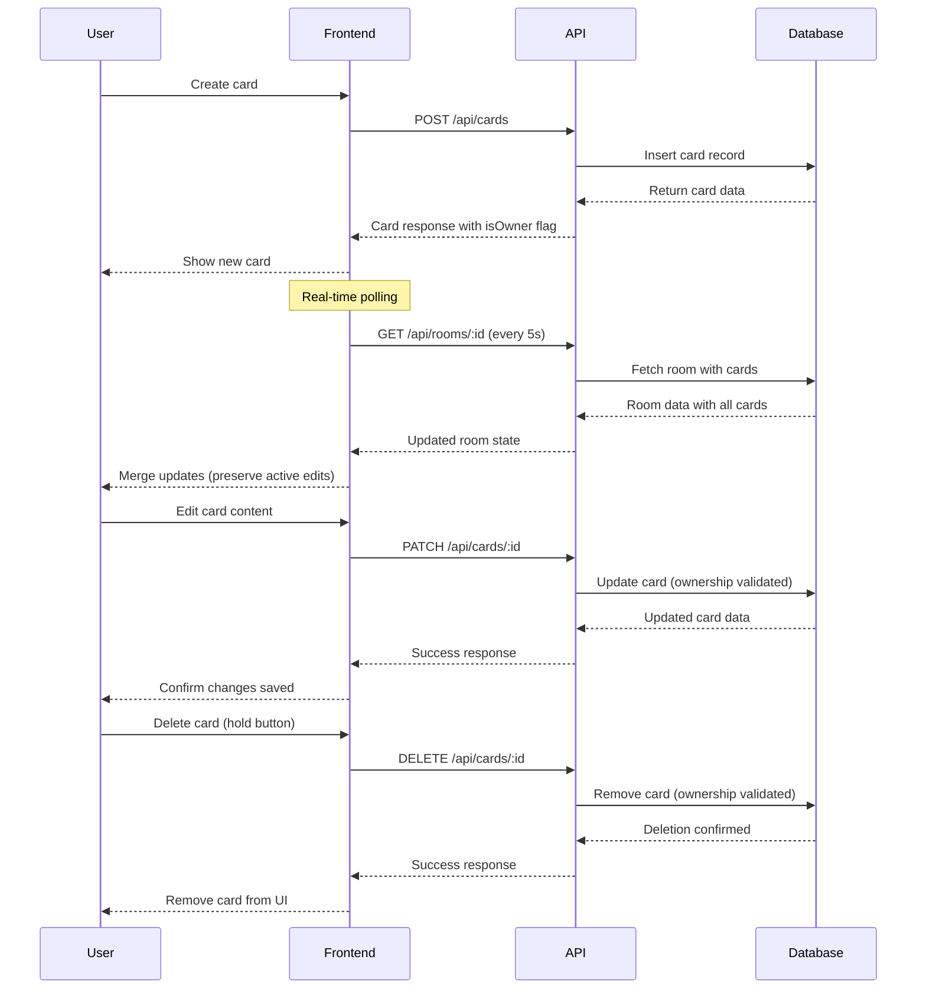

# Card CRUD Operations

The card CRUD system handles creating, reading, updating, and deleting
retrospective cards during the setup and writing phases. Cards are the
primary content units where participants capture their thoughts and feedback.

## Architecture Overview



## Database Schema

### Cards Table

- `id`: Unique card identifier (UUID)
- `columnId`: Reference to parent column
- `authorId`: Reference to card creator (internal user ID)
- `content`: Card text content (1-500 characters)
- `isAnonymous`: Always true (cards appear anonymous to others)
- `sortOrder`: Position within column for consistent ordering
- `groupId`: Reference to card group (null if not grouped)
- `createdAt`: Timestamp of card creation
- `updatedAt`: Timestamp of last modification

**Key Constraints:**

- Cards are always anonymous (isAnonymous = true)
- Content is required and limited to 500 characters
- Sort order maintained automatically for position management
- Group membership is exclusive (card in column OR group, not both)

## API Endpoints

### Create Card

```http
POST /api/cards
Content-Type: application/json
Authorization: Guest guest-1704067200000-abc123

{
  "columnId": "column-uuid",
  "content": "We should improve our testing process"
}
```

**Response (201):**

```json
{
  "success": true,
  "data": {
    "id": "card-uuid",
    "columnId": "column-uuid", 
    "content": "We should improve our testing process",
    "isOwner": true,
    "sortOrder": 3,
    "createdAt": "2024-01-01T00:00:00.000Z"
  }
}
```

**Errors:**

- `400`: Missing required fields (columnId, content, guestId)
- `403`: Phase restriction (not in setup/writing phase)
- `404`: Column not found or user not room participant
- `500`: Database error

### Update Card

```http
PATCH /api/cards/:id
Content-Type: application/json
Authorization: Guest guest-1704067200000-abc123

{
  "content": "We should improve our automated testing process"
}
```

**Response (200):**

```json
{
  "success": true,
  "data": {
    "id": "card-uuid",
    "columnId": "column-uuid",
    "content": "We should improve our automated testing process", 
    "isOwner": true,
    "sortOrder": 3,
    "updatedAt": "2024-01-01T00:05:00.000Z"
  }
}
```

**Errors:**

- `400`: Missing content or guestId
- `403`: Not card owner or phase restriction
- `404`: Card not found
- `500`: Database error

### Delete Card

```http
DELETE /api/cards/:id
Authorization: Guest guest-1704067200000-abc123
```

**Response (200):**

```json
{
  "success": true,
  "message": "Card deleted successfully"
}
```

**Errors:**

- `400`: Missing guestId
- `403`: Not card owner or phase restriction  
- `404`: Card not found
- `500`: Database error

## Backend Implementation

### Business Logic

**Card Creation:**

- Validates user is room participant through column ownership
- Enforces phase restrictions (setup and writing phases only)
- Automatically assigns sort order for consistent positioning
- Sets anonymous flag and links to author for ownership validation
- Returns card data with ownership flag for requesting user

**Card Updates:**

- Validates ownership before allowing modifications
- Enforces phase restrictions for editing permissions
- Handles empty content as deletion request (special case)
- Preserves card position and metadata during updates
- Updates modification timestamp automatically

**Card Deletion:**

- Validates ownership before allowing deletion
- Enforces phase restrictions for deletion permissions
- Removes card from any groups it belongs to
- Reorders remaining cards to maintain consistent positioning
- Handles group cleanup if card was last member

**Ownership Model:**

- Cards linked to internal user ID (not guest ID directly)
- Ownership determined by matching author ID to resolved user ID
- Cards appear anonymous to all users except the author
- Visual ownership indicated through `isOwner` flag in API responses

### Backend Implementation Files

- **Controller Logic:** [`backend/src/controllers/cardController.ts`](../backend/src/controllers/cardController.ts)
- **Position Management:** [`backend/src/utils/positionUtils.ts`](../backend/src/utils/positionUtils.ts)
- **Authorization Helpers:** [`backend/src/middleware/auth.ts`](../backend/src/middleware/auth.ts)

## Frontend Implementation

### Card Creation

**User Experience:**

- "Add Card" button appears in each column during setup/writing phases
- Click opens inline text input with auto-focus
- Enter key saves card, Escape cancels creation
- Loading state shown during API request
- New card appears immediately after successful creation

**Business Logic:**

- Validates user has guest credentials before allowing creation
- Submits card content with column ID and guest ID
- Handles creation errors with user-friendly messages
- Updates local state immediately upon successful API response
- Maintains card positioning within column automatically

### Card Editing

**User Experience:**

- Click card to enter edit mode (owner only)
- Text area expands to show full content
- Auto-save on blur (click away) or Enter key press
- Empty content triggers deletion confirmation
- Visual feedback during save operations

**Business Logic:**

- Only card owners can edit their cards (enforced by backend)
- Real-time validation of content length (500 character limit)
- Optimistic UI updates with rollback on API errors
- Special handling for empty content (triggers deletion)
- Preserves edit state during real-time polling updates

### Card Deletion

**User Experience:**

- Hold-to-delete button with progress indicator
- Appears on hover for card owners only
- Visual countdown (2-second hold) prevents accidental deletion
- Immediate removal from UI upon successful deletion
- Error handling with retry options

**Business Logic:**

- Progressive disclosure (button only visible to owners)
- Confirmation mechanism through hold-to-delete pattern
- Immediate UI updates upon successful API response
- Graceful error handling with user feedback
- Integration with real-time polling for consistency

### Real-time Updates

**Polling Mechanism:**

- Fetches updated room data every 5 seconds
- Pauses when browser tab not visible (Page Visibility API)
- Smart merging preserves user's active card edits
- Handles network errors gracefully without disrupting UX

**Edit Conflict Resolution:**

- Tracks which card user is currently editing
- Excludes active card from polling updates
- Preserves user input during concurrent modifications
- Resumes normal updates when user finishes editing

### Frontend Implementation Files

- **Card Components:** [`frontend/src/components/RetroCard.tsx`](../frontend/src/components/RetroCard.tsx), [`frontend/src/components/AddCardButton.tsx`](../frontend/src/components/AddCardButton.tsx)
- **Delete Component:** [`frontend/src/components/HoldToDeleteButton.tsx`](../frontend/src/components/HoldToDeleteButton.tsx)
- **Room Management:** [`frontend/src/pages/RetroPage.tsx`](../frontend/src/pages/RetroPage.tsx)
- **Polling Hook:** [`frontend/src/hooks/useRoomPolling.ts`](../frontend/src/hooks/useRoomPolling.ts)
- **API Client:** [`frontend/src/utils/api.ts`](../frontend/src/utils/api.ts)

## Phase-Based Restrictions

### Setup Phase

- **Card Creation**: ✅ Allowed
- **Card Editing**: ✅ Allowed (own cards only)
- **Card Deletion**: ✅ Allowed (own cards only)

### Writing Phase  

- **Card Creation**: ✅ Allowed
- **Card Editing**: ✅ Allowed (own cards only)
- **Card Deletion**: ✅ Allowed (own cards only)

### Grouping Phase

- **Card Creation**: ❌ Disabled (UI hidden)
- **Card Editing**: ❌ Disabled (cards become read-only)
- **Card Deletion**: ❌ Disabled (delete buttons hidden)
- **Card Movement**: ✅ Allowed (facilitators only)

### Voting Phase

- **Card Operations**: ❌ All disabled
- **Voting**: ✅ Enabled (future feature)

### Discussing Phase

- **Card Operations**: ❌ All disabled
- **Action Items**: ✅ Enabled (future feature)

**Implementation Note:** Phase restrictions are enforced in the frontend UI
only. Backend validates ownership and room participation but does not enforce
phase-based restrictions for simplicity.

## Error Handling

### Backend Error Scenarios

| Scenario | HTTP Status | Response | Frontend Behavior |
|----------|-------------|----------|-------------------|
| Missing required fields | 400 | Validation error | Show field error |
| Card not found | 404 | Not found | Remove from UI |
| Not card owner | 403 | Authorization error | Show permission error |
| Database error | 500 | Server error | Show retry option |

### Frontend Error Handling

**Error Classification:**

- **400 Errors**: Validation issues, show field-level error messages
- **403 Errors**: Permission denied, show access error with explanation
- **404 Errors**: Resource not found, remove from UI and show notification
- **500 Errors**: Server issues, show retry UI with error details

**Error Recovery:**

- Validation errors prevent form submission with inline feedback
- Permission errors show explanatory messages about ownership
- Network errors provide retry mechanisms with exponential backoff
- Optimistic updates rollback gracefully on API failures

## Validation Rules

### Content Validation

- **Minimum**: 1 character (after trimming whitespace)
- **Maximum**: 500 characters (enforced on frontend and backend)
- **Empty content**: Triggers deletion when submitted via Enter key
- **Whitespace**: Leading/trailing whitespace trimmed automatically

### Permission Validation

- **Create**: Must be room participant in setup or writing phase
- **Update**: Must be card owner in setup or writing phase
- **Delete**: Must be card owner in setup or writing phase
- **View**: All room participants can view all cards (anonymous)

### Phase Validation

- **Frontend**: UI elements hidden/disabled based on current phase
- **Backend**: Ownership validation only (no phase enforcement)
- **Facilitator**: Can move cards during grouping phase (separate API)

## Performance Considerations

### Database Optimization

- Indexed queries on columnId, authorId, and groupId for fast lookups
- Sort order maintained automatically for consistent positioning
- Bulk operations for position updates during card movement
- Efficient joins for room data fetching with card ownership flags

### Frontend Optimization

- Optimistic UI updates for immediate feedback
- Debounced auto-save to reduce API calls during typing
- Smart polling that preserves active user edits
- Component memoization to prevent unnecessary re-renders

### Real-time Efficiency

- Polling interval balances responsiveness with server load
- Tab visibility detection reduces unnecessary requests
- Efficient diffing algorithm for state merging
- Graceful degradation during network issues

## Integration with Other Features

### Authentication Integration

- All card operations require valid guest ID in request body
- Guest ID resolved to internal user ID for ownership validation
- Invalid credentials result in 500 errors for simplicity

### Room Management Integration

- Cards belong to room columns and inherit room access permissions
- Card visibility controlled by room participation
- Real-time updates delivered through room polling mechanism

### Grouping System Integration

- Cards can be moved to groups during grouping phase (facilitator only)
- Group membership is exclusive (card in column OR group)
- Position management handles both individual cards and grouped cards
- Card deletion from groups triggers automatic group cleanup

## Troubleshooting

**Cards not appearing**

- Check network connectivity
- Verify user is room participant
- Confirm room polling is active
- Look for JavaScript errors in console

**Cannot edit cards**

- Verify card ownership (isOwner flag should be true)
- Check current room phase (editing disabled after writing phase)
- Ensure guest user session is valid
- Confirm room participation status

**Cards disappearing unexpectedly**

- Check for accidental deletion (empty content + Enter key)
- Verify network connectivity for real-time updates
- Look for API errors in network tab
- Confirm room access permissions haven't changed

**Real-time updates not working**

- Verify tab is visible (polling pauses when hidden)
- Check network connectivity and API accessibility
- Confirm room ID is valid and accessible
- Look for polling errors in browser console
