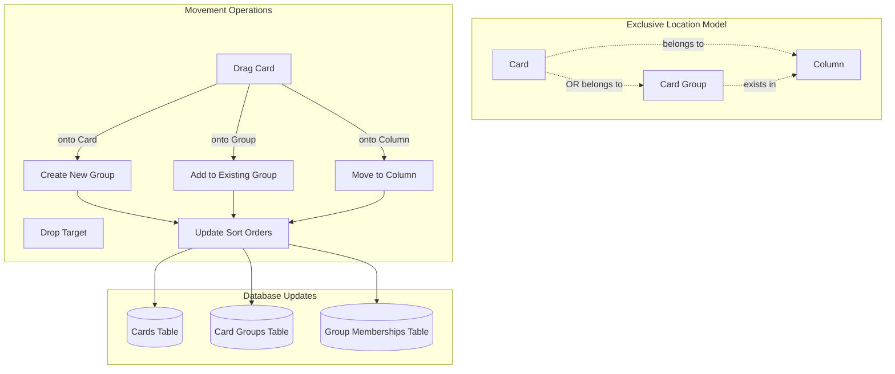
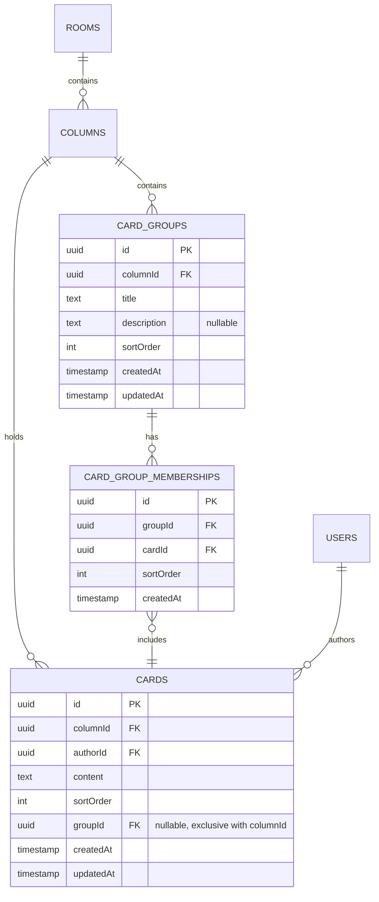

# Card Grouping & Movement

The card grouping system enables facilitators to organize cards during the
grouping phase using drag-and-drop interactions. This system supports creating
groups, moving cards between groups and columns, and managing the spatial
organization of retrospective content.

## Architecture Overview



## Entity Relationship Diagram



## API Endpoints

### Create Card Group

```http
POST /api/card-groups
Content-Type: application/json

{
  "columnId": "column-uuid",
  "title": "Communication Issues",
  "description": "Cards related to team communication",
  "cardIds": ["card-1-uuid", "card-2-uuid"],
  "guestId": "guest-1704067200000-abc123"
}
```

**Response (201):**

```json
{
  "success": true,
  "data": {
    "id": "group-uuid",
    "columnId": "column-uuid",
    "title": "Communication Issues",
    "description": "Cards related to team communication",
    "sortOrder": 0,
    "cards": [
      {
        "id": "card-1-uuid",
        "content": "Daily standups are too long",
        "sortOrder": 0
      },
      {
        "id": "card-2-uuid", 
        "content": "Need better async communication",
        "sortOrder": 1
      }
    ]
  }
}
```

### Update Group Title

```http
PATCH /api/card-groups/:id
Content-Type: application/json

{
  "title": "Communication & Collaboration",
  "guestId": "guest-1704067200000-abc123"
}
```

### Add Cards to Group

```http
POST /api/card-groups/:id/cards
Content-Type: application/json

{
  "cardIds": ["card-3-uuid", "card-4-uuid"],
  "guestId": "guest-1704067200000-abc123"
}
```

### Remove Cards from Group

```http
DELETE /api/card-groups/:id/cards
Content-Type: application/json

{
  "cardIds": ["card-3-uuid"],
  "guestId": "guest-1704067200000-abc123"
}
```

### Delete Group

```http
DELETE /api/card-groups/:id
Content-Type: application/json

{
  "guestId": "guest-1704067200000-abc123"
}
```

### Move Card Between Columns

```http
PATCH /api/cards/:id/move
Content-Type: application/json

{
  "targetColumnId": "target-column-uuid",
  "sortOrder": 2,
  "guestId": "guest-1704067200000-abc123"
}
```

### Update Card Position

```http
PATCH /api/cards/:id/position
Content-Type: application/json

{
  "sortOrder": 1,
  "guestId": "guest-1704067200000-abc123"
}
```

## Backend Implementation

### Business Logic

**Card Group Creation:**

- Validates facilitator role before allowing group operations
- Creates group record with title and optional description
- Moves specified cards from columns into the new group
- Updates card `columnId` to match group's column location
- Assigns sort orders for both group and member cards

**Group Management:**

- Title updates preserve group structure and card memberships
- Adding cards removes them from previous locations (columns or other groups)
- Removing cards returns them to the group's parent column
- Group deletion automatically returns all cards to parent column
- Empty groups are automatically deleted when last card is removed

**Card Movement:**

- Facilitator-only operations during grouping phase
- Cards can move between columns, groups, or individual positions
- Movement updates `columnId` to reflect new logical location
- Sort order recalculated to maintain consistent positioning
- Previous group memberships cleaned up automatically

**Exclusive Location Model:**

- Cards exist in EITHER a column's individual list OR exactly one group
- Groups exist within columns but cards in groups are not in column lists
- Moving cards updates `columnId` to match their current logical location
- Position management handles both individual cards and grouped cards

### Position Management

**Sort Order Calculation:**

- Cards and groups maintain separate sort order sequences within columns
- New items inserted at calculated positions to maintain order
- Bulk reordering operations minimize database updates
- Position conflicts resolved through automatic reordering

**Cross-Column Movement:**

- Cards can be grouped with cards from different columns
- Group location determined by drop target column
- Card `columnId` updated to match group's column
- Original column positions compacted after card removal

### Backend Implementation Files

- **Group Controller:** [`backend/src/controllers/cardGroupController.ts`](../backend/src/controllers/cardGroupController.ts)
- **Card Movement:** [`backend/src/controllers/cardController.ts`](../backend/src/controllers/cardController.ts)
  (moveCard, updateCardPosition)
- **Position Utilities:** [`backend/src/utils/positionUtils.ts`](../backend/src/utils/positionUtils.ts)
- **Authorization:** [`backend/src/middleware/auth.ts`](../backend/src/middleware/auth.ts)

## Frontend Implementation

### Drag and Drop System

**React DnD Integration:**

- Cards are draggable during grouping phase (facilitator only)
- Columns and groups serve as drop targets for card placement
- Visual feedback shows valid drop zones during drag operations
- Drag preview shows card content for clear identification

**Drop Target Logic:**

- **Card onto Card**: Creates new group with both cards
- **Card onto Group**: Adds card to existing group
- **Card onto Column**: Moves card to column (removes from group if needed)
- **Card onto Different Column**: Moves card and updates column association

### User Experience

**Visual Feedback:**

- Draggable cards show "grab" cursor when hovering (facilitator only)
- Drop zones highlight during drag operations
- Loading states shown during API operations
- Error messages displayed for failed operations

**Facilitator Controls:**

- Drag and drop enabled only for facilitators during grouping phase
- Phase controls allow facilitators to transition between phases
- Group creation happens automatically when cards are combined
- Group titles can be edited inline after creation

**Participant Experience:**

- Cards appear non-draggable for participants
- Group structure visible to all participants
- Real-time updates show grouping changes made by facilitators
- No group management controls visible to non-facilitators

### Error Handling

**Drag and Drop Errors:**

- Network failures during drop operations show retry options
- Invalid drop targets provide user-friendly error messages
- Failed operations rollback UI state to previous configuration
- Optimistic updates with graceful error recovery

**Permission Errors:**

- Non-facilitators see read-only view of grouped cards
- Phase restrictions communicated through UI state
- Authorization errors handled with explanatory messages

### Frontend Implementation Files

- **Draggable Cards:** [`frontend/src/components/DraggableCard.tsx`](../frontend/src/components/DraggableCard.tsx)
- **Drop Targets:** [`frontend/src/components/DroppableColumn.tsx`](../frontend/src/components/DroppableColumn.tsx), [`frontend/src/components/DroppableGroup.tsx`](../frontend/src/components/DroppableGroup.tsx)
- **Card Groups:** [`frontend/src/components/CardGroup.tsx`](../frontend/src/components/CardGroup.tsx)
- **Room Management:** [`frontend/src/pages/RetroPage.tsx`](../frontend/src/pages/RetroPage.tsx)

## Phase-Based Restrictions

### Setup & Writing Phases

- **Grouping**: ❌ Disabled (cards remain in individual columns)
- **Card CRUD**: ✅ Enabled (participants can create/edit/delete own cards)

### Grouping Phase

- **Card Creation**: ❌ Disabled (Add Card buttons hidden)
- **Card Editing**: ❌ Disabled (cards become read-only)
- **Card Deletion**: ❌ Disabled (delete buttons hidden)
- **Card Movement**: ✅ Enabled (facilitators only)
- **Group Management**: ✅ Enabled (facilitators only)

### Voting & Discussing Phases

- **All Card Operations**: ❌ Disabled
- **Group Structure**: ✅ Visible (read-only)

**Important:** The backend does **not** enforce phase restrictions (e.g.,
`currentPhase === 'grouping'`). Phase enforcement is handled entirely in the
frontend UI.

## Facilitator Permissions

### Authorization Model

- **Group Operations**: Facilitator role required for all group CRUD operations
- **Card Movement**: Facilitator role required for moving any cards
- **Phase Transitions**: Facilitator role required for changing room phases
- **Participant View**: All participants can view group structure (read-only)

### Role Validation

- Backend validates facilitator role before processing group operations
- Frontend UI shows/hides controls based on user's facilitator status
- Authorization failures return 403 errors with descriptive messages
- Role determination based on room participation records

## Performance Considerations

### Database Efficiency

- **Bulk Operations**: Position updates processed in batches
- **Indexed Queries**: Fast lookups on groupId, columnId, and sortOrder
- **Transaction Safety**: Group operations wrapped in database transactions
- **Cascading Updates**: Efficient cleanup when groups are deleted

### Frontend Optimization

- **Optimistic Updates**: Immediate UI feedback during drag operations
- **Smart Merging**: Real-time polling preserves drag state during updates
- **Component Memoization**: Prevents unnecessary re-renders during drag
- **Efficient Diffing**: Minimal DOM updates during state changes

### Real-time Synchronization

- **Polling Integration**: Group changes propagated through existing room polling
- **Conflict Resolution**: Active drag operations protected from polling updates
- **State Consistency**: UI state synchronized with backend after operations
- **Error Recovery**: Failed operations restore previous UI state

## Integration with Other Features

### Authentication Integration

- All grouping operations require valid guest ID in request body
- Guest ID resolved to internal user ID for facilitator validation
- Invalid credentials result in 500 errors for consistency

### Room Management Integration

- Grouping only available during grouping phase (frontend enforced)
- Phase transitions controlled by facilitators through room management
- Group structure persists across phase changes

### Card CRUD Integration

- Cards can be edited only during setup and writing phases
- Grouping phase disables card creation, editing, and deletion
- Card ownership remains intact when cards are moved to groups
- Real-time updates include both individual cards and grouped cards

## Troubleshooting

**Drag-and-drop not working**

- Check if user is a facilitator (only facilitators can move cards)
- Verify current phase is "grouping" (movement disabled in other phases)
- Ensure JavaScript is enabled and no console errors present
- Confirm React DnD is properly initialized

**Cards not moving between columns**

- Verify facilitator permissions for cross-column operations
- Check network connectivity for API requests
- Ensure target column exists and is accessible
- Look for authorization errors in network tab

**Groups not updating**

- Check facilitator role validation in backend logs
- Verify group operations are using correct API endpoints
- Ensure database transactions are completing successfully
- Confirm real-time polling is active and working

**Empty groups appearing**

- Groups are auto-deleted when no cards remain in them
- Check for race conditions in group membership updates
- Verify cleanup logic is executing after card removal
- Look for database constraint violations

**Cards appearing in multiple places**

- Frontend deduplication may be failing during state updates
- Check exclusive location model enforcement in backend
- Verify position management utilities are working correctly
- Ensure polling updates are merging state properly

## Database Migration

### Position Consistency

A migration utility is available to fix historical data inconsistencies:

```bash
npm run db:fix-positions
```

**What it fixes:**

1. Grouped cards have `columnId` matching their group's column
2. Sort orders are sequential and consistent within columns
3. Orphaned group memberships are cleaned up
4. Position conflicts are resolved automatically

**When to run:**

- After major grouping system updates
- When position inconsistencies are detected
- During database maintenance windows
- Before production deployments

### Implementation

The migration script handles:

1. Grouped cards have `columnId` matching their group's column
2. Sort orders recalculated for cards and groups within columns  
3. Orphaned memberships cleaned up
4. Position gaps eliminated through compaction

**Migration File:** [`backend/src/database/migrations/fix-card-positions.ts`](../backend/src/database/migrations/fix-card-positions.ts)
