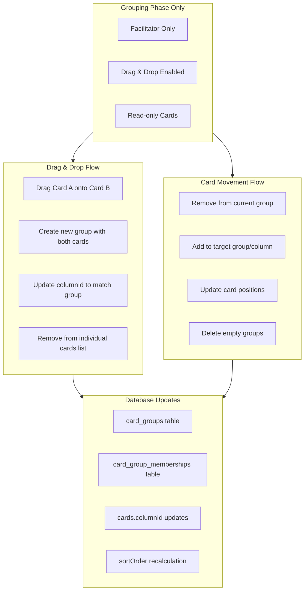
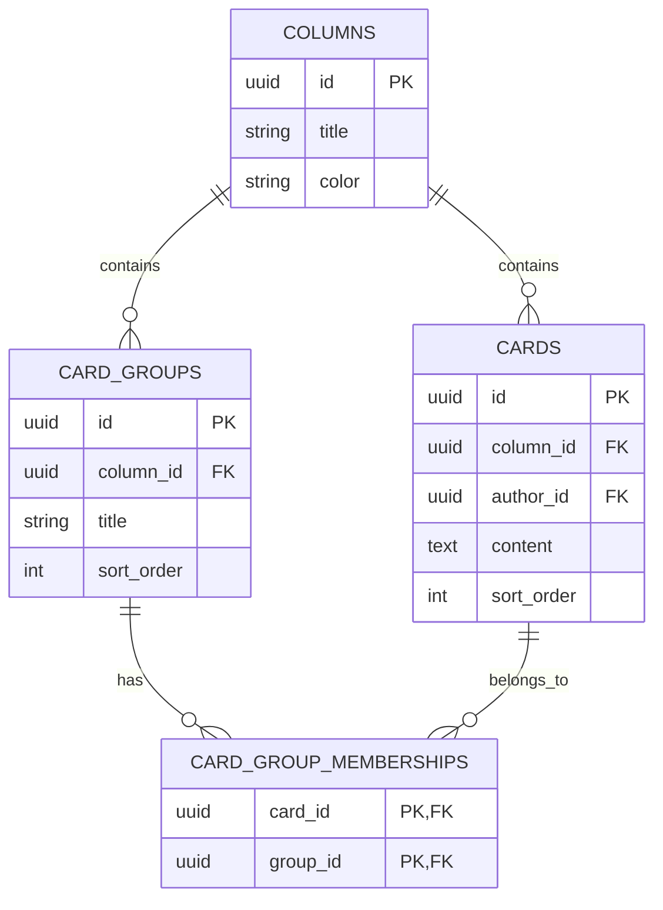

# Card Grouping & Movement

The card grouping system enables facilitators to organize cards during the
grouping phase using drag-and-drop interactions. This system supports creating
groups, moving cards between groups and columns, and managing the spatial
organization of retrospective content.

## Architecture Overview



## Database Schema

### Card Groups

```sql
CREATE TABLE card_groups (
  id UUID PRIMARY KEY DEFAULT gen_random_uuid(),
  column_id UUID NOT NULL REFERENCES columns(id) ON DELETE CASCADE,
  title VARCHAR(255),
  description TEXT,
  sort_order INTEGER NOT NULL DEFAULT 0,
  created_at TIMESTAMP NOT NULL DEFAULT NOW(),
  updated_at TIMESTAMP NOT NULL DEFAULT NOW()
);

CREATE INDEX card_groups_column_id_idx ON card_groups(column_id);
CREATE INDEX card_groups_sort_order_idx ON card_groups(column_id, sort_order);
```

### Card Group Memberships

```sql
CREATE TABLE card_group_memberships (
  card_id UUID NOT NULL REFERENCES cards(id) ON DELETE CASCADE,
  group_id UUID NOT NULL REFERENCES card_groups(id) ON DELETE CASCADE,
  joined_at TIMESTAMP NOT NULL DEFAULT NOW(),
  PRIMARY KEY (card_id, group_id)
);
```

### Exclusive Location Model

The system implements an "exclusive location" model where:

1. **Cards exist in exactly one location**: Either as individual cards in a column OR as members of a group
2. **Groups exist in columns**: Each group belongs to a specific column
3. **Card columnId synchronization**: When cards join a group, their `columnId` is updated to match the group's column
4. **Visual deduplication**: Frontend filters grouped cards from individual card lists



## Backend Implementation

### API Endpoints

#### Create Card Group

```http
POST /api/card-groups
Content-Type: application/json

{
  "columnId": "column-uuid",
  "title": "Performance Issues",
  "cardIds": ["card-1-uuid", "card-2-uuid"],
  "guestId": "guest-1704067200000-abc123"
}
```

**Response (201):**

```json
{
  "success": true,
  "data": {
    "id": "group-uuid",
    "columnId": "column-uuid",
    "title": "Performance Issues",
    "description": null,
    "sortOrder": 0,
    "cards": [
      {
        "id": "card-1-uuid",
        "content": "Database queries are slow",
        "isOwner": false,
        "columnId": "column-uuid"
      },
      {
        "id": "card-2-uuid", 
        "content": "Frontend bundle is large",
        "isOwner": true,
        "columnId": "column-uuid"
      }
    ],
    "createdAt": "2024-01-01T00:00:00.000Z"
  }
}
```

#### Update Group Title

```http
PATCH /api/card-groups/:id
Content-Type: application/json

{
  "title": "Critical Performance Issues",
  "guestId": "guest-1704067200000-abc123"
}
```

#### Add Cards to Group

```http
POST /api/card-groups/:id/cards
Content-Type: application/json

{
  "cardIds": ["card-3-uuid"],
  "guestId": "guest-1704067200000-abc123"
}
```

#### Remove Cards from Group

```http
DELETE /api/card-groups/:id/cards
Content-Type: application/json

{
  "cardIds": ["card-1-uuid"],
  "guestId": "guest-1704067200000-abc123"
}
```

#### Delete Group

```http
DELETE /api/card-groups/:id
Content-Type: application/json

{
  "guestId": "guest-1704067200000-abc123"
}
```

#### Move Card Between Columns

```http
PATCH /api/cards/:id/move
Content-Type: application/json

{
  "targetColumnId": "column-2-uuid",
  "targetPosition": 2,
  "guestId": "guest-1704067200000-abc123"
}
```

#### Update Card Position

```http
PATCH /api/cards/:id/position
Content-Type: application/json

{
  "sortOrder": 5,
  "guestId": "guest-1704067200000-abc123"
}
```

### Controller Implementation

#### Card Group Controller

Located in [`backend/src/controllers/cardGroupController.ts`](../backend/src/controllers/cardGroupController.ts):

```typescript
export const createCardGroup = asyncHandler(async (req: Request, res: CustomResponse<CardGroupResponse>) => {
  const { columnId, title, cardIds, guestId } = req.body as CreateCardGroupRequest

  // Validation
  if (!columnId || !cardIds?.length || !guestId) {
    res.status(400).json({
      success: false,
      error: 'Validation Error',
      message: 'Column ID, card IDs, and guest ID are required'
    })
    return
  }

  try {
    const userId = await resolveGuestUser(guestId)
    
    // Verify column exists and get room
    const column = await db.query.columns.findFirst({
      where: eq(columns.id, columnId),
      with: { room: true }
    })

    if (!column) {
      res.status(404).json({
        success: false,
        error: 'Not Found',
        message: 'Column not found'
      })
      return
    }

    // Validate facilitator role
    const isFacilitator = await validateFacilitatorRole(userId, column.room.id)
    if (!isFacilitator) {
      res.status(403).json({
        success: false,
        error: 'Authorization Error',
        message: 'Only facilitators can create card groups'
      })
      return
    }

    // Verify all cards exist and belong to the same room
    const cardsToGroup = await db.query.cards.findMany({
      where: inArray(cards.id, cardIds),
      with: { column: true }
    })

    if (cardsToGroup.length !== cardIds.length) {
      res.status(400).json({
        success: false,
        error: 'Validation Error',
        message: 'Some cards do not exist'
      })
      return
    }

    // Ensure all cards belong to the same room as the target column
    const invalidCards = cardsToGroup.filter(card => card.column.roomId !== column.room.id)
    if (invalidCards.length > 0) {
      res.status(400).json({
        success: false,
        error: 'Validation Error',
        message: 'Some cards do not belong to the specified room'
      })
      return
    }

    const result = await db.transaction(async (tx) => {
      // Create group
      const newGroup = await tx
        .insert(cardGroups)
        .values({
          columnId,
          title: title?.trim() || null,
          sortOrder: 0 // TODO: Calculate proper sort order
        })
        .returning()

      const group = newGroup[0]

      // Update cards' columnId to match group's column (exclusive location model)
      await tx
        .update(cards)
        .set({
          columnId: group.columnId,
          updatedAt: new Date()
        })
        .where(inArray(cards.id, cardIds))

      // Create memberships
      await tx
        .insert(cardGroupMemberships)
        .values(
          cardIds.map(cardId => ({
            cardId,
            groupId: group.id
          }))
        )

      // Fetch complete group data
      const completeGroup = await tx.query.cardGroups.findFirst({
        where: eq(cardGroups.id, group.id),
        with: {
          cards: {
            with: { author: true }
          }
        }
      })

      return completeGroup
    })

    if (!result) {
      throw new Error('Failed to create group')
    }

    res.status(201).json({
      success: true,
      data: transformCardGroupResponse(result, userId)
    })
  } catch (error) {
    console.error('Failed to create card group:', error)
    res.status(500).json({
      success: false,
      error: 'Internal Server Error',
      message: 'Failed to create card group'
    })
  }
})

export const addCardsToGroup = asyncHandler(async (req: Request, res: CustomResponse<CardGroupResponse>) => {
  const groupId = req.params.id
  const { cardIds, guestId } = req.body as AddCardsToGroupRequest

  try {
    const userId = await resolveGuestUser(guestId)

    // Get group with room info
    const group = await db.query.cardGroups.findFirst({
      where: eq(cardGroups.id, groupId),
      with: {
        column: { with: { room: true } }
      }
    })

    if (!group) {
      res.status(404).json({
        success: false,
        error: 'Not Found',
        message: 'Card group not found'
      })
      return
    }

    // Validate facilitator role
    const isFacilitator = await validateFacilitatorRole(userId, group.column.room.id)
    if (!isFacilitator) {
      res.status(403).json({
        success: false,
        error: 'Authorization Error',
        message: 'Only facilitators can modify card groups'
      })
      return
    }

    await db.transaction(async (tx) => {
      // Update cards' columnId to match the group's column (exclusive location model)
      await tx
        .update(cards)
        .set({
          columnId: group.columnId,
          updatedAt: new Date()
        })
        .where(inArray(cards.id, cardIds))

      // Add cards to group (onConflictDoNothing handles duplicates)
      await tx
        .insert(cardGroupMemberships)
        .values(
          cardIds.map(cardId => ({
            cardId,
            groupId
          }))
        )
        .onConflictDoNothing()
    })

    // Return updated group
    const updatedGroup = await getCompleteGroup(groupId)
    res.status(200).json({
      success: true,
      data: transformCardGroupResponse(updatedGroup, userId)
    })
  } catch (error) {
    console.error('Failed to add cards to group:', error)
    res.status(500).json({
      success: false,
      error: 'Internal Server Error',
      message: 'Failed to add cards to group'
    })
  }
})

export const removeCardsFromGroup = asyncHandler(async (req: Request, res: CustomResponse) => {
  const groupId = req.params.id
  const { cardIds, guestId } = req.body as RemoveCardsFromGroupRequest

  try {
    const userId = await resolveGuestUser(guestId)

    // Validate group exists and get room info
    const group = await db.query.cardGroups.findFirst({
      where: eq(cardGroups.id, groupId),
      with: {
        column: { with: { room: true } }
      }
    })

    if (!group) {
      res.status(404).json({
        success: false,
        error: 'Not Found',
        message: 'Card group not found'
      })
      return
    }

    // Validate facilitator role
    const isFacilitator = await validateFacilitatorRole(userId, group.column.room.id)
    if (!isFacilitator) {
      res.status(403).json({
        success: false,
        error: 'Authorization Error',
        message: 'Only facilitators can modify card groups'
      })
      return
    }

    await db.transaction(async (tx) => {
      // Remove cards from group
      await tx
        .delete(cardGroupMemberships)
        .where(
          and(
            eq(cardGroupMemberships.groupId, groupId),
            inArray(cardGroupMemberships.cardId, cardIds)
          )
        )

      // Check if group is now empty
      const remainingMemberships = await tx.query.cardGroupMemberships.findMany({
        where: eq(cardGroupMemberships.groupId, groupId)
      })

      // Auto-delete empty groups
      if (remainingMemberships.length === 0) {
        await tx.delete(cardGroups).where(eq(cardGroups.id, groupId))
      }
    })

    res.status(200).json({
      success: true,
      message: 'Cards removed from group successfully'
    })
  } catch (error) {
    console.error('Failed to remove cards from group:', error)
    res.status(500).json({
      success: false,
      error: 'Internal Server Error',
      message: 'Failed to remove cards from group'
    })
  }
})
```

#### Card Movement Controller

Located in [`backend/src/controllers/cardController.ts`](../backend/src/controllers/cardController.ts):

```typescript
export const moveCard = asyncHandler(async (req: Request, res: CustomResponse<CardDetailResponse>) => {
  const cardId = req.params.id
  const { targetColumnId, targetPosition, guestId } = req.body as MoveCardRequest

  if (!cardId || !targetColumnId || !guestId) {
    res.status(400).json({
      success: false,
      error: 'Validation Error',
      message: 'Card ID, target column ID, and guest ID are required'
    })
    return
  }

  try {
    const userId = await resolveGuestUser(guestId)

    // Get room ID from the card's current column
    const cardRoomId = await getRoomIdFromCard(cardId)
    if (!cardRoomId) {
      res.status(404).json({
        success: false,
        error: 'Not Found',
        message: 'Card not found'
      })
      return
    }

    // Validate user is a facilitator of the room
    const isFacilitator = await validateFacilitatorRole(userId, cardRoomId)
    if (!isFacilitator) {
      res.status(403).json({
        success: false,
        error: 'Authorization Error',
        message: 'Only facilitators can move cards during grouping phase'
      })
      return
    }

    // Validate target column is in the same room
    const targetRoomId = await getRoomIdFromColumn(targetColumnId)
    if (!targetRoomId || targetRoomId !== cardRoomId) {
      res.status(400).json({
        success: false,
        error: 'Validation Error',
        message: 'Target column must be in the same room as the card'
      })
      return
    }

    // Move card using position utilities
    await moveCardToColumn(cardId, targetColumnId, targetPosition)

    // Return updated card
    const updatedCard = await db.query.cards.findFirst({
      where: eq(cards.id, cardId),
      with: { author: true }
    })

    if (!updatedCard) {
      throw new Error('Card not found after move')
    }

    res.status(200).json({
      success: true,
      data: {
        id: updatedCard.id,
        content: updatedCard.content,
        isAnonymous: updatedCard.isAnonymous,
        sortOrder: updatedCard.sortOrder,
        createdAt: updatedCard.createdAt.toISOString(),
        columnId: updatedCard.columnId,
        authorId: updatedCard.authorId,
        updatedAt: updatedCard.updatedAt.toISOString(),
        isOwner: updatedCard.authorId === userId
      }
    })
  } catch (error) {
    console.error('Failed to move card:', error)
    res.status(500).json({
      success: false,
      error: 'Internal Server Error',
      message: 'Failed to move card'
    })
  }
})
```

### Position Management Utilities

Located in [`backend/src/utils/positionUtils.ts`](../backend/src/utils/positionUtils.ts):

```typescript
export const calculateNextSortOrder = async (columnId: string): Promise<number> => {
  const lastCard = await db.query.cards.findFirst({
    where: eq(cards.columnId, columnId),
    orderBy: desc(cards.sortOrder)
  })

  return lastCard ? lastCard.sortOrder + 1 : 0
}

export const reorderCards = async (columnId: string, cardIds: string[]): Promise<void> => {
  // Update sort order based on array index
  for (let i = 0; i < cardIds.length; i++) {
    await db
      .update(cards)
      .set({
        sortOrder: i,
        updatedAt: new Date()
      })
      .where(and(eq(cards.id, cardIds[i]), eq(cards.columnId, columnId)))
  }
}

export const insertCardAtPosition = async (
  cardId: string,
  columnId: string,
  position?: number
): Promise<void> => {
  if (position === undefined) {
    // Append to end
    const nextSortOrder = await calculateNextSortOrder(columnId)
    await db
      .update(cards)
      .set({
        columnId,
        sortOrder: nextSortOrder,
        updatedAt: new Date()
      })
      .where(eq(cards.id, cardId))
    return
  }

  // Shift existing cards at or after this position
  await db
    .update(cards)
    .set({
      sortOrder: sql`${cards.sortOrder} + 1`,
      updatedAt: new Date()
    })
    .where(and(
      eq(cards.columnId, columnId),
      gte(cards.sortOrder, position)
    ))

  // Insert card at position
  await db
    .update(cards)
    .set({
      columnId,
      sortOrder: position,
      updatedAt: new Date()
    })
    .where(eq(cards.id, cardId))
}

export const moveCardToColumn = async (
  cardId: string,
  targetColumnId: string,
  targetPosition?: number
): Promise<void> => {
  // Get current card info
  const card = await db.query.cards.findFirst({
    where: eq(cards.id, cardId)
  })

  if (!card) {
    throw new Error('Card not found')
  }

  const sourceColumnId = card.columnId

  await db.transaction(async (tx) => {
    // Insert into target column
    await insertCardAtPosition(cardId, targetColumnId, targetPosition)

    // Compact source column if different
    if (sourceColumnId !== targetColumnId) {
      await compactSortOrders(sourceColumnId)
    }
  })
}

export const compactSortOrders = async (columnId: string): Promise<void> => {
  const cardsInColumn = await db.query.cards.findMany({
    where: eq(cards.columnId, columnId),
    orderBy: asc(cards.sortOrder)
  })

  // Re-sequence to remove gaps
  for (let i = 0; i < cardsInColumn.length; i++) {
    if (cardsInColumn[i].sortOrder !== i) {
      await db
        .update(cards)
        .set({
          sortOrder: i,
          updatedAt: new Date()
        })
        .where(eq(cards.id, cardsInColumn[i].id))
    }
  }
}
```

## Frontend Implementation

### Drag and Drop System

The frontend uses `react-dnd` with the HTML5 backend for drag-and-drop functionality.

#### DndProvider Setup

Located in [`frontend/src/pages/RetroPage.tsx`](../frontend/src/pages/RetroPage.tsx):

```typescript
import { DndProvider } from 'react-dnd'
import { HTML5Backend } from 'react-dnd-html5-backend'

export function RetroPage() {
  return (
    <DndProvider backend={HTML5Backend}>
      <div className="retro-board">
        {/* Board content */}
      </div>
    </DndProvider>
  )
}
```

#### DraggableCard Component

Located in [`frontend/src/components/DraggableCard.tsx`](../frontend/src/components/DraggableCard.tsx):

```typescript
interface DraggableCardProps {
  id: string
  type: string
  isFacilitator: boolean
  isGroupingPhase: boolean
  onDropCard: (draggedCardId: string, targetCardId: string) => void
  children: React.ReactNode
}

export function DraggableCard({
  id,
  type,
  isFacilitator,
  isGroupingPhase,
  onDropCard,
  children
}: DraggableCardProps) {
  const [{ isDragging }, drag] = useDrag(() => ({
    type,
    item: { type, id },
    canDrag: isFacilitator && isGroupingPhase,
    collect: (monitor) => ({
      isDragging: monitor.isDragging()
    })
  }), [id, type, isFacilitator, isGroupingPhase])

  const [{ isOver }, drop] = useDrop(() => ({
    accept: type,
    drop: (item: DragItem) => {
      if (item.id !== id) {
        onDropCard(item.id, id)
      }
    },
    canDrop: (item: DragItem) => {
      return isFacilitator && isGroupingPhase && item.id !== id
    },
    collect: (monitor) => ({
      isOver: monitor.isOver() && monitor.canDrop()
    })
  }), [id, type, isFacilitator, isGroupingPhase, onDropCard])

  const dragDropRef = useRef<HTMLDivElement>(null)
  
  // Combine drag and drop refs
  drag(drop(dragDropRef))

  return (
    <div
      ref={dragDropRef}
      className={`
        ${isDragging ? 'opacity-50' : ''}
        ${isOver ? 'ring-2 ring-blue-400 ring-offset-2' : ''}
        ${isFacilitator && isGroupingPhase ? 'cursor-move' : ''}
        transition-all duration-200
      `}
    >
      {children}
    </div>
  )
}
```

#### DroppableColumn Component

Located in [`frontend/src/components/DroppableColumn.tsx`](../frontend/src/components/DroppableColumn.tsx):

```typescript
interface DroppableColumnProps {
  columnId: string
  isFacilitator: boolean
  isGroupingPhase: boolean
  onDropCard: (draggedCardId: string, targetColumnId: string) => void
  children: React.ReactNode
}

export function DroppableColumn({
  columnId,
  isFacilitator,
  isGroupingPhase,
  onDropCard,
  children
}: DroppableColumnProps) {
  const [{ isOver }, drop] = useDrop(() => ({
    accept: 'card',
    drop: (item: DragItem, monitor) => {
      // Only handle if not handled by nested drop targets
      if (!monitor.didDrop()) {
        onDropCard(item.id, columnId)
      }
    },
    canDrop: () => isFacilitator && isGroupingPhase,
    collect: (monitor) => ({
      isOver: monitor.isOver({ shallow: true }) && monitor.canDrop()
    })
  }), [columnId, isFacilitator, isGroupingPhase, onDropCard])

  return (
    <div
      ref={drop}
      className={`
        min-h-[200px] transition-colors duration-200
        ${isOver ? 'bg-blue-50 border-blue-300' : ''}
      `}
    >
      {children}
    </div>
  )
}
```

#### DroppableGroup Component

Located in [`frontend/src/components/DroppableGroup.tsx`](../frontend/src/components/DroppableGroup.tsx):

```typescript
interface DroppableGroupProps {
  groupId: string
  isFacilitator: boolean
  isGroupingPhase: boolean
  onDropCard: (draggedCardId: string, targetGroupId: string) => void
  children: React.ReactNode
}

export function DroppableGroup({
  groupId,
  isFacilitator,
  isGroupingPhase,
  onDropCard,
  children
}: DroppableGroupProps) {
  const [{ isOver }, drop] = useDrop(() => ({
    accept: 'card',
    drop: (item: DragItem) => {
      onDropCard(item.id, groupId)
    },
    canDrop: () => isFacilitator && isGroupingPhase,
    collect: (monitor) => ({
      isOver: monitor.isOver() && monitor.canDrop()
    })
  }), [groupId, isFacilitator, isGroupingPhase, onDropCard])

  return (
    <div
      ref={drop}
      className={`
        transition-colors duration-200
        ${isOver ? 'bg-green-50 border-green-300' : ''}
      `}
    >
      {children}
    </div>
  )
}
```

### CardGroup Component

Located in [`frontend/src/components/CardGroup.tsx`](../frontend/src/components/CardGroup.tsx):

```typescript
interface CardGroupProps {
  group: CardGroupResponse
  columnColor: string
  isFacilitator: boolean
  isGroupingPhase: boolean
  currentPhase: 'setup' | 'writing' | 'grouping' | 'voting' | 'discussing'
  onUpdateGroup: (groupId: string, title: string) => Promise<void>
  onDeleteGroup: (groupId: string) => Promise<void>
  onUpdateCard: (cardId: string, content: string) => Promise<void>
  onDeleteCard: (cardId: string) => Promise<void>
  onCardEditStart?: (cardId: string) => void
  onCardEditEnd?: () => void
  onDropCard?: (draggedCardId: string, targetCardId: string) => void
}

export function CardGroup({
  group,
  columnColor,
  isFacilitator,
  isGroupingPhase,
  currentPhase,
  onUpdateGroup,
  onDeleteGroup,
  onUpdateCard,
  onDeleteCard,
  onCardEditStart,
  onCardEditEnd,
  onDropCard
}: CardGroupProps) {
  const [isEditingTitle, setIsEditingTitle] = useState(false)
  const [title, setTitle] = useState(group.title || '')

  const handleTitleClick = () => {
    if (isFacilitator && isGroupingPhase) {
      setIsEditingTitle(true)
      setTimeout(() => inputRef.current?.focus(), 0)
    }
  }

  const handleTitleSave = async () => {
    if (!title.trim()) {
      setError('Group title cannot be empty')
      return
    }

    try {
      await onUpdateGroup(group.id, title.trim())
      setIsEditingTitle(false)
    } catch (error) {
      console.error('Failed to update group title:', error)
    }
  }

  const handleDeleteGroup = async () => {
    if (!isFacilitator || !isGroupingPhase) return

    const confirmed = window.confirm('Are you sure you want to delete this group? All cards will be ungrouped.')
    if (!confirmed) return

    try {
      await onDeleteGroup(group.id)
    } catch (error) {
      console.error('Failed to delete group:', error)
    }
  }

  return (
    <div
      className="bg-white rounded-lg border-2 shadow-sm p-4 space-y-3"
      style={{
        borderLeftColor: columnColor,
        borderLeftWidth: '4px',
        borderLeftStyle: 'solid'
      }}
    >
      {/* Group Header */}
      <div className="flex items-center justify-between">
        <div className="flex-1">
          {isEditingTitle ? (
            <Input
              value={title}
              onChange={(e) => setTitle(e.target.value)}
              onKeyDown={(e) => {
                if (e.key === 'Enter') handleTitleSave()
                if (e.key === 'Escape') setIsEditingTitle(false)
              }}
              onBlur={handleTitleSave}
              className="text-sm font-medium"
              placeholder="Enter group title..."
            />
          ) : (
            <h3
              className={`text-sm font-medium text-gray-900 ${
                isFacilitator && isGroupingPhase ? 'cursor-pointer hover:text-gray-700' : ''
              }`}
              onClick={handleTitleClick}
            >
              {group.title || 'Untitled Group'}
              {isFacilitator && isGroupingPhase && (
                <Edit2Icon className="inline-block w-3 h-3 ml-1 opacity-50" />
              )}
            </h3>
          )}
        </div>

        {/* Group Actions */}
        {isFacilitator && isGroupingPhase && (
          <Button
            variant="ghost"
            size="sm"
            onClick={handleDeleteGroup}
            className="h-6 w-6 p-0 text-gray-400 hover:text-red-600"
          >
            <Trash2Icon className="w-3 h-3" />
          </Button>
        )}
      </div>

      {/* Group Cards */}
      <div className="space-y-2">
        {group.cards.map((card) => (
          <DraggableCard
            key={card.id}
            id={card.id}
            type="card"
            isFacilitator={isFacilitator}
            isGroupingPhase={isGroupingPhase}
            onDropCard={onDropCard || (() => {})}
          >
            <RetroCard
              card={{
                ...card,
                isOwner: (currentPhase === 'setup' || currentPhase === 'writing') ? (card.isOwner || false) : false
              }}
              columnColor={columnColor}
              onUpdate={onUpdateCard}
              onDelete={onDeleteCard}
              onEditStart={onCardEditStart}
              onEditEnd={onCardEditEnd}
              disabled={currentPhase !== 'setup' && currentPhase !== 'writing'}
              showBlur={currentPhase === 'setup' || currentPhase === 'writing'}
              isDraggable={isFacilitator && isGroupingPhase}
            />
          </DraggableCard>
        ))}
      </div>

      {/* Group Info */}
      <div className="text-xs text-gray-500 border-t pt-2">
        {group.cards.length} card{group.cards.length !== 1 ? 's' : ''} in this group
      </div>
    </div>
  )
}
```

### Drag and Drop Orchestration

Located in [`frontend/src/pages/RetroPage.tsx`](../frontend/src/pages/RetroPage.tsx):

```typescript
export function RetroPage() {
  const [room, setRoom] = useState<DetailedRoomResponse | null>(null)
  const { guestUser } = useGuestUser()

  const isFacilitator = useMemo(() => {
    if (!room || !guestUser.userId) return false
    return room.participants.some(p => p.id === guestUser.userId && p.role === 'facilitator')
  }, [room, guestUser.userId])

  // Remove card from current group (if any)
  const removeCardFromCurrentGroup = async (cardId: string) => {
    if (!room) return

    // Find which group contains this card
    for (const column of room.columns) {
      for (const group of column.cardGroups) {
        if (group.cards.some(card => card.id === cardId)) {
          try {
            await cardGroupApi.removeCardsFromGroup(group.id, {
              cardIds: [cardId],
              guestId: guestUser.guestId!
            })
            return
          } catch (error) {
            console.error('Failed to remove card from group:', error)
          }
        }
      }
    }
  }

  // Handle card-to-card drops (create group or add to existing)
  const handleDropCard = async (draggedCardId: string, targetCardId: string) => {
    if (!isFacilitator || room?.currentPhase !== 'grouping' || !guestUser.guestId) return

    try {
      // Remove dragged card from current group
      await removeCardFromCurrentGroup(draggedCardId)

      // Find target card's location
      let targetGroup: CardGroupResponse | null = null
      let targetColumn: DetailedColumnResponse | null = null

      for (const column of room.columns) {
        // Check if target is in a group
        for (const group of column.cardGroups) {
          if (group.cards.some(card => card.id === targetCardId)) {
            targetGroup = group
            targetColumn = column
            break
          }
        }
        
        // Check if target is an individual card
        if (!targetGroup && column.cards.some(card => card.id === targetCardId)) {
          targetColumn = column
          break
        }
      }

      if (!targetColumn) return

      if (targetGroup) {
        // Add to existing group
        await cardGroupApi.addCardsToGroup(targetGroup.id, {
          cardIds: [draggedCardId],
          guestId: guestUser.guestId
        })
      } else {
        // Create new group with both cards
        await cardGroupApi.createCardGroup({
          columnId: targetColumn.id,
          title: 'New Group',
          cardIds: [targetCardId, draggedCardId],
          guestId: guestUser.guestId
        })
      }

      // Refresh room data
      await loadRoom()
    } catch (error) {
      console.error('Failed to handle card drop:', error)
      setError('Failed to move card. Please try again.')
    }
  }

  // Handle card drops on groups
  const handleDropCardOnGroup = async (draggedCardId: string, targetGroupId: string) => {
    if (!isFacilitator || room?.currentPhase !== 'grouping' || !guestUser.guestId) return

    try {
      // Remove from current group if different
      const currentGroup = room.columns
        .flatMap(col => col.cardGroups)
        .find(group => group.cards.some(card => card.id === draggedCardId))

      if (currentGroup && currentGroup.id !== targetGroupId) {
        await cardGroupApi.removeCardsFromGroup(currentGroup.id, {
          cardIds: [draggedCardId],
          guestId: guestUser.guestId
        })
      }

      // Add to target group
      await cardGroupApi.addCardsToGroup(targetGroupId, {
        cardIds: [draggedCardId],
        guestId: guestUser.guestId
      })

      await loadRoom()
    } catch (error) {
      console.error('Failed to add card to group:', error)
      setError('Failed to move card to group. Please try again.')
    }
  }

  // Handle card drops on columns
  const handleDropCardOnColumn = async (draggedCardId: string, targetColumnId: string) => {
    if (!isFacilitator || room?.currentPhase !== 'grouping' || !guestUser.guestId) return

    try {
      // Remove from current group
      await removeCardFromCurrentGroup(draggedCardId)

      // Find current card column
      const currentCard = room.columns
        .flatMap(col => col.cards)
        .find(card => card.id === draggedCardId)

      // Move to different column if needed
      if (currentCard && currentCard.columnId !== targetColumnId) {
        await cardApi.moveCard(draggedCardId, {
          targetColumnId,
          guestId: guestUser.guestId
        })
      }

      await loadRoom()
    } catch (error) {
      console.error('Failed to move card to column:', error)
      setError('Failed to move card to column. Please try again.')
    }
  }

  // Render with drag-and-drop wrappers
  return (
    <DndProvider backend={HTML5Backend}>
      <div className="retro-board">
        {room?.columns.map(column => (
          <Card key={column.id} className="h-fit">
            <DroppableColumn
              columnId={column.id}
              isFacilitator={isFacilitator}
              isGroupingPhase={room.currentPhase === 'grouping'}
              onDropCard={handleDropCardOnColumn}
            >
              <CardHeader style={{ backgroundColor: `${column.color}15` }}>
                <CardTitle>{column.title}</CardTitle>
              </CardHeader>
              
              <CardContent className="space-y-4 pt-6 pb-4">
                {/* Individual Cards */}
                <div className="space-y-3">
                  {column.cards
                    .filter(card => 
                      !column.cardGroups.some(group => 
                        group.cards.some(groupCard => groupCard.id === card.id)
                      )
                    )
                    .map(card => (
                      <DraggableCard
                        key={card.id}
                        id={card.id}
                        type="card"
                        isFacilitator={isFacilitator}
                        isGroupingPhase={room.currentPhase === 'grouping'}
                        onDropCard={handleDropCard}
                      >
                        <RetroCard
                          card={{
                            ...card,
                            isOwner: room.currentPhase === 'setup' || room.currentPhase === 'writing'
                              ? card.isOwner || false
                              : false
                          }}
                          columnColor={column.color}
                          onUpdate={handleUpdateCard}
                          onDelete={handleDeleteCard}
                          onEditStart={handleCardEditStart}
                          onEditEnd={handleCardEditEnd}
                          disabled={room.currentPhase !== 'setup' && room.currentPhase !== 'writing'}
                          showBlur={room.currentPhase === 'setup' || room.currentPhase === 'writing'}
                          isDraggable={isFacilitator && room.currentPhase === 'grouping'}
                        />
                      </DraggableCard>
                    ))}
                </div>

                {/* Card Groups */}
                <div className="space-y-4">
                  {column.cardGroups.map(group => (
                    <DroppableGroup
                      key={group.id}
                      groupId={group.id}
                      isFacilitator={isFacilitator}
                      isGroupingPhase={room.currentPhase === 'grouping'}
                      onDropCard={handleDropCardOnGroup}
                    >
                      <CardGroup
                        group={group}
                        columnColor={column.color}
                        isFacilitator={isFacilitator}
                        isGroupingPhase={room.currentPhase === 'grouping'}
                        currentPhase={room.currentPhase}
                        onUpdateGroup={handleUpdateGroup}
                        onDeleteGroup={handleDeleteGroup}
                        onUpdateCard={handleUpdateCard}
                        onDeleteCard={handleDeleteCard}
                        onCardEditStart={handleCardEditStart}
                        onCardEditEnd={handleCardEditEnd}
                        onDropCard={handleDropCard}
                      />
                    </DroppableGroup>
                  ))}
                </div>
              </CardContent>
            </DroppableColumn>
          </Card>
        ))}
      </div>
    </DndProvider>
  )
}
```

## Phase-Based Restrictions

### Backend Enforcement

All card grouping operations require **facilitator role validation**:

```typescript
// Validate facilitator role for all grouping operations
const isFacilitator = await validateFacilitatorRole(userId, roomId)
if (!isFacilitator) {
  res.status(403).json({
    success: false,
    error: 'Authorization Error',
    message: 'Only facilitators can modify card groups'
  })
  return
}
```

**Important:** The backend does **not** enforce phase restrictions (e.g.,
`currentPhase === 'grouping'`). Phase enforcement is handled entirely in the
frontend UI.

### Frontend Phase Logic

```typescript
// Drag-and-drop is only enabled during grouping phase for facilitators
const canDragDrop = isFacilitator && room.currentPhase === 'grouping'

// Pass to all drag-and-drop components
<DraggableCard
  isFacilitator={isFacilitator}
  isGroupingPhase={room.currentPhase === 'grouping'}
  // ...
/>

<DroppableColumn
  isFacilitator={isFacilitator}
  isGroupingPhase={room.currentPhase === 'grouping'}
  // ...
/>

// Card editing is disabled during grouping phase
<RetroCard
  disabled={room.currentPhase !== 'setup' && room.currentPhase !== 'writing'}
  // ...
/>
```

### Visual Feedback

During the grouping phase:

1. **Cards show grabby cursor** (`cursor-move`) for facilitators
2. **Drop zones highlight** when dragging over valid targets
3. **Cards are non-editable** (no click-to-edit, no delete buttons)
4. **All cards appear anonymous** (no ownership blur)
5. **Group titles are editable** by facilitators only

## Error Handling

### Backend Error Scenarios

| Scenario | HTTP Status | Response | Frontend Action |
|----------|-------------|----------|-----------------|
| Missing required fields | 400 | Validation error | Show validation message |
| Invalid guestId | 500 | Server error | Show generic error |
| Not a facilitator | 403 | Authorization error | Show permission error |
| Column/group not found | 404 | Not found | Show "not found" message |
| Cards from different rooms | 400 | Validation error | Show "invalid cards" message |
| Database error | 500 | Server error | Show retry option |
| Empty group auto-delete | 200 | Success | Update UI normally |

### Frontend Error Handling

```typescript
// Drag-and-drop error handling with user feedback
const handleDropCard = async (draggedCardId: string, targetCardId: string) => {
  try {
    // Remove from current group
    await removeCardFromCurrentGroup(draggedCardId)
    
    // Add to target location
    if (targetGroup) {
      await cardGroupApi.addCardsToGroup(targetGroup.id, { cardIds: [draggedCardId], guestId })
    } else {
      await cardGroupApi.createCardGroup({ columnId, title: 'New Group', cardIds: [targetCardId, draggedCardId], guestId })
    }
    
    // Refresh room
    await loadRoom()
  } catch (error) {
    const status = (error as any)?.status
    
    switch (status) {
      case 403:
        setError('You do not have permission to move cards. Only facilitators can group cards.')
        break
      case 404:
        setError('Card or group not found. Please refresh the page.')
        break
      case 400:
        setError('Cannot group cards from different rooms.')
        break
      default:
        setError('Failed to move card. Please try again.')
    }
    
    // Don't redirect user - show error and let them retry
    console.error('Drag-and-drop error:', error)
  }
}

// Group management error handling
const handleUpdateGroup = async (groupId: string, title: string) => {
  try {
    await cardGroupApi.updateCardGroup(groupId, { title, guestId })
    // Update local state optimistically
    updateGroupTitleInState(groupId, title)
  } catch (error) {
    console.error('Failed to update group title:', error)
    // Revert optimistic update
    revertGroupTitleInState(groupId)
    setError('Failed to update group title')
  }
}
```

## Performance Considerations

### Optimistic Updates

The system uses optimistic updates for better user experience:

```typescript
// Optimistic group creation
const handleCreateGroup = async (columnId: string, cardIds: string[]) => {
  // Create temporary group in UI
  const tempGroup = {
    id: `temp-${Date.now()}`,
    columnId,
    title: 'New Group',
    cards: cardIds.map(id => findCardById(id))
  }
  
  addGroupToUI(tempGroup)
  removeCardsFromIndividualList(cardIds)
  
  try {
    const realGroup = await cardGroupApi.createCardGroup({ columnId, title: 'New Group', cardIds, guestId })
    replaceGroupInUI(tempGroup.id, realGroup)
  } catch (error) {
    // Revert optimistic changes
    removeGroupFromUI(tempGroup.id)
    addCardsToIndividualList(cardIds)
    throw error
  }
}
```

### Drag Performance

```typescript
// Throttle drag events to prevent excessive re-renders
const throttledDragOver = useCallback(
  throttle((monitor: DropTargetMonitor) => {
    setIsOver(monitor.isOver() && monitor.canDrop())
  }, 16), // ~60fps
  []
)

// Use shallow comparison for drop targets
const [{ isOver }, drop] = useDrop(() => ({
  accept: 'card',
  collect: (monitor) => ({
    isOver: monitor.isOver({ shallow: true }) && monitor.canDrop()
  })
}))
```

### Memory Management

```typescript
// Cleanup drag-and-drop refs
useEffect(() => {
  return () => {
    if (dragRef.current) {
      dragRef.current = null
    }
    if (dropRef.current) {
      dropRef.current = null
    }
  }
}, [])
```

## Integration Points

### Authentication Integration

- All grouping operations require valid `guestId`
- Facilitator role validation for all mutations
- Room participation required for access

### Room Management Integration

- Grouping only available during grouping phase
- Phase transitions controlled by facilitators
- Room polling updates group state in real-time

### Card CRUD Integration

- Cards can be edited only during setup/writing phases
- Grouped cards maintain ownership but hide edit affordances
- Card deletion removes from groups automatically

## Troubleshooting

### Common Issues

**Drag-and-drop not working**

- Check if user is a facilitator
- Verify room is in grouping phase
- Ensure `DndProvider` wraps the component tree
- Check browser console for react-dnd errors

**Cards not moving between columns**

- Verify facilitator permissions
- Check if cards belong to the same room
- Ensure target column exists
- Look for network errors in browser dev tools

**Groups not updating**

- Check facilitator role validation
- Verify group still exists (may have been auto-deleted)
- Check for concurrent modifications
- Ensure WebSocket/polling is working

**Empty groups appearing**

- Groups are auto-deleted when last card is removed
- Check for race conditions in card removal
- Verify transaction integrity in backend

**Cards appearing in multiple places**

- Frontend deduplication may be failing
- Check exclusive location model implementation
- Verify `columnId` updates in database
- Look for stale state in frontend

### Debug Commands

```javascript
// Check drag-and-drop state
console.log('DnD Backend:', HTML5Backend)
console.log('Can drag:', isFacilitator && isGroupingPhase)

// Check room state
console.log('Room phase:', room?.currentPhase)
console.log('User role:', room?.participants.find(p => p.id === guestUser.userId)?.role)

// Check group memberships
room?.columns.forEach(col => {
  console.log(`Column ${col.title}:`, col.cards.length, 'individual cards')
  col.cardGroups.forEach(group => {
    console.log(`  Group "${group.title}":`, group.cards.length, 'cards')
  })
})
```

### Database Queries

```sql
-- Check card group memberships
SELECT 
  cg.title as group_title,
  c.content as card_content,
  c.column_id,
  cg.column_id as group_column_id
FROM card_groups cg
JOIN card_group_memberships cgm ON cg.id = cgm.group_id
JOIN cards c ON cgm.card_id = c.id
WHERE cg.column_id = 'column-uuid'
ORDER BY cg.title, c.created_at;

-- Check for orphaned memberships
SELECT cgm.* 
FROM card_group_memberships cgm
LEFT JOIN cards c ON cgm.card_id = c.id
LEFT JOIN card_groups cg ON cgm.group_id = cg.id
WHERE c.id IS NULL OR cg.id IS NULL;

-- Check exclusive location model compliance
SELECT 
  c.id,
  c.content,
  c.column_id,
  COUNT(cgm.group_id) as group_count,
  STRING_AGG(cg.title, ', ') as groups
FROM cards c
LEFT JOIN card_group_memberships cgm ON c.id = cgm.card_id
LEFT JOIN card_groups cg ON cgm.group_id = cg.id
WHERE c.column_id IN (SELECT id FROM columns WHERE room_id = 'room-uuid')
GROUP BY c.id, c.content, c.column_id
HAVING COUNT(cgm.group_id) > 1; -- Should return no results
```

### Migration Script

If data inconsistencies are found, use the migration script:

```bash
# Run the position fix migration
npm run db:fix-positions
```

This script ensures:

1. Grouped cards have `columnId` matching their group's column
2. Sort orders are properly calculated
3. No orphaned memberships exist
4. Group sort orders are set correctly
