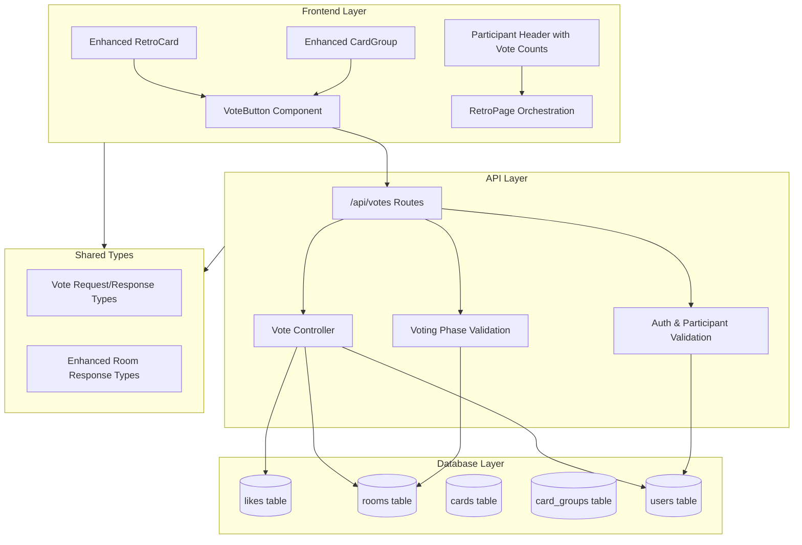
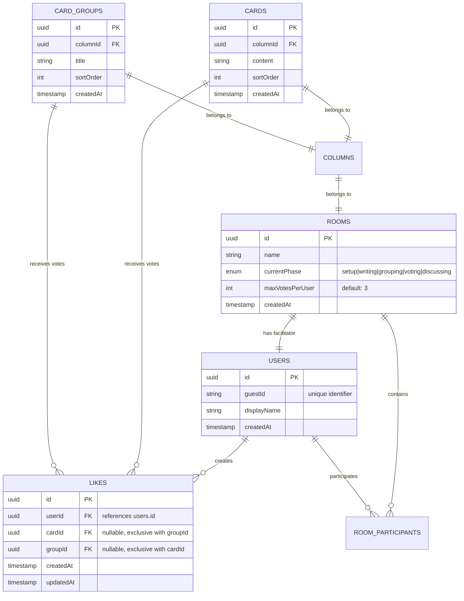
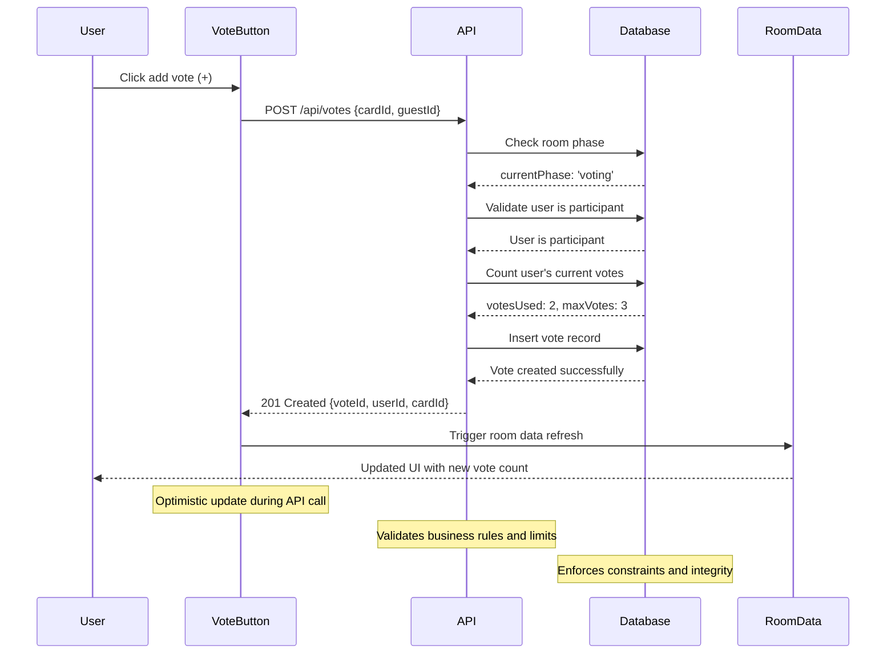

# Voting System

The voting system enables participants to vote on cards and groups during the voting phase, with configurable vote
limits and real-time tracking. Participants can cast multiple votes on the same target and redistribute votes by removing
and adding them elsewhere.

## Architecture Overview



## Entity Relationship Diagram



## API Endpoints

### Vote on Target

Cast a vote on a card or group during the voting phase.

```http
POST /api/votes
Content-Type: application/json
Authorization: Guest guest-1704067200000-abc123

{
  "cardId": "card-uuid-here"
}
```

**Response (201):**

```json
{
  "success": true,
  "data": {
    "id": "vote-uuid-here",
    "userId": "user-uuid-here",
    "cardId": "card-uuid-here",
    "createdAt": "2024-01-01T12:00:00.000Z"
  }
}
```

### Remove Vote from Target

Remove one vote from a card or group during the voting phase.

```http
DELETE /api/votes
Content-Type: application/json
Authorization: Guest guest-1704067200000-abc123

{
  "groupId": "group-uuid-here"
}
```

**Response (200):**

```json
{
  "success": true,
  "message": "Vote removed successfully"
}
```

### Vote Request Types

```typescript
// Vote on a card
{
  "cardId": "uuid"
}

// Vote on a group
{
  "groupId": "uuid"
}
```

## Database Schema

### Likes Table

The `likes` table stores all vote records with the following structure:

```sql
CREATE TABLE likes (
  id UUID PRIMARY KEY DEFAULT gen_random_uuid(),
  user_id UUID NOT NULL REFERENCES users(id) ON DELETE CASCADE,
  card_id UUID REFERENCES cards(id) ON DELETE CASCADE,
  group_id UUID REFERENCES card_groups(id) ON DELETE CASCADE,
  created_at TIMESTAMP WITH TIME ZONE DEFAULT NOW(),
  updated_at TIMESTAMP WITH TIME ZONE DEFAULT NOW(),
  
  -- Ensure exactly one target per vote (card XOR group)
  CONSTRAINT likes_single_target_check 
    CHECK ((card_id IS NOT NULL)::int + (group_id IS NOT NULL)::int = 1)
);

-- Indexes for performance
CREATE INDEX idx_likes_user_id ON likes(user_id);
CREATE INDEX idx_likes_card_id ON likes(card_id) WHERE card_id IS NOT NULL;
CREATE INDEX idx_likes_group_id ON likes(group_id) WHERE group_id IS NOT NULL;
CREATE INDEX idx_likes_created_at ON likes(created_at);
```

### Database Constraints

1. **Single Target Constraint**: Each vote must target exactly one entity (card OR group)
2. **Foreign Key Constraints**: All references maintain referential integrity
3. **Cascade Deletes**: Votes are automatically removed when cards/groups/users are deleted

## Frontend Components

### VoteButton Component

Reusable voting component that handles add/remove vote actions with visual feedback.

#### Visual States

- **No votes**: Single thumbs-up button
- **Has votes**: Three-element layout:
  - ➖ Remove button (left)
  - 👍 Vote count badge (center)
  - ➕ Add button (right, disabled if at vote limit)

### Enhanced RetroCard Component

Cards display vote buttons during voting phase and vote counts during discussion phase.

#### Phase-Based Behavior

- **Voting Phase**: Shows VoteButton (unless card is in a group)
- **Discussion Phase**: Shows total vote count with rankings (anonymous)
- **Other Phases**: No vote-related UI

### Enhanced CardGroup Component

Groups display vote buttons for the entire group and prevent individual card voting.

#### Group Voting Rules

- Vote button appears on group header during voting phase
- Individual cards within groups show "Vote on group instead" message
- Group vote counts are displayed during discussion phase

## Business Logic

### Voting Rules

1. **Phase Restriction**: Votes can only be cast/removed during the 'voting' phase
2. **Participant Only**: Only room participants can vote
3. **Target Exclusivity**: Users vote on cards OR groups, not cards within groups
4. **Multiple Votes**: Users can cast multiple votes on the same target
5. **Vote Limits**: Users cannot exceed their `maxVotesPerUser` limit
6. **Vote Redistribution**: Users can remove votes to add them elsewhere

### Privacy & Security

- **User ID Anonymization**: Vote responses have `userId` field removed for privacy
- **Header Authentication**: All vote operations require `Authorization: Guest <guestId>` header
- **Room Participation Validation**: Middleware ensures users can only vote in rooms they've joined
- **Phase Enforcement**: Voting middleware validates room is in 'voting' phase before allowing operations

### Vote Limit Enforcement

Vote limits are enforced both on the backend (preventing API calls when at limit) and frontend (disabling vote
buttons when at limit).

### Vote Display Rules

| Phase | Vote Counts Shown | User Vote Counts | Participant Totals |
|-------|-------------------|------------------|-------------------|
| Setup/Writing/Grouping | ❌ Hidden | ❌ Hidden | ❌ Hidden |
| Voting | ❌ Hidden | ✅ Own votes only | ✅ Votes used/remaining |
| Discussion | ✅ All totals with rankings | ❌ Hidden (anonymous) | ✅ Final totals |

## Vote Flow Sequence



## Error Scenarios

### Phase Validation Errors

**Error**: Voting outside voting phase

```json
{
  "success": false,
  "error": "Invalid Phase",
  "message": "Voting is only allowed during the voting phase. Current phase: grouping"
}
```

**Recovery**: Wait for facilitator to transition to voting phase

### Vote Limit Errors

**Error**: Exceeding vote limit

```json
{
  "success": false,
  "error": "Max Votes Exceeded",
  "message": "You have used all 3 of your votes. Remove a vote before adding a new one."
}
```

**Recovery**: Remove existing votes before adding new ones

### Authorization Errors

**Error**: Non-participant voting

```json
{
  "success": false,
  "error": "Authorization Error", 
  "message": "You must be a participant in this room to vote"
}
```

**Recovery**: Join the room as a participant

### Target Validation Errors

**Error**: Voting on card within group

```json
{
  "success": false,
  "error": "Validation Error",
  "message": "Cannot vote on cards within groups. Vote on the group instead."
}
```

**Recovery**: Vote on the parent group instead

## Error Handling Strategy

| Error Type | Status Code | Frontend Handling | User Experience |
|------------|-------------|-------------------|-----------------|
| Phase Invalid | 409 | Show phase message | "Wait for voting phase" |
| Max Votes | 403 | Disable add buttons | "Remove votes first" |
| Not Participant | 403 | Show join prompt | "Join room to vote" |
| Card in Group | 400 | Hide card vote button | "Vote on group instead" |
| Network Error | - | Retry mechanism | "Retrying..." |

## Testing Approach

### Unit Tests

- Vote validation logic (phase restrictions, vote limits, participant validation)
- Vote count calculations and aggregation
- Business rule enforcement (cards in groups, target validation)
- Error handling scenarios

### Integration Tests

- Complete voting workflow from API perspective
- Database constraints and integrity
- Phase transition behavior during voting
- Concurrent voting scenarios and conflict resolution

### User Acceptance Tests

1. **Vote Casting**: Participants can vote on cards and groups
2. **Vote Limits**: System prevents exceeding vote limits
3. **Vote Redistribution**: Users can move votes between targets
4. **Phase Restrictions**: Voting only works in voting phase
5. **Group Rules**: Cards in groups cannot be voted on individually
6. **Real-time Updates**: Vote counts update for all participants

## Performance Considerations

### Database Optimization

- **Indexes**: Optimized queries on `user_id`, `card_id`, `group_id`
- **Constraints**: Database-level validation prevents invalid data
- **Cascading Deletes**: Automatic cleanup when entities are removed

### Frontend Optimization

- **Optimistic Updates**: Immediate UI feedback during API calls
- **Efficient Polling**: Room data refresh includes all vote information
- **Component Memoization**: Prevent unnecessary re-renders

### API Efficiency

- **Batch Operations**: Room data includes all vote information in single request
- **Minimal Payloads**: Only essential data in vote requests/responses
- **Caching Strategy**: Vote counts cached within room data structure

## Security Considerations

### Input Validation

- **Target Validation**: Ensure card/group exists and belongs to room
- **User Authorization**: Verify user is room participant
- **Phase Validation**: Enforce voting phase restrictions
- **Rate Limiting**: Prevent vote spam attacks

### Data Integrity

- **Database Constraints**: Prevent invalid vote records
- **Transaction Safety**: Atomic vote operations
- **Audit Trail**: Vote creation timestamps for tracking
- **Referential Integrity**: Cascading deletes maintain consistency

## Migration Guide

### Database Migration

Apply vote constraints with `npm run db:allow-multiple-votes` and verify with `npm run db:studio`.

### Feature Rollout

1. **Deploy Backend**: Vote API endpoints with phase validation
2. **Deploy Frontend**: Enhanced components with voting UI
3. **Test Integration**: Verify voting workflow end-to-end
4. **Monitor Performance**: Track vote API response times
5. **Gather Feedback**: User experience with voting system

## Troubleshooting

### Common Issues

**Issue**: Vote buttons not appearing

- **Check**: Room is in voting phase
- **Check**: User is room participant
- **Check**: Card is not in a group (for card votes)

**Issue**: Cannot add votes

- **Check**: User has remaining votes (`votesRemaining > 0`)
- **Check**: API returns 403 for vote limit exceeded
- **Solution**: Remove existing votes first

**Issue**: Vote counts not updating

- **Check**: Room data polling is active
- **Check**: Network connectivity for API calls
- **Solution**: Refresh room data manually

### Debug Information

Key debugging points:

- Check user vote status (used, remaining, max votes)
- Verify room is in correct phase for voting
- Inspect vote button state (userVotes, canAddVote, disabled)
- Monitor API responses for error details
