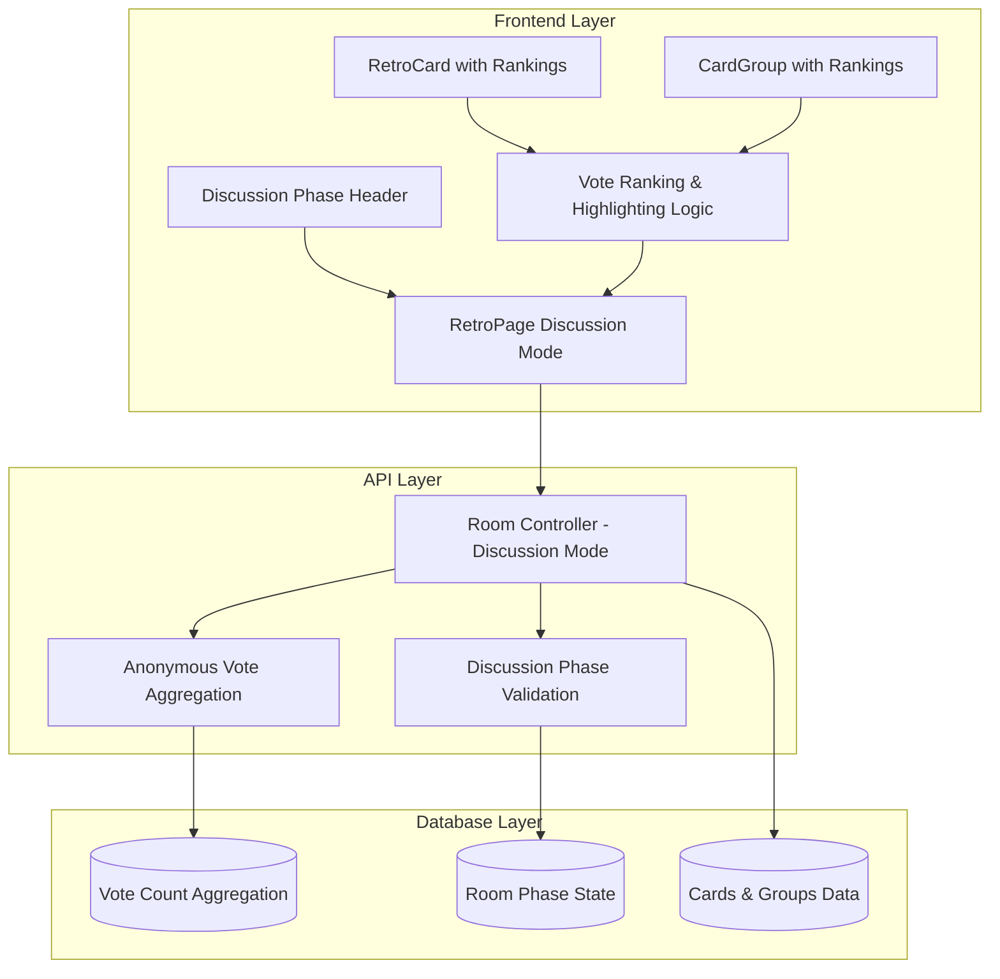
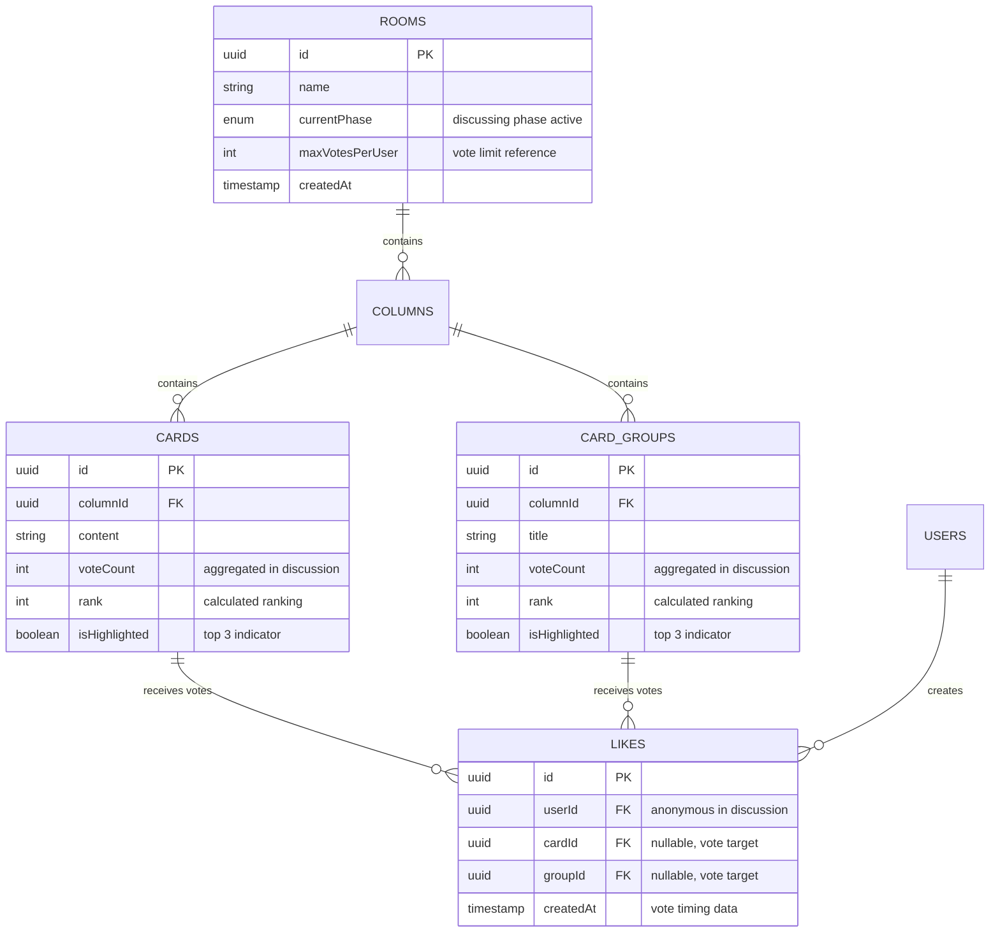

# Discussion Phase

The discussion phase displays voting results with anonymous vote totals and visual highlighting of top-voted items.
This phase enables teams to focus their discussion on the most important topics identified through voting, while
maintaining complete anonymity of individual votes.

## Architecture Overview



## Entity Relationship Diagram



## Discussion Phase Features

### Vote Result Display

**Anonymous Vote Totals**

- Displays aggregate vote counts for all cards and groups
- Shows "0 votes" for items with no votes
- Maintains complete anonymity (no individual vote information)

**Visual Ranking System**

- **🥇 First Place**: Gold highlighting with yellow background and border
- **🥈 Second Place**: Silver highlighting with gray background and border
- **🥉 Third Place**: Bronze highlighting with orange background and border

**Tie Handling**

- Multiple items can share the same rank
- If 4 items tie for 1st place → all 4 highlighted as 1st, no other highlights
- If 1 item is 1st and 3 items tie for 2nd → 1st place + all 3 tied for 2nd highlighted
- Consistent ranking logic across all scenarios

### Discussion Phase Header

The discussion phase header provides context and statistics including voting completion status, total votes cast,
number of items to discuss, and visual indicators for highlighted items.

### UI Components

**Enhanced RetroCard**

- Prominent vote count display (`text-sm font-semibold`)
- Ranking badges with emojis and rank numbers
- Visual highlighting with colored borders and backgrounds
- Anonymous display (no "You voted X times" in discussion phase)

**Enhanced CardGroup**

- Similar styling to RetroCard for consistency
- Group-level vote aggregation and ranking
- Cards within groups show no individual vote counts

## API Integration

### Room Data Response (Discussion Phase)

When `currentPhase === 'discussing'`, the room API returns:

```typescript
interface DiscussionPhaseCard {
  id: string
  content: string
  // ... other card properties
  voteCount: number  // Always present, including 0
  // userVotes: NOT included for anonymity
}

interface DiscussionPhaseGroup {
  id: string
  title: string
  // ... other group properties
  voteCount: number  // Always present, including 0
  // userVotes: NOT included for anonymity
  cards: DiscussionPhaseCard[]
}
```

**Implementation**: See [`backend/src/controllers/roomController.ts`](../backend/src/controllers/roomController.ts)

### Vote Count Aggregation

The backend aggregates votes by querying all votes for cards/groups in the current room, grouping by target,
counting total votes per target, including zero counts for items with no votes, and excluding user-specific
vote information to maintain anonymity.

**Key Features:**

- Always includes vote counts (even 0 votes) for consistent UI display
- Excludes individual user voting information
- Aggregates at room level to ensure accurate counts
- Maintains referential integrity with cards and groups

**Implementation**: See vote aggregation logic in [`backend/src/controllers/roomController.ts`](../backend/src/controllers/roomController.ts)

## Frontend Implementation

### Vote Ranking Logic

The frontend calculates vote rankings client-side by sorting items by vote count, grouping by vote count to handle
ties, assigning ranks, and determining which items should be highlighted (top 3). This approach avoids additional
API calls and provides real-time ranking updates.

**Implementation**: See [`frontend/src/pages/RetroPage.tsx`](../frontend/src/pages/RetroPage.tsx)

### Component Integration

The RetroPage component calculates rankings when in discussion phase and passes ranking information to RetroCard
and CardGroup components. Enhanced vote display shows prominent vote counts with ranking badges for highlighted items.

**Components**:

- [`frontend/src/components/RetroCard.tsx`](../frontend/src/components/RetroCard.tsx)
- [`frontend/src/components/CardGroup.tsx`](../frontend/src/components/CardGroup.tsx)

## Phase Transition

### From Voting to Discussion

**Facilitator Action**

- Click "Start Discussion Phase" button in facilitator controls
- Automatically transitions room from `voting` to `discussing` phase
- All participants see updated UI immediately via polling

**Automatic Changes**

- Vote buttons disappear (no more voting allowed)
- Vote counts become visible with rankings
- Discussion header appears with statistics
- Cards and groups become read-only
- User-specific vote information hidden

### UI State Changes

**Before (Voting Phase)**: VoteButton components active, userVotes displayed for personal reference, vote limits
and remaining votes shown, interactive voting controls

**After (Discussion Phase)**: VoteButton components hidden, only aggregate voteCount displayed, rankings and
highlighting visible, read-only discussion mode, anonymous vote totals only

## Styling and Accessibility

### Visual Hierarchy

**Vote Count Prominence**

- Font size: `text-sm font-semibold` (larger than voting phase)
- Color: `text-gray-800` (high contrast)
- Positioning: Separated with border for visual distinction

**Ranking Badges**

- Size: `text-sm font-bold` with `px-3 py-1` padding
- Colors: High contrast backgrounds with borders
- Emojis: Universal visual indicators (🥇🥈🥉)
- Numbers: Clear rank indication (#1, #2, #3)

### Accessibility Features

**Color Independence**

- Rankings use emojis AND numbers (not just color)
- High contrast color combinations
- Consistent visual patterns

**Screen Reader Support**

- Semantic HTML structure maintained
- Vote counts announced clearly
- Ranking information accessible
- Anonymous nature preserved in announcements

**Keyboard Navigation**

- All interactive elements remain keyboard accessible
- Focus management during phase transition
- Logical tab order maintained

## Performance Considerations

### Client-Side Ranking

**Benefits**

- No additional API calls required
- Real-time ranking updates with polling
- Reduced server load
- Immediate visual feedback

**Implementation**

- Rankings calculated in `useMemo` hook
- Efficient sorting and grouping algorithms
- Minimal re-renders on data updates
- Memory-efficient Map structures for lookups

### Data Efficiency

**Optimized Responses**

- Only necessary data sent (no userVotes in discussion)
- Consistent vote count structure (always includes 0)
- Reuses existing room polling mechanism
- No additional network requests

## Security and Privacy

### Vote Anonymity

**Complete Anonymity**

- No individual vote information displayed
- Backend excludes userVotes from discussion response
- No way to identify who voted for what
- Aggregate data only

**Data Protection**

- Vote history preserved in database
- Individual votes never exposed in discussion UI
- Facilitator cannot see individual voting patterns
- Anonymous discussion environment maintained

## Testing Strategy

### Unit Tests

**Ranking Logic**: Test tie handling, ranking calculations, and highlighting logic to ensure consistent results
across different vote distribution scenarios.

**Component Rendering**: Verify vote counts display correctly without user-specific information, ranking badges
appear for highlighted items, and anonymity is maintained.

### Integration Tests

**Phase Transition**: Verify voting UI disappears, discussion UI appears, vote count accuracy, and ranking
calculations work correctly during phase transitions.

**Anonymity Verification**: Ensure no user vote information displayed, backend response excludes userVotes,
and multiple users see identical anonymous data.

## Troubleshooting

### Common Issues

**Issue**: Rankings not displaying correctly

- **Check**: Room is in `discussing` phase
- **Check**: Vote data is present in room response
- **Check**: Ranking calculation logic handles ties
- **Solution**: Verify `calculateVoteRankings` function

**Issue**: Vote counts showing as 0 for all items

- **Check**: Backend includes `voteCount: cardVoteInfo?.total || 0`
- **Check**: Vote aggregation query includes room filtering
- **Check**: Database has vote records for the room
- **Solution**: Verify vote data aggregation in room controller

**Issue**: User vote information still showing

- **Check**: Backend excludes `userVotes` in discussing phase
- **Check**: Frontend doesn't display user vote text
- **Check**: Component props don't include user vote data
- **Solution**: Remove userVotes from discussion phase response

**Issue**: Highlighting not working

- **Check**: CSS classes applied correctly
- **Check**: Ranking info passed to components
- **Check**: `isHighlighted` flag set properly
- **Solution**: Verify ranking logic and component styling

### Debug Information

Key debugging points: room phase verification, vote count aggregation accuracy, ranking calculation results,
anonymity confirmation, tie handling scenarios, and visual highlighting application.

### Performance Monitoring

Monitor ranking calculation performance with large datasets, memory usage of ranking structures, re-render
frequency during polling updates, and CSS performance with many highlighted items.
