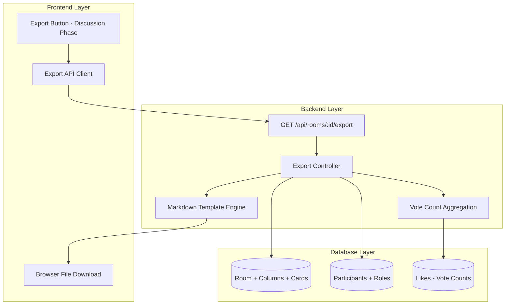

# Export Functionality

The export functionality allows facilitators to download a comprehensive Markdown summary of their retrospective
sessions during the discussion phase. This feature provides a permanent record of the retrospective results with
proper vote ranking and participant information.

## Architecture Overview



## Feature Overview

### Access Control

- **Facilitator-Only**: Only users with facilitator role can export retrospectives
- **Discussion Phase**: Export functionality is only available during the discussion phase
- **Authentication**: Uses existing guest user authentication system

### Export Content

- **Room Metadata**: Room name, export date, vote limits
- **Participants**: List of all participants with role indicators
- **Ranked Results**: Cards and groups sorted by vote count (highest first)
- **Anonymity Preserved**: Anonymous cards show no author information
- **Grouping Logic**: Grouped cards appear under their group, ungrouped cards separately

## User Interface

### Export Button Location

The export button appears in the facilitator controls section, replacing the phase transition button when the room
reaches the discussion phase.

### User Experience

1. **Visibility**: Export button only visible to facilitators in discussion phase
2. **Loading State**: Button shows "Exporting..." during file generation
3. **Automatic Download**: Browser automatically downloads the generated file
4. **Error Handling**: Clear error messages for failed exports
5. **File Naming**: Files named as `{RoomName} - {YYYY-MM-DD}.md`

## Export Format

The generated Markdown follows a clean, scannable format:

```markdown
# Retro: Sprint 12

**Description:** Sprint 12 retrospective focusing on gameplay improvements

Exported at: 2026-04-08
Votes per User: 3 votes

## Participants

* Charlie (facilitator)
* Owen
* Walter (facilitator)
* chad123chud

## Column: Liked

### Group: Playtesting improvements (4 votes)

* The tutorial landed much better this time
* Players understood movement faster
* Fewer early questions in the demo

### Ungrouped

* Nice visual polish on the menu flow (3 votes)

## Column: Learned

### Group: Scope control (2 votes)

* We underestimated UI edge cases
* Grouping took longer than expected 

## Column: Lacked

### Ungrouped

* Needed more bug bash time (5 votes)
* Mobile readability still needs work (3 votes)

## Column: Longed For

No cards
```

### Template Structure

1. **Header**: Room name with "Retro:" prefix
2. **Description**: Room description (if provided) with bold formatting
3. **Metadata**: Export date and vote limits
4. **Participants Section**: Level 2 header with bullet list and role indicators for facilitators
5. **Columns**: Each column as a level 2 header with "Column:" prefix
6. **Groups**: Level 3 headers with "Group:" prefix and vote counts
7. **Cards**: Asterisk bullet points with inline vote counts for ungrouped items
8. **Empty Columns**: Simple "No cards" message

### Ranking Logic

Items within each column are ranked by:

1. **Vote Count**: Highest votes first
2. **Consistent Tie-Breaking**: Alphabetical by ID for reproducible ordering
3. **Grouping Priority**: Groups appear before ungrouped cards
4. **Zero Votes Included**: Items with no votes still appear in export

## API Specification

### Export Endpoint

```http
GET /api/rooms/:id/export
Authorization: Guest {guestId}
```

**Parameters:**

- `id` (path): Room UUID

**Response Headers:**

- `Content-Type: text/markdown; charset=utf-8`
- `Content-Disposition: attachment; filename="{room-name}-{date}.md"`

**Success Response (200):**

- Body: Markdown content as text stream

**Error Responses:**

- `400`: Missing room ID
- `403`: Insufficient permissions (not facilitator)
- `404`: Room not found
- `500`: Export generation failed

## Security and Privacy

### Authorization

- **Role Validation**: Only facilitators can export
- **Room Participation**: User must be a participant in the room
- **Phase Restriction**: Export only available in discussion phase

### Data Privacy

- **Anonymous Cards**: Author information omitted for anonymous cards
- **Vote Anonymity**: Individual voting patterns not exposed
- **Participant Data**: Only display names and roles included

### File Security

- **Filename Sanitization**: Room names sanitized for filesystem compatibility
- **Content Encoding**: UTF-8 encoding for international character support
- **No Sensitive Data**: No internal IDs or system information exposed

## Performance and Scalability

- **Query Efficiency**: Leverages existing optimized database queries
- **Memory Usage**: Streaming response without intermediate storage
- **Small File Sizes**: Markdown format keeps exports compact
- **Client-Side Download**: Browser handles file saving
- **Stateless Operation**: No server-side session requirements

## Error Handling

### Common Scenarios

- **Room Not Found**: Returns 404 with appropriate error message
- **Insufficient Permissions**: Handled by authentication middleware
- **Export Generation Failure**: Returns 500 with error details
- **Network Errors**: Frontend provides graceful error handling with retry capability

## Implementation Files

- **Backend Route**: [`backend/src/routes/rooms.ts`](../backend/src/routes/rooms.ts)
- **Backend Controller**: [`backend/src/controllers/roomController.ts`](../backend/src/controllers/roomController.ts)
- **Markdown Template**: [`backend/src/templates/retroExport.ts`](../backend/src/templates/retroExport.ts)
- **Frontend API**: [`frontend/src/utils/api.ts`](../frontend/src/utils/api.ts)
- **Frontend UI**: [`frontend/src/pages/RetroPage.tsx`](../frontend/src/pages/RetroPage.tsx)
- **Shared Types**: [`shared/src/types/api.ts`](../shared/src/types/api.ts)

## Future Enhancements

### Additional Export Formats

- **PDF Export**: Formatted PDF generation for formal documentation
- **CSV Export**: Structured data export for analysis tools
- **JSON Export**: Machine-readable format for integrations

### Enhanced Features

- **Email Export**: Send export directly to participants
- **Export History**: Track and store previous exports
- **Custom Templates**: Allow teams to customize export format
- **Scheduled Exports**: Automatic exports at retrospective completion
