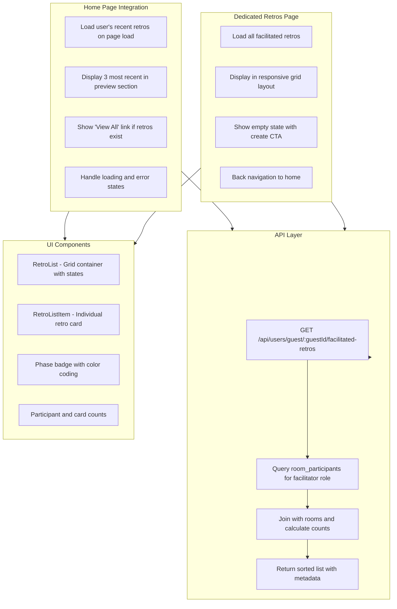
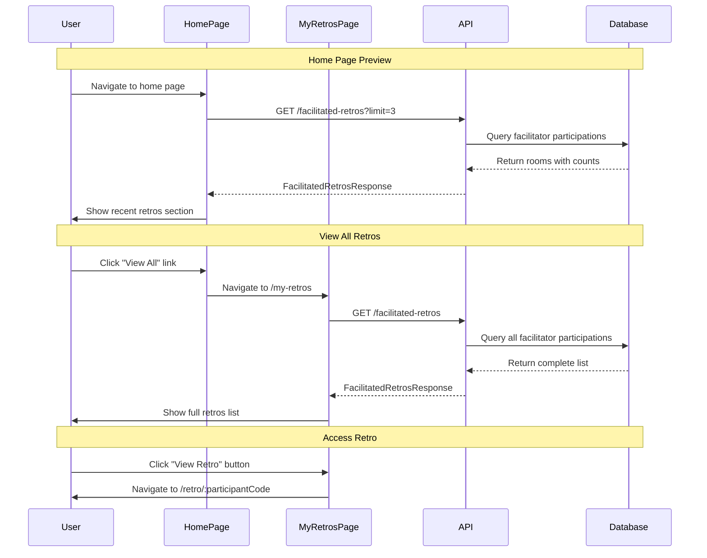
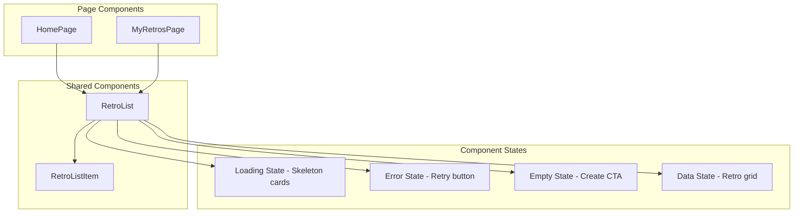

# Facilitated Retros List

The facilitated retros list feature allows users to view and access all retrospectives they have facilitated.
It provides a preview section on the home page showing the 3 most recent retros, and a dedicated page for
viewing the complete list.

## Architecture Overview



## User Experience Flow



## Database Integration

The feature leverages existing database tables without requiring schema changes:

### Query Pattern

```sql
-- Get facilitated retros with counts
SELECT 
  r.id,
  r.name,
  r.current_phase,
  r.is_active,
  r.created_at,
  r.updated_at,
  r.facilitator_code,
  r.participant_code,
  COUNT(DISTINCT rp.user_id) as participant_count,
  COUNT(DISTINCT c.id) as card_count
FROM rooms r
JOIN room_participants rp_facilitator ON r.id = rp_facilitator.room_id
LEFT JOIN room_participants rp ON r.id = rp.room_id
LEFT JOIN columns col ON r.id = col.room_id
LEFT JOIN cards c ON col.id = c.column_id
WHERE rp_facilitator.user_id = ? 
  AND rp_facilitator.role = 'facilitator'
GROUP BY r.id, r.name, r.current_phase, r.is_active, 
         r.created_at, r.updated_at, r.facilitator_code, r.participant_code
ORDER BY r.updated_at DESC
LIMIT ?;
```

**Key Relationships:**

- Uses existing `room_participants` table to identify facilitator role
- Joins with `rooms` for basic retro information
- Aggregates participant count from `room_participants`
- Aggregates card count from `cards` via `columns`

## Backend Implementation

### API Endpoints

#### Get Facilitated Retros

```http
GET /api/users/guest/:guestId/facilitated-retros?limit=3
Authorization: Guest guest-1704067200000-abc123

Response 200:
{
  "success": true,
  "data": {
    "retros": [
      {
        "id": "550e8400-e29b-41d4-a716-446655440000",
        "name": "Sprint 23 Retrospective",
        "currentPhase": "discussing",
        "isActive": true,
        "createdAt": "2024-03-15T10:00:00.000Z",
        "updatedAt": "2024-03-16T14:30:00.000Z",
        "participantCount": 5,
        "cardCount": 12,
        "facilitatorCode": "ABC12345",
        "participantCode": "XYZ789"
      }
    ],
    "totalCount": 1
  },
  "message": "Facilitated retros retrieved successfully"
}
```

#### Error Responses

```http
Response 403:
{
  "success": false,
  "error": "Authorization Error",
  "message": "You can only access your own facilitated retros"
}

Response 404:
{
  "success": false,
  "error": "Not Found", 
  "message": "Guest user not found"
}

Response 500:
{
  "success": false,
  "error": "Internal Server Error",
  "message": "Failed to retrieve facilitated retros"
}
```

### Query Implementation

The backend uses Drizzle ORM with relations to efficiently fetch data:

1. **Find user by guestId** - Validates ownership
2. **Query room participations** - Filter by facilitator role
3. **Join with room data** - Get room details and related data
4. **Calculate aggregates** - Count participants and cards
5. **Sort and limit** - Order by updated_at, apply optional limit

### Authentication & Authorization

- **Authentication**: Requires `Authorization: Guest <guestId>` header
- **Ownership validation**: Users can only access their own facilitated retros
- **Role verification**: Only returns rooms where user has facilitator role

## Frontend Implementation

### Component Architecture



### RetroListItem Design

Each retro card displays:

- **Header**: Retro name and phase badge
- **Metadata**: Creation/update dates
- **Statistics**: Participant count and card count with icons
- **Action**: "View Retro" button using participant code

### Phase Badge Styling

Phase badges use color-coded styling for visual recognition:

- **Setup**: Gray (`bg-gray-100 text-gray-800`)
- **Writing**: Blue (`bg-blue-100 text-blue-800`)
- **Grouping**: Yellow (`bg-yellow-100 text-yellow-800`)
- **Voting**: Purple (`bg-purple-100 text-purple-800`)
- **Discussing**: Green (`bg-green-100 text-green-800`)

### Responsive Design

The layout adapts to different screen sizes:

- **Mobile**: Single column stack
- **Tablet**: 2-column grid (`md:grid-cols-2`)
- **Desktop**: 3-column grid (`lg:grid-cols-3`)

### Loading States

**Skeleton Loading**: Animated placeholder cards that match the final layout structure, providing visual
continuity during data fetching.

**Error Handling**: Retry functionality with clear error messages and optional retry buttons.

**Empty States**:

- Home page: "You haven't facilitated any retros yet. Create your first retro to get started!"
- My Retros page: "You haven't facilitated any retros yet." with "Create Your First Retro" CTA

## Navigation Integration

### Home Page Section

The home page includes a new "Your Recent Retros" section that:

- Appears below the existing Create/Join cards
- Shows only when user has facilitated retros
- Displays up to 3 most recent retros
- Includes "View All" link when retros exist
- Handles loading and error states gracefully

### Dedicated Page Route

New route `/my-retros` provides:

- Complete list of all facilitated retros
- Back navigation to home page
- Same RetroList component without limit
- Empty state with create retro CTA

## API Client Integration

The frontend API client includes a new method in the `guestUserApi` object:

```typescript
getFacilitatedRetros: async (guestId: string, limit?: number): Promise<FacilitatedRetrosResponse>
```

This method:

- Accepts optional limit parameter for home page preview
- Constructs proper query parameters
- Returns typed response using shared interfaces
- Integrates with existing authentication headers

## Security Considerations

### Access Control

- **Ownership validation**: Users can only view their own facilitated retros
- **Role verification**: Only returns retros where user is facilitator
- **Code exposure**: Facilitator codes included since user has facilitator role

### Privacy Protection

- **No sensitive data**: Response includes only necessary retro metadata
- **Participant anonymity**: Individual participant details not exposed
- **Card content privacy**: Card contents not included in list view

## Performance Optimizations

### Database Efficiency

- **Single query**: Uses joins and aggregations to minimize database calls
- **Indexed lookups**: Leverages existing indexes on user_id and role
- **Optional limiting**: Home page preview limits results to 3 items

### Frontend Caching

- **Component state**: Caches retros data to avoid unnecessary re-fetches
- **Conditional loading**: Only loads when guestId is available
- **Error recovery**: Provides retry mechanism for failed requests

## Error Handling

### Network Errors

- **Retry functionality**: Users can retry failed requests
- **Graceful degradation**: Shows error state without breaking page layout
- **Clear messaging**: Specific error messages for different failure types

### Empty States

- **Contextual messaging**: Different messages for home vs dedicated page
- **Actionable CTAs**: Direct links to create new retros
- **Visual consistency**: Maintains layout structure even when empty

## Future Enhancements

### Potential Improvements

1. **Search and filtering**: Add search by name and filter by phase/status
2. **Sorting options**: Allow sorting by name, date, or participant count  
3. **Bulk actions**: Select multiple retros for batch operations
4. **Retro analytics**: Show engagement metrics and completion rates
5. **Archive functionality**: Allow archiving old retros
6. **Sharing options**: Quick copy of participant codes

### Performance Considerations

1. **Pagination**: Implement pagination for users with many retros
2. **Virtual scrolling**: Handle large lists efficiently
3. **Incremental loading**: Load additional data on scroll
4. **Caching strategy**: Implement more sophisticated caching

## Testing Considerations

### Backend Testing

- **Authentication validation**: Verify ownership checks work correctly
- **Role filtering**: Ensure only facilitator retros are returned
- **Count accuracy**: Validate participant and card count calculations
- **Sorting behavior**: Confirm proper ordering by updated_at

### Frontend Testing

- **Loading states**: Verify skeleton loading displays correctly
- **Error handling**: Test retry functionality and error messages
- **Navigation**: Ensure proper routing between home and dedicated page
- **Responsive design**: Test layout on different screen sizes

## Troubleshooting

### Common Issues

1. **Empty list showing**: Check if user has facilitated any retros
2. **Counts incorrect**: Verify database relationships and aggregation queries
3. **Loading forever**: Check API endpoint accessibility and authentication
4. **Navigation not working**: Verify route configuration in App.tsx

### Debug Steps

1. **Check localStorage**: Verify guestId exists and is valid
2. **Network inspection**: Check API requests and responses in browser dev tools
3. **Database verification**: Use Drizzle Studio to verify data relationships
4. **Console logs**: Check for JavaScript errors in browser console
5.
