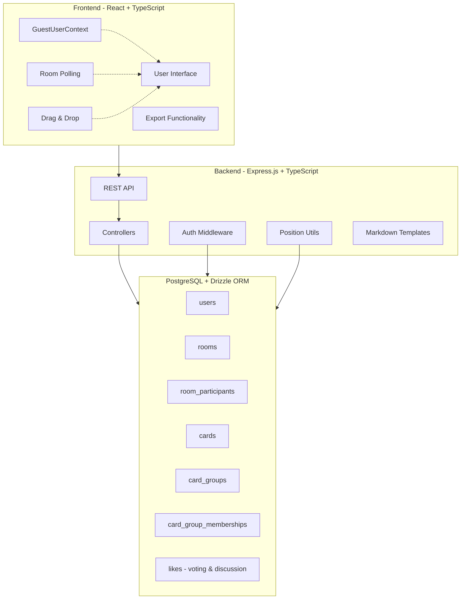

# Yet Another Retro Tool - Documentation

This documentation covers the full-stack architecture and implementation
details of the retrospective application's core features.

## Features Overview

The application is built as a monorepo with a React frontend, Express.js
backend, and PostgreSQL database. It provides a complete retrospective
facilitation platform with the following key features:

### 1. [User Authentication & Guest System](01-user-authentication.md)

- Passwordless guest user system with persistent localStorage IDs
- Server-generated opaque credentials (`guestId`)
- Automatic session recovery and error handling
- User profile management (display name updates)

### 2. [Room Management](02-room-management.md)

- Room creation with customizable templates
- Dual-code access system (facilitator vs participant codes)
- Room joining and access control validation
- Phase-based workflow management

### 3. [Card CRUD Operations](03-card-crud.md)

- Real-time card creation, editing, and deletion
- Phase-based permissions (setup and writing phases)
- Ownership-based access control with visual anonymity
- Polling-based synchronization across clients

### 4. [Card Grouping & Movement](04-card-grouping.md)

- Drag-and-drop card grouping during grouping phase
- Facilitator-only movement permissions
- Cross-column grouping capabilities
- Position management and conflict resolution

### 5. [Voting System](05-voting-system.md)

- Configurable vote limits per participant (default: 3 votes)
- Vote on cards or groups with exclusive voting rules
- Multiple votes allowed on same target with redistribution
- Real-time vote tracking without revealing counts until discussion
- Phase-based vote visibility and enforcement

### 6. [Discussion Phase](06-discussion-phase.md)

- Anonymous vote result display with aggregate totals
- Visual ranking system highlighting top 3 most-voted items
- Intelligent tie handling for consistent ranking
- Discussion-focused UI with prominent vote counts
- Complete anonymity maintenance (no individual vote information)

### 7. [Export Functionality](07-export-functionality.md)

- Facilitator-only Markdown export during discussion phase
- Comprehensive retrospective summary with vote rankings
- Participant list with role indicators
- Clean, scannable format optimized for sharing
- Automatic file download with sanitized naming

## Architecture Overview

## Data Flow Summary

1. **Authentication**: Guest users are created server-side, `guestId` stored
   in localStorage and sent via `Authorization` header
2. **Room Access**: Join codes map to room participation with role assignment
3. **Card Operations**: Ownership and phase-based permissions control CRUD
   operations with author ID filtering for anonymity
4. **Real-time Updates**: Polling-based synchronization with conflict
   resolution and role-based response filtering
5. **Grouping**: Facilitator-only drag-and-drop with position management
6. **Voting**: Phase-restricted voting with limits, real-time tracking, and
   user ID anonymization
7. **Discussion**: Anonymous vote result display with ranking and highlighting
8. **Export**: Facilitator-only Markdown generation with vote aggregation and file download

## Technology Stack

### Frontend

- **React 18** with TypeScript
- **React Router** for navigation
- **React DnD** for drag-and-drop functionality
- **Tailwind CSS** for styling
- **Vite** for build tooling

### Backend

- **Express.js** with TypeScript
- **Drizzle ORM** for database operations
- **PostgreSQL** for data persistence
- **Docker Compose** for local development

### Shared

- **TypeScript** for type safety across the stack
- **Shared types** package for API contracts

## Development Quick Start

1. **Prerequisites**: Node.js, Docker (via Colima on macOS)
2. **Database**: `npm run db:up` (starts PostgreSQL container)
3. **Development**: `npm run dev` (starts backend then frontend)
4. **Database Management**: `npm run db:studio` (Drizzle Studio)

## Common Patterns

### Error Handling

- **404 errors**: Clear localStorage, redirect to home
- **500 errors**: Preserve session, show retry UI
- **403 errors**: Redirect with specific error messages

### State Management

- **Context-based**: `GuestUserContext` for authentication
- **Component state**: Local state with API synchronization
- **Polling**: Background updates with edit conflict resolution

### Security Model

- **Header-based authentication**: `Authorization: Guest <guestId>` header format
- **Role-based access control**: Middleware-enforced facilitator vs participant permissions
- **Response filtering**: Sensitive data filtered based on user role and access level
- **Data anonymization**: Author IDs and vote user IDs removed for privacy
- **Client-side validation**: UI restrictions backed by server enforcement

## Troubleshooting

### Common Issues

1. **ECONNREFUSED**: Backend not started before frontend
2. **Guest ID lost**: Check for 404 vs 500 error handling
3. **Cards not updating**: Verify polling is enabled and working
4. **Drag-and-drop not working**: Check facilitator status and phase

### Debug Tools

- Browser localStorage inspection for `retro-guest-id`
- Network tab for API request/response debugging
- Database studio for data verification
- Terminal logs for backend error details

## API Documentation

Each feature document includes:

- Complete API endpoint specifications
- Request/response type definitions
- Error scenario handling
- Authentication requirements

## Security Enhancements

### Authentication & Authorization

- **Header-Based Authentication**: All protected endpoints require `Authorization: Guest <guestId>` header
- **Role-Based Middleware**: Automatic validation of user roles (facilitator vs participant)
- **Room Access Control**: Middleware ensures users can only access rooms they've joined

### Response Filtering & Privacy

- **Facilitator Code Protection**: Only exposed to users with facilitator role
- **Author ID Anonymization**: Card author IDs removed from responses for privacy
- **Vote User ID Filtering**: User IDs removed from vote responses to maintain anonymity
- **Participant ID Preservation**: User IDs kept in participant lists for ordering and functionality

### Middleware Architecture

- `requireGuestUser`: Validates authentication for all protected endpoints
- `requireRoomParticipant`: Ensures user is a participant in the specified room
- `requireFacilitator`: Ensures user has facilitator role in the specified room
- Dynamic room ID resolution from URL params, request body, or middleware context

## Contributing

When adding new features:

1. Update the relevant documentation file
2. Include database schema changes
3. Document API contracts in shared types
4. Add error handling scenarios
5. Update this main README if needed
6. Follow security patterns for authentication and response filtering
