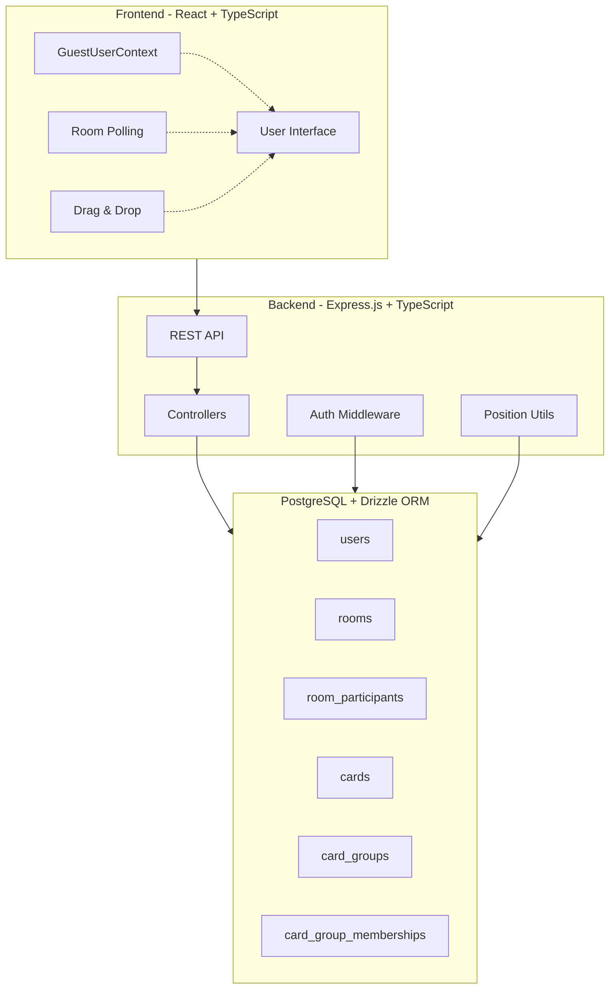

# Yet Another Retro Tool - Documentation

This documentation covers the full-stack architecture and implementation
details of the retrospective application's core features.

## Features Overview

The application is built as a monorepo with a React frontend, Express.js
backend, and PostgreSQL database. It provides a complete retrospective
facilitation platform with the following key features:

### 1. [User Authentication & Guest System](01-user-authentication.md)

- Passwordless guest user system with persistent localStorage IDs
- Server-generated opaque credentials (`guestId`)
- Automatic session recovery and error handling
- User profile management (display name updates)

### 2. [Room Management](02-room-management.md)

- Room creation with customizable templates
- Dual-code access system (facilitator vs participant codes)
- Room joining and access control validation
- Phase-based workflow management

### 3. [Card CRUD Operations](03-card-crud.md)

- Real-time card creation, editing, and deletion
- Phase-based permissions (setup and writing phases)
- Ownership-based access control with visual anonymity
- Polling-based synchronization across clients

### 4. [Card Grouping & Movement](04-card-grouping.md)

- Drag-and-drop card grouping during grouping phase
- Facilitator-only movement permissions
- Cross-column grouping capabilities
- Position management and conflict resolution

## Architecture Overview

## Data Flow Summary

1. **Authentication**: Guest users are created server-side, `guestId` stored
   in localStorage
2. **Room Access**: Join codes map to room participation with role assignment
3. **Card Operations**: Ownership and phase-based permissions control CRUD
   operations
4. **Real-time Updates**: Polling-based synchronization with conflict
   resolution
5. **Grouping**: Facilitator-only drag-and-drop with position management

## Technology Stack

### Frontend

- **React 18** with TypeScript
- **React Router** for navigation
- **React DnD** for drag-and-drop functionality
- **Tailwind CSS** for styling
- **Vite** for build tooling

### Backend

- **Express.js** with TypeScript
- **Drizzle ORM** for database operations
- **PostgreSQL** for data persistence
- **Docker Compose** for local development

### Shared

- **TypeScript** for type safety across the stack
- **Shared types** package for API contracts

## Development Quick Start

1. **Prerequisites**: Node.js, Docker (via Colima on macOS)
2. **Database**: `npm run db:up` (starts PostgreSQL container)
3. **Development**: `npm run dev` (starts backend then frontend)
4. **Database Management**: `npm run db:studio` (Drizzle Studio)

## Common Patterns

### Error Handling

- **404 errors**: Clear localStorage, redirect to home
- **500 errors**: Preserve session, show retry UI
- **403 errors**: Redirect with specific error messages

### State Management

- **Context-based**: `GuestUserContext` for authentication
- **Component state**: Local state with API synchronization
- **Polling**: Background updates with edit conflict resolution

### Security Model

- **No traditional auth**: Opaque server-issued guest IDs
- **Role-based access**: Facilitator vs participant permissions
- **Client-side validation**: UI restrictions backed by server enforcement

## Troubleshooting

### Common Issues

1. **ECONNREFUSED**: Backend not started before frontend
2. **Guest ID lost**: Check for 404 vs 500 error handling
3. **Cards not updating**: Verify polling is enabled and working
4. **Drag-and-drop not working**: Check facilitator status and phase

### Debug Tools

- Browser localStorage inspection for `retro-guest-id`
- Network tab for API request/response debugging
- Database studio for data verification
- Terminal logs for backend error details

## API Documentation

Each feature document includes:

- Complete API endpoint specifications
- Request/response type definitions
- Error scenario handling
- Authentication requirements

## Contributing

When adding new features:

1. Update the relevant documentation file
2. Include database schema changes
3. Document API contracts in shared types
4. Add error handling scenarios
5. Update this main README if needed
